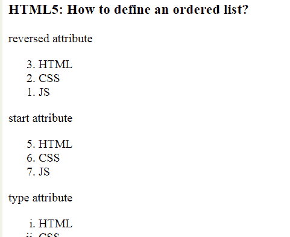

# 如何使用 HTML5 创建有序列表？

> 原文:[https://www . geesforgeks . org/如何使用-html5 创建有序列表/](https://www.geeksforgeeks.org/how-to-create-an-ordered-list-using-html5/)

在本文中，我们使用文档中的 **[< ol >标签](https://www.geeksforgeeks.org/html-ol-tag/)** 来定义有序列表，该标签用于有序列表，有序列表可以是数字的，也可以是字母的。在 **< ol >** 标签中，你必须列出一个符合订单的物品清单 **li** 。

**语法:**

```html
<ol>
   <li>Item1</li>
   <li>Item2</li>
   <li>Item3</li>
</ol>

```

**示例:**

```html
<!DOCTYPE html>
<html>

<head>
    <title>
        Define an ordered list?
    </title>
</head>

<body>
    <h1 style="color:green;">
        GeeksforGeeks
    </h1>

    <h3>
        HTML5: How to define 
        an ordered list?
    </h3>

    <p>reversed attribute</p>
    <ol reversed>
        <li>HTML</li>
        <li>CSS</li>
        <li>JS</li>
    </ol>

    <p>start attribute</p>
    <ol start=5>
        <li>HTML</li>
        <li>CSS</li>
        <li>JS</li>
    </ol>

    <p>type attribute</p>
    <ol type="i">
        <li>HTML</li>
        <li>CSS</li>
        <li>JS</li>
    </ol>
</body>

</html> 
```

**输出:**



**支持的浏览器:**

*   谷歌 Chrome
*   微软公司出品的 web 浏览器
*   火狐浏览器
*   歌剧
*   旅行队