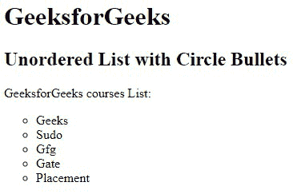

# 如何在 HTML 中创建无序列表？

> 原文:[https://www . geesforgeks . org/如何创建一个无序的 html 列表/](https://www.geeksforgeeks.org/how-to-create-an-unordered-list-in-html/)

在本文中，我们将了解如何在 HTML 中创建一个无序列表。HTML 中的**无序列表** [**< ul >标签**](https://www.geeksforgeeks.org/html-ul-tag/) 用于定义 HTML 文档中的无序列表项。它包含列表项< li >元素。< ul >标签需要开、闭标签。

**语法:**

```html
<ul> List of items </ul>
```

**属性:**该标签包含以下两个属性:

*   [](https://www.geeksforgeeks.org/html-ul-compact-attribute/#:~:text=The%20HTML%20%7C%20compact,It%20is%20a%20Boolean%20attribute.)****:**会让列表变小。**
*   **[**类型**](https://www.geeksforgeeks.org/html-ul-type-attribute/) **:** 指定列表中使用哪种标记。**

****注意:**HTML 5 不支持< ul >属性。**

****示例:**该示例通过使用< ul >标签说明了无序列表的使用。**

## **超文本标记语言**

```html
<!DOCTYPE html>
<html>

<head>
    <title>Unordered list</title>
</head>

<body>
    <h2>Welcome To GeeksforGeeks Learning</h2>
    <h5>List of available courses</h5>
    <ul>
        <li>Data Structures & Algorithm</li>
        <li>Web Technology</li>
        <li>Aptitude & Logical Reasoning</li>
        <li>Programming Languages</li>
    </ul>
</body>

</html>
```

****输出:****

**

无序列表** 

**有几种列表类型的属性可以用于无序列表项。**

**[**HTML < li >类型属性:**](https://www.geeksforgeeks.org/html-li-type-attribute/)**HTML 中的 **< li >类型属性**用于指定列表项的类型。该属性还定义了列表项的项目符号的样式。****

```html
**<li type="disc|circle|square">**
```

******属性值:******

*   ******盘:**为默认值。它会创建一个实心圆。****
*   ******圆:**它创建一个未填充的圆。****
*   ******正方形:**它创建一个填充的正方形。****

******注意:**HTML 5 不支持< li >类型属性。****

******示例:**这个示例描述了 HTML 无序列表。****

## ****超文本标记语言****

```html
**<!DOCTYPE html>
<html>

<head>
    <title>How to define an unordered list</title>
</head>

<body>
    <h1>GeeksforGeeks</h1>
    <h2>HTML5: How to define an unordered list?</h2>
    <p>GeeksforGeeks courses List:</p>

    <ul>
        <li>Geeks</li>
        <li>Sudo</li>
        <li>Gfg</li>
        <li>Gate</li>
        <li>Placement</li>
    </ul>
</body>

</html>**
```

******输出:******

****

无序列表**** 

******HTML 无序列表有各种列表项标记:******

******Disc:** 用于将列表项标记设置为项目符号，即默认。****

******示例 1:** 该示例通过将*列表样式类型*属性设置为 disc 来说明带有磁盘项目符号的无序列表的使用。****

## ****超文本标记语言****

```html
**<!DOCTYPE html>
<html>

<head>
    <title>HTML ul tag</title>
</head>

<body>
    <h1>GeeksforGeeks</h1>
    <h2>Unordered List with Disc Bullets</h2>
    <p>GeeksforGeeks courses List:</p>

    <ul style="list-style-type:disc;">
        <li>Geeks</li>
        <li>Sudo</li>
        <li>Gfg</li>
        <li>Gate</li>
        <li>Placement</li>
    </ul>
</body>

</html>**
```

******输出:******

****

带有光盘列表项目标记的无序列表**** 

******圆形:**用于将列表项标记设置为圆形。****

******示例 2:** 在本例中，我们通过将*列表样式类型*属性设置为圆形，使用了带有圆形项目符号的无序列表。****

## ****超文本标记语言****

```html
**<!DOCTYPE html>
<html>

<body>
    <h1>GeeksforGeeks</h1>
    <h2>Unordered List with Circle Bullets</h2>
    <p>GeeksforGeeks courses List:</p>

    <ul style="list-style-type: circle">
        <li>Geeks</li>
        <li>Sudo</li>
        <li>Gfg</li>
        <li>Gate</li>
        <li>Placement</li>
    </ul>
</body>

</html>**
```

******输出:******

****

带有圆形列表项目标记的无序列表**** 

******正方形:**用于将列表项标记设置为正方形。****

******示例 3:** 在本例中，我们通过将*列表样式类型*属性设置为方形，使用了带有方形项目符号的无序列表。****

## ****超文本标记语言****

```html
**<!DOCTYPE html>
<html>

<body>
    <h1>GeeksforGeeks</h1>
    <h2>Unordered List with Square Bullets</h2>
    <p>GeeksforGeeks courses List:</p>

    <ul style="list-style-type: square">
        <li>Geeks</li>
        <li>Sudo</li>
        <li>Gfg</li>
        <li>Gate</li>
        <li>Placement</li>
    </ul>
</body>

</html>**
```

******输出:******

****

带有方形列表项目标记的无序列表**** 

******无:**用于设置无标记的列表项标记。****

******示例 4:** 该示例通过将*列表样式类型*属性设置为无来说明不带项目符号的无序列表的使用。****

## ****超文本标记语言****

```html
**<!DOCTYPE html>
<html>

<body>
    <h1>GeeksforGeeks</h1>
    <h2>Unordered List with No Bullets</h2>
    <p>GeeksforGeeks courses List:</p>

    <ul style="list-style-type: none">
        <li>Geeks</li>
        <li>Sudo</li>
        <li>Gfg</li>
        <li>Gate</li>
        <li>Placement</li>
    </ul>
</body>

</html>**
```

******输出:******

****

没有列表项标记的无序列表**** 

******嵌套无序列表:**用于嵌套列表项，即列表在另一个列表中。****

******示例:**该示例描述了以嵌套格式使用无序列表。****

## ****超文本标记语言****

```html
**<!DOCTYPE html>
<html>

<body>
    <h1>GeeksforGeeks</h1>
    <h2>Nested Unordered List</h2>
    <p>GeeksforGeeks courses List:</p>

    <ul>
        <li>DSA</li>
        <ul>
            <li>Array</li>
            <li>Linked List</li>
            <li>stack</li>
            <li>Queue</li>
        </ul>
        <li>Web Technologies</li>
        <ul>
            <li>HTML</li>
            <li>CSS</li>
            <li>JavaScript</li>
        </ul>
        <li>Aptitude</li>
        <li>Gate</li>
        <li>Placement</li>
    </ul>
</body>

</html>**
```

******输出:******

****

嵌套无序列表**** 

******支持的浏览器:******

*   ****谷歌 Chrome 94.0 及以上****
*   ****火狐 92.0 及以上版本****
*   ****微软边缘 93.0****
*   ****IE 11.0****
*   ****Safari 14.1****
*   ****Opera 78.0****