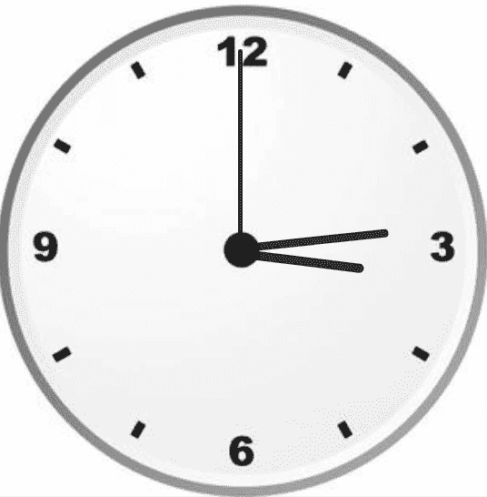

# 使用 HTML、CSS 和 JavaScript 创建模拟时钟

> 原文:[https://www . geesforgeks . org/如何使用 html-css 和-javascript 创建模拟时钟/](https://www.geeksforgeeks.org/how-to-create-analog-clock-using-html-css-and-javascript/)

我们将使用 HTML、CSS 和 JavaScript 构建一个实时模拟时钟。

**先决条件:**

*   基本了解 [HTML](https://www.geeksforgeeks.org/html-tutorials/) 、 [CSS](https://www.geeksforgeeks.org/css-tutorials/) 、 [JavaScript](https://www.geeksforgeeks.org/javascript-tutorial/) 。

**方法:**我们将创建三个文件(HTML 文件、一个 CSS 文件和一个 JavaScript 文件)，我们还有一个将在后台使用的时钟图像，在此基础上，我们将制作一个小时、分钟和秒针(使用 HTML 和 CSS)。这些手将根据系统时间旋转(我们将使用 JavaScript 的预定义日期函数来计算每只手的旋转程度)。

*   **HTML:** 它是一个简单的文件，具有网页的基本结构和时钟主体以及秒、分、时针的 ID。
*   **CSS:**CSS 只是用来让时钟看起来更好一点。我们基本上把时钟放在了网页的中间。
*   **JavaScript:**JavaScript 文件将提供手部旋转背后的逻辑。

**示例:**

*   首先，我们从 HTML 中选择了小时、分钟和秒。
*   为了获得当前时间，我们使用了 JavaScript 提供的 Date()对象。这将分别给出当前的秒、分和小时。
*   现在，我们有了小时、分钟和秒，我们知道时钟旋转了 360 度。所以，我们将转换，将时钟指针的旋转转换成度数。度数计算基于简单的一元方法。

## index.html

```html
<!DOCTYPE html>
<html lang="en">
<head>
    <link rel="stylesheet" href="style.css">
    <script src="index.js"></script>
</head>
<body>
    <div id="clockContainer">
        <div id="hour"></div>
        <div id="minute"></div>
        <div id="second"></div>
    </div>
</body>
</html>
```

## style.css

```html
#clockContainer {
    position: relative;
    margin: auto;
    height: 40vw;
    /*to make the height and width responsive*/
    width: 40vw;
    background: url(clock.png) no-repeat;
    /*setting our background image*/
    background-size: 100%;
}

#hour,
#minute,
#second {
    position: absolute;
    background: black;
    border-radius: 10px;
    transform-origin: bottom;
}

#hour {
    width: 1.8%;
    height: 25%;
    top: 25%;
    left: 48.85%;
    opacity: 0.8;
}

#minute {
    width: 1.6%;
    height: 30%;
    top: 19%;
    left: 48.9%;
    opacity: 0.8;
}

#second {
    width: 1%;
    height: 40%;
    top: 9%;
    left: 49.25%;
    opacity: 0.8;
}
```

## js 索引

```html
setInterval(() => {
    d = new Date(); //object of date()
    hr = d.getHours();
    min = d.getMinutes();
    sec = d.getSeconds();
    hr_rotation = 30 * hr + min / 2; //converting current time
    min_rotation = 6 * min;
    sec_rotation = 6 * sec;

    hour.style.transform = `rotate(${hr_rotation}deg)`;
    minute.style.transform = `rotate(${min_rotation}deg)`;
    second.style.transform = `rotate(${sec_rotation}deg)`;
}, 1000);
```

**所用图片:**[https://media . geesforgeks . org/WP-content/uploads/20210302161254/imgonlinecomuaCompressToSizeOmNATjUMFKw-300×300 . jpg](https://media.geeksforgeeks.org/wp-content/uploads/20210302161254/imgonlinecomuaCompressToSizeOmNATjUMFKw-300x300.jpg)

**输出:**

