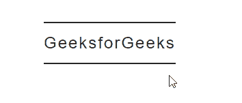

# 如何使用 HTML 和 CSS 创建动画横幅链接？

> 原文:[https://www . geesforgeks . org/如何使用 html 和 css 创建动画横幅链接/](https://www.geeksforgeeks.org/how-to-create-animated-banner-links-using-html-and-css/)

链接是网站制作中最重要的组成部分之一。几乎每个组件都有某种形式的链接。一个常见的例子是菜单/导航条。我们所看到的只是一些按钮，如 home、about 等。但在引擎盖下，它们都是链接。有时会出现不想将链接包装在按钮内的情况。因此，在这种情况下，横幅链接可能非常有用。它有一个非常简单的外观和动画，这使得它很容易设计和实现，它看起来也很棒，因为它是一个简单干净的设计。
**方法:**方法是给链接周围一些边框，然后鼠标悬停拉长整个链接。现在，有许多方法来实现相同的，但我们将操纵字母间距来实现我们的目标。
**HTML 代码:**在这一节中，我们创建了一个简单的链接，将我们带到无处可去的地方。您应该在标记的 href 属性中添加您想要的链接。

## 超文本标记语言

```html
<!DOCTYPE html>
<html lang="en">
  <head>
    <meta charset="UTF-8" />
    <meta name="viewport"
          content="width=device-width, initial-scale=1.0" />
    <title>Animated Link</title>
</head>
  <body>
    <a href="#">GeeksforGeeks</a>
  </body>
</html>
```

**CSS 代码:**对于 CSS，请按照下面给出的步骤操作。

*   **第一步:**应用一些基本的造型链接字体大小、字体系列等。
*   **步骤 2:** 应用任意颜色和宽度的上下边框。
*   **第三步:**使用悬停选择器，增加字母间距。

**注:**字母间距应至少增加字母间距初始值的 2-3 倍。

## 半铸钢ˌ钢性铸铁(Cast Semi-Steel)

```html
a{
        position: absolute;
        top: 50%;
        left:50%;
        padding: 15px 0;
        font-size: 24px;
        font-family: Arial, Helvetica, sans-serif;
        text-decoration: none;
        color: #262626;
        border-top: 2px solid #262626;
        border-bottom: 2px solid #262626;
        letter-spacing: 2px;
        transition: .5s;

      }
      a:hover{
        letter-spacing: 10px;
      }
```

**完整代码:**是以上两段代码的组合。

## 超文本标记语言

```html
<!DOCTYPE html>
<html lang="en">
  <head>
    <meta charset="UTF-8" />
    <meta name="viewport"
          content="width=device-width, initial-scale=1.0" />
    <title>Animated Link</title>
    <style>
      a{
        position: absolute;
        top: 50%;
        left:50%;
        padding: 15px 0;
        font-size: 24px;
        font-family: Arial, Helvetica, sans-serif;
        text-decoration: none;
        color: #262626;
        border-top: 2px solid #262626;
        border-bottom: 2px solid #262626;
        letter-spacing: 2px;
        transition: .5s;

      }
      a:hover{
        letter-spacing: 10px;
      }
    </style>
  </head>
  <body>
    <a href="#">GeeksforGeeks</a>
  </body>
</html>
```

**输出:**

