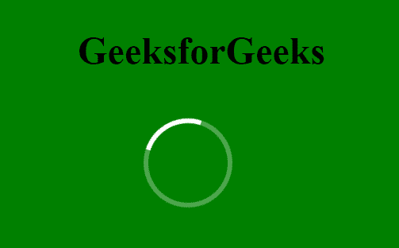

# 如何使用 HTML 和 CSS 创建动画加载环？

> 原文:[https://www . geesforgeks . org/how-create-animated-loader-ring-use-html-and-CSS/](https://www.geeksforgeeks.org/how-to-create-animated-loader-ring-using-html-and-css/)

加载环可以很容易地用 HTML 和 CSS 生成。浏览器加载网页时会显示加载环。为了创建一个加载环，我们将使用允许 HTML 元素动画的 CSS 动画。

HTML 代码用于创建动画加载环的基本结构，CSS 代码用于设置加载环的样式。我们将使用**@关键帧**规则，该规则允许动画在特定时间从当前样式逐渐变为新样式，然后我们将使用**变换**属性将动画旋转 360 度。

**示例:**

```html
<!DOCTYPE html>
<html>

<head>
    <meta charset="utf-8">
    <title>
        How to Create Animated Loader
        Ring using HTML and CSS?
    </title>

    <style>
        body {
            margin: 0;
            padding: 0;
            background: #008000;
        }

        .circle {
            position: absolute;
            top: 40%;
            left: 50%;
            transform: translate(-40%, -50%);
            animation: effect 1s linear infinite;
            width: 100px;
            height: 100px;
            border-radius: 50%;
            border: 6px solid rgba(255, 255, 255, 0.3);
            border-top-color: #fff;
        }

        @keyframes effect {
            0% {
                transform: rotate(0deg);
            }

            100% {
                transform: rotate(360deg);
            }

        }
    </style>
</head>

<body>
    <div class="circle"></div>
</body>

</html>
```

**输出:**
