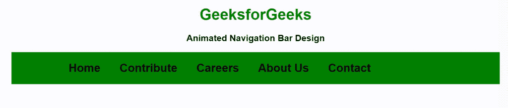

# 如何使用 HTML 和 CSS 创建具有悬停效果的动画导航栏？

> 原文:[https://www . geesforgeks . org/如何使用 html 和 css 创建带有悬停效果的动画导航栏/](https://www.geeksforgeeks.org/how-to-create-animated-navigation-bar-with-hover-effect-using-html-and-css/)

导航栏、导航栏或菜单栏是任何网络或移动应用程序中最重要的组件。用户只能通过此菜单从一个页面导航到另一个页面。它通常在网站顶部提供，以提供更好的 UX(用户体验)。

**方法:**方法是首先创建一个导航条，然后在和[悬停](https://www.geeksforgeeks.org/css-hover-selector/)选择器之前，使用[在每个项目下面制作一条线的动画。](https://www.geeksforgeeks.org/css-before-selector/)

**HTML 代码:**在本节中，我们使用无序列表(ul)创建了一个简单的导航栏菜单。

```html
<!DOCTYPE html>
<html lang="en">

<head>
    <meta charset="UTF-8">
    <meta name="viewport" content=
        "width=device-width, initial-scale=1.0">
    <title>Animated Navbar </title>
</head>

<body>
    <h1>GeeksforGeeks</h1>

    <h3>Animated Navigation Bar Design</h3>
    <ul>
        <li><a href="#">Home</a></li>
        <li><a href="#">Contribute</a></li>
        <li><a href="#">Careers</a></li>
        <li><a href="#">About Us</a></li>
        <li><a href="#">Contact</a></li>
    </ul>
</body>

</html>
```

**CSS 代码:**在本节中，我们使用了一些 CSS 属性来制作吸引人的动画导航栏。

*   **步骤 1:** 首先，我们使用 flex 属性以水平方式对齐列表。
*   **第二步:**然后去掉所有的文字装饰，提供所需的边距和填充。
*   **第三步:**然后我们使用了 before 选择器在每个元素下面对齐一条线，保持它的宽度为 0。
*   **第 4 步:**现在，使用悬停配合 before 选择器为线条提供宽度，并在 x 轴上进行变换，以获得想要的效果。

```html
<style>
    body {
        margin: 0;
        padding: 0;
        font-family: Arial, Helvetica, sans-serif;
    }

    h1 {
        color: green;
    }

    h1,
    h3 {
        text-align: center;
    }

    ul {
        margin: 0 10%;
        padding: 10px 0px 10px 100px;
        display: flex;
        background: green;
    }

    ul li {
        list-style: none;
        padding: 10px 20px;

    }

    ul li a {
        text-decoration: none;
        font-size: 24px;
        font-weight: bold;
        color: black;
        position: relative;

    }

    ul li a::before {
        content: "";
        width: 0px;
        height: 10px;
        background: black;
        position: absolute;
        top: 100%;
        left: 0;
        transition: .5s;
    }

    ul li a:hover::before {
        width: 50%;
        transform: translateX(100%);
    }
</style>
```

**完整代码:**在本节中，我们将结合以上两个部分创建一个动画导航栏。

```html
<!DOCTYPE html>
<html lang="en">

<head>
    <meta charset="UTF-8">
    <meta name="viewport" content=
        "width=device-width, initial-scale=1.0">
    <title>Animated Navbar </title>

    <style>
        body {
            margin: 0;
            padding: 0;
            font-family: Arial, Helvetica, sans-serif;
        }

        h1 {
            color: green;
        }

        h1,
        h3 {
            text-align: center;
        }

        ul {
            margin: 0 10%;
            padding: 10px 0px 10px 100px;
            display: flex;
            background: green;
        }

        ul li {
            list-style: none;
            padding: 10px 20px;

        }

        ul li a {
            text-decoration: none;
            font-size: 24px;
            font-weight: bold;
            color: black;
            position: relative;

        }

        ul li a::before {
            content: "";
            width: 0px;
            height: 10px;
            background: black;
            position: absolute;
            top: 100%;
            left: 0;
            transition: .5s;
        }

        ul li a:hover::before {
            width: 50%;
            transform: translateX(100%);
        }
    </style>
</head>

<body>
    <h1>GeeksforGeeks</h1>

    <h3>Animated Navigation Bar Design</h3>
    <ul>
        <li><a href="#">Home</a></li>
        <li><a href="#">Contribute</a></li>
        <li><a href="#">Careers</a></li>
        <li><a href="#">About Us</a></li>
        <li><a href="#">Contact</a></li>
    </ul>
</body>

</html>
```

**输出:**
