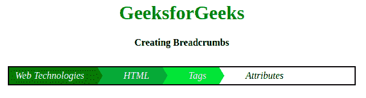
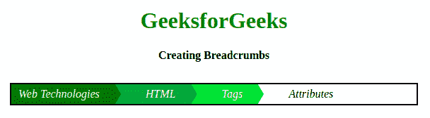

# 如何使用 HTML 和 CSS 创建面包屑？

> 原文:[https://www . geeksforgeeks . org/如何使用-html-and-css 创建面包屑/](https://www.geeksforgeeks.org/how-to-create-breadcrumbs-using-html-and-css/)



创建一个吸引人的**面包屑导航**对于非 CSS 专家来说是相当困难的。不使用 CSS，面包屑导航将窃取你的网站的华丽。通过只使用 HTML 和 CSS，我们可以创建一个吸引人的面包屑导航。在本文中，主要的焦点将是 CSS。我们将首先为面包屑创建结构，然后我们将设计我们想要的结构。

**创建结构:**这里我们将使用 **[< li >标记](https://www.geeksforgeeks.org/html-li-tag/)** 来创建一个普通结构。这将创建一个简单的界面，您可以通过运行以下代码来检查它:

*   **HTML 代码:**

    ```html
    <!DOCTYPE html>
    <html>

    <head>
        <title>Creating Breadcrumbs</title>

    </head>

    <body>
        <h1>GeeksforGeeks</h1>
        <b>Creating Breadcrumbs</b>
        <ul class="addressLink">
            <li>
                <a href="#">Web Technologies</a>
            </li>
            <li>
                <a href="#">HTML</a>
            </li>
            <li>
                <a href="#">Tags</a>
            </li>
            <li>
                <a href="#">Attributes</a>
            </li>
        </ul>
    </body>

    </html>
    ```

**设计结构:**这里最难的任务是在面包屑的右侧创建箭头形状。为了创建箭头形状，我们将在选择器 之后使用 **[。使用](https://www.geeksforgeeks.org/css-after-selector/)**[z-index 属性](https://www.geeksforgeeks.org/css-z-index-property/)** 将一个列表放在另一个列表上。对于一个 CSS 开发人员来说，其他事情都很容易。**

*   **CSS 代码:**

    ```html
    <style>
        body {
            text-align: center;
        }
        h1{
            color: green;
        }

        .addressLink {
            list-style: none;
            overflow: hidden;
            font: 16px;
            margin: 30px;
            padding: 0px;
            border: 2px solid black;
            font-style: italic;
        }

        .addressLink li {
            float: left;
        }

        .addressLink li a {
            background: #006600;
            color: white;
            text-decoration: none;
            padding: 5px 0px 5px 65px;
            position: relative;
            float: left;
        }

        .addressLink li a:after {
            content: " ";
            border-top: 50px solid transparent;
            border-bottom: 50px solid transparent;
            border-left: 30px solid #006600;
            margin-top: -50px;
            position: absolute;
            top: 50%;
            left: 100%;
            z-index: 2;
        }

        .addressLink li a:before {
            content: " ";
            border-top: 50px solid transparent;
            border-bottom: 50px solid transparent;
            border-left: 30px solid white;
            position: absolute;
            top: 50%;
            left: 100%;
            z-index: 1;
        }

        .addressLink li:first-child a {
            padding-left: 10px;
        }

        .addressLink li:nth-child(2) a {
            background: #009933;
        }

        .addressLink li:nth-child(2) a:after {
            border-left-color: #009933;
        }

        .addressLink li:nth-child(3) a {
            background: #33cc33;
        }

        .addressLink li:nth-child(3) a:after {
            border-left-color: #33cc33;
        }

        .addressLink li:last-child a {
            background: transparent !important;
            color: black;
        }

        .addressLink li:last-child a:after {
            border: 0;
        }

        .addressLink li a:hover {
            background: #99ff99;
        }

        .addressLink li a:hover:after {
            border-left-color: #99ff99 !important;
        }
    </style>
    ```

**最终解决方案:**在本节中，我们将结合 HTML 和 CSS 代码来创建面包屑。

```html
<!DOCTYPE html>
<html>

<head>
    <title>Creating Breadcrumbs</title>
    <style>
        body {
            text-align: center;
        }
        h1{
            color: green;
        }

        /* Styling addressLink class */
        .addressLink {
            list-style: none;
            overflow: hidden;
            font: 16px;
            margin: 30px;
            padding: 0px;
            border: 2px solid black;
            font-style: italic;
        }

        /* Floating addressLink list */
        .addressLink li {
            float: left;
        }

        /* Styling addressLink list's anchor element*/
        .addressLink li a {
            background: #006600;
            color: white;
            text-decoration: none;
            padding: 5px 0px 5px 65px;
            position: relative;
            float: left;
        }

        .addressLink li a:after {
            content: " ";
            border-top: 50px solid transparent;
            border-bottom: 50px solid transparent;
            border-left: 30px solid #006600;
            margin-top: -50px;
            position: absolute;
            top: 50%;
            left: 100%;
            z-index: 2;
        }

        .addressLink li a:before {
            content: " ";
            border-top: 50px solid transparent;
            border-bottom: 50px solid transparent;
            border-left: 30px solid white;
            position: absolute;
            top: 50%;
            left: 100%;
            z-index: 1;
        }

        /* First child padding */
        .addressLink li:first-child a {
            padding-left: 10px;
        }

        /* Second child bg-color */
        .addressLink li:nth-child(2) a {
            background: #009933;
        }

        /* Second child Second half bg-color */
        .addressLink li:nth-child(2) a:after {
            border-left-color: #009933;
        }

        /* Third child bg-color */
        .addressLink li:nth-child(3) a {
            background: #33cc33;
        }

        /* Third child Second half bg-color */
        .addressLink li:nth-child(3) a:after {
            border-left-color: #33cc33;
        }

        /* Last child bg-color and text-color */
        .addressLink li:last-child a {
            background: transparent !important;
            color: black;
        }

        .addressLink li:last-child a:after {
            border: 0px;
        }

        /* Hover on list's anchor element */
        .addressLink li a:hover {
            background: #99ff99;
        }

        .addressLink li a:hover:after {
            border-left-color: #99ff99 !important;
        }
    </style>
</head>

<body>
    <h1>GeeksforGeeks</h1>
    <b>Creating Breadcrumbs</b>
    <ul class="addressLink">
        <li>
            <a href="#">Web Technologies</a>
        </li>
        <li>
            <a href="#">HTML</a>
        </li>
        <li>
            <a href="#">Tags</a>
        </li>
        <li>
            <a href="#">Attributes</a>
        </li>
    </ul>
</body>

</html>
```

**输出:**
