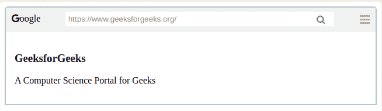

# 如何使用 HTML 和 CSS 创建浏览器窗口？

> 原文:[https://www . geesforgeks . org/如何创建浏览器-使用 html 和 css 的窗口/](https://www.geeksforgeeks.org/how-to-create-browsers-window-using-html-and-css/)



浏览器窗口是从互联网上查看页面的工具。它用于在互联网上搜索内容，并从互联网上获取相关信息。
**创建结构:**在这一部分，我们将创建一个基本的网站结构，并为将用作菜单图标的图标附加字体-真棒的 CDN 链接。
**字体超赞图标的 CDN 链接:**

> <link rel="”stylesheet”" href="”https://cdnjs.cloudflare.com/ajax/libs/font-awesome/4.7.0/css/font-awesome.min.css”">

*   **HTML 代码:**

## 超文本标记语言

```html
<!DOCTYPE html>
<html>

<head>
    <meta name="viewport"
        content="width=device-width, initial-scale=1">
    <link rel="stylesheet" href=
"https://cdnjs.cloudflare.com/ajax/libs/font-awesome/4.7.0/css/font-awesome.min.css">
</head>

<body>

    <div class="container">
        <div class="geeks">
            <div class="gfg left">
                <i class="fa fa-google"
                aria-hidden="true">oogle</i>

            </div>

            <!-- Google icon from font awesome-->
            <div class="gfg middle">
                <input type="text"
                    value="https://www.geeksforgeeks.org/">
                <i class="fa fa-search"
                aria-hidden="true"></i>
            </div>
            <div class="gfg right">
                <div style="float:right">
                    <span class="bar"></span>
                    <span class="bar"></span>
                    <span class="bar"></span>
                </div>
            </div>
        </div>

        <div class="body">
            <h3>GeeksforGeeks</h3>

<p>A Computer Science Portal for Geeks</p>

        </div>
    </div>

</body>

</html>                   
```