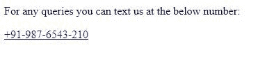
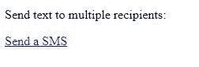

# 如何用 HTML 创建按钮打开短信合成一个电话号码？

> 原文:[https://www . geesforgeks . org/如何使用 html 创建按钮打开短信撰写电话号码/](https://www.geeksforgeeks.org/how-to-create-button-to-open-sms-compose-to-a-phone-number-using-html/)

有时候，当你在网上搜索一个号码时，你可能想直接从网页上给它发短信，而不是记下来然后发信息给它。这对用户来说变得非常方便。在 HTML 中制作短信链接非常容易。在这里，我们将看到如何在网页上制作短信链接。

**方法:使用 [< a > href 属性](https://www.geeksforgeeks.org/html-a-href-attribute/) :** 输入电话号码代替网址，并在其前添加**短信:**进行短信链接。在将显示为可点击链接的标签之间添加文本。

**单收件人:**
**语法:**

```html
<a href="sms:(countrycode)(number)"> Text </a>
```

**示例:**

```html
<!DOCTYPE html>
<html>

<head>
    <title>
        Create button to open SMS 
        compose to a phone number
    </title>
</head>

<body>
    <p>
        For any queries you can text
        us at the below number: 
    </p>

    <a href="sms:+911234567890">
        +91-123-4567-890
    </a>
</body>

</html>
```

**输出:**
**点击链接前:**

**点击链接后:**


**对于多个收件人:**
**语法:**

```html
<a href="sms:(countrycode)(number), 
    (countrycode)(number), ...."> Text </a>
```

**示例:**

```html
<!DOCTYPE html>
<html>

<head>
    <title>
        Create button to open SMS
        compose to a phone number
    </title>
</head>

<body>
    <p>
        Send text to multiple 
        recipients: 
    </p>

    <a href="sms:+911234567890, 
            +11234567890">
        Send a SMS
    </a>
</body>

</html>
```

**输出:**
**点击链接前:**

**点击链接后:**
