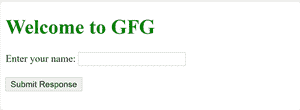
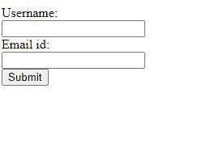

# 如何在 HTML5 中创建属于一个或多个表单的按钮？

> 原文:[https://www . geesforgeks . org/如何创建属于一个或多个表单的按钮 html5/](https://www.geeksforgeeks.org/how-to-create-button-which-belongs-to-one-or-more-forms-in-html5/)

在 HTML 中， **[<按钮>](https://www.geeksforgeeks.org/html-button-tag/)** 标签用来在你的网页上创建一个可点击的按钮。它还有一个写为</按钮>的结束标签。您可以在<按钮>标签中添加文本或图像，无论您想要显示什么按钮。<按钮>标签的类型属性应始终由您指定。每个浏览器都有自己的按钮元素默认类型。

按钮可以在窗体内部或外部创建。它可以使用 CSS 以不同的方式进行样式化。

例如，要创建文本为“单击此处”的按钮，可以创建为:

**语法:**

```html
<button type="button">Click Here</button>
```

<button>标签有许多属性，为按钮提供了所需的功能。</button>

<按钮>标签的 *[**表单**](https://www.geeksforgeeks.org/html-button-form-attribute/)* ***属性*** 用于在 HTML 中创建属于一个或多个表单的按钮。

**语法:**

```html
<button form="form_id">
```

要指定按钮所属的一个或多个表单，使用*表单属性*。表单属性的值应该等于同一文档中表单元素的 **id 属性**。

**form_id :** 指定<按钮>元素所属的表单元素。该 id 的值应该等于同一文档中表单元素的 id 属性。

**例 1:**

## 超文本标记语言

```html
<!DOCTYPE html>
<html>
  <head>
    <title>HTML form attribute</title>
  </head>
  <body>
    <h1 style="color: green">Welcome to GFG</h1>
    <!-- To create a form -->
    <form action="/action_page.php" 
          method="get" id="nameform">

      <label for="fullname">Enter your name:</label>

      <!-- To take input from user in the form -->
      <input type="text" id="fullname" 
             name="fullname" />
      <br /><br />
    </form>
    <!-- Same form id : "nameform" is used -->
    <button type="submit" form="nameform" value="Submit">
      Submit Response
    </button>
  </body>
</html>
```

**输出:**



**例 2:**

## 超文本标记语言

```html
<!DOCTYPE html>
<html>

<body>

    <form id="formid" method="POST">
        Username:<br>
        <input type="text" name="username">
        <br> Email id:<br>
        <input type="text" name="email_id">
    </form>
    <button type="submit" 
            value="Submit" 
            form="formid">Submit</button>
</body>

</html>
```

**输出:**

