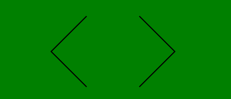

# 如何使用 HTML 和 CSS 为自己的网站创建自定义箭头？

> 原文:[https://www . geesforgeks . org/如何使用 html 和 css 为您的网站创建自定义箭头/](https://www.geeksforgeeks.org/how-to-create-custom-arrows-for-your-website-using-html-and-css/)

箭头在现代网站中被广泛使用。这些主要用于滑动图像和换页。虽然这些箭头有很多图标。有时你需要根据客户的要求设计一个定制的图像。使用 CSS 创建箭头有很多好处，比如它们不会影响页面加载时间，对于为网站提供自定义触摸的搜索引擎优化也非常有益。

**方法:**使用 CSS 创建箭头非常简单。首先，使用一些*框阴影*属性创建一个 L(字母)形状，然后将其旋转到某个角度，将它们(左右箭头)对齐在一起。

**HTML 代码:**在本节中，创建了两个 *div* 元素，每个箭头一个。

```html
<!DOCTYPE html>
<html lang="en">
  <head>
    <meta charset="UTF-8" />
    <meta name="viewport" content=
      "width=device-width, initial-scale=1.0" />
    <title>Arrow</title>
</head>
<body>
    <div class="left"></div>
    <div class="right"></div>
</body>
</html>
```

**CSS 代码:**

*   **第一步:**首先使用*框影*属性将 *div* 元素做成 L 形。
*   **步骤 2:** 现在以 45 度和-135 度的角度旋转两者，使它们彼此相对对齐。

**注意:**右箭头可以用一些其他的值，比如 225 度。您可以使用开发人员控制台找到 def 的完美价值。也可以根据需要添加*悬停*效果。

```html
<style>
    body {
        padding: 280px 0 0 500px;
        background: green;
    }

    .left,
    .right {
        width: 100px;
        height: 100px;
        transition: .5s;
        float: left;
        box-shadow: -2px 2px 0 black;
    }

    .left {
        transform: rotate(45deg);
    }

    .right {
        transform: rotate(-135deg);
    }
</style>
```

**完整代码:**是以上两段代码的组合。

```html
<!DOCTYPE html>
<html lang="en">

<head>
    <meta charset="UTF-8" />

    <meta name="viewport" content=
        "width=device-width, initial-scale=1.0" />

    <title>Arrow</title>

    <style>
        body {
            padding: 280px 0 0 500px;
            background: green;
        }

        .left,
        .right {
            width: 100px;
            height: 100px;
            transition: .5s;
            float: left;
            box-shadow: -2px 2px 0 black;
        }

        .left {
            transform: rotate(45deg);
        }

        .right {
            transform: rotate(-135deg);
        }
    </style>
</head>

<body>
    <div class="left"></div>
    <div class="right"></div>
</body>

</html>
```

**输出:**
