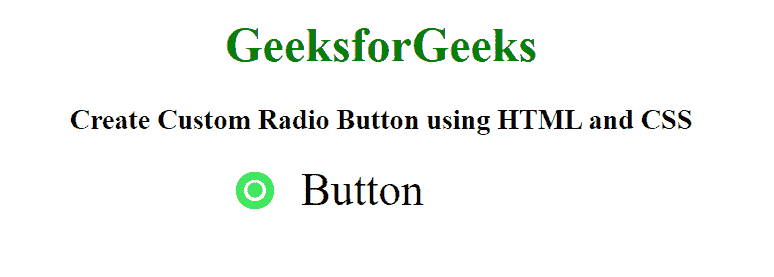

# 如何使用 HTML 和 CSS 创建自定义单选按钮？

> 原文:[https://www . geesforgeks . org/如何使用 html 和 css 创建自定义单选按钮/](https://www.geeksforgeeks.org/how-to-create-custom-radio-button-using-html-and-css/)

简单的单选按钮可以使用 HTML 和 CSS 轻松定制。我们将使用一些 CSS 属性来创建一个自定义单选按钮。**:在**伪元素和**勾选**属性后，用于设置一些 CSS 属性。完整的代码分为两部分，第一部分包含 HTML 代码，第二部分包含创建自定义单选按钮的 CSS 代码。

**HTML 代码:**在本节中，我们将使用 [<标签>](https://www.geeksforgeeks.org/html-label-tag/) 和 [<输入>](https://www.geeksforgeeks.org/html-input-tag/) 标签创建一个简单的单选按钮。

```html
<!DOCTYPE html>
<html>

<head>
    <meta charset="utf-8">

    <title>
        How to Create Custom Radio
        Button using HTML and CSS?
    </title>
</head>

<body>
    <h1>GeeksforGeeks</h1>

    <h3>
        Create Custom Radio Button
        using HTML and CSS
    </h3>

    <div>
        <label class="radio">
            <input type="radio"> Button
            <div class="circle"></div>
        </label>
    </div>
</body>

</html>
```

**CSS 代码:**在本节中，我们将使用**:在** psuedo 元素和**选中**属性后设计单选按钮。

```html
<style>
    body {
        text-align: center;
    }

    h1 {
        color: green;
    }

    div {
        margin: 0;
        padding: 0;
        box-sizing: border-box;
        font-family: serif;
        font-size: 3em;
        display: flex;
        align-items: center;
        justify-content: center;
    }

    .radio {
        font-size: 30px;
        font-weight: 500;
        display: inline-flex;
        align-items: center;
        color: black;
    }

    input {
        display: none;
    }

    .circle {
        position: relative;
        height: 25px;
        width: 25px;
        border: 5px solid #3CE75B;
        display: inline-block;
        right: 125px;
        border-radius: 50%;
    }

    .circle:after {
        content: '';
        height: 10px;
        width: 10px;
        display: block;
        position: absolute;
        background: #3CE75B;
        left: 50%;
        top: 50%;
        transform: translate(-50%, -50%);
        border-radius: 50%;
        opacity: 0;
    }

    .radio input:checked~.circle:after {
        opacity: 1;
    }
</style>
```

**完整代码:**在本节中，我们将结合以上两个部分(HTML 和 CSS)的代码来创建一个自定义单选按钮。

```html
<!DOCTYPE html>
<html>

<head>
    <meta charset="utf-8">

    <title>
        How to Create Custom Radio
        Button using HTML and CSS?
    </title>

    <style>
        body {
            text-align: center;
        }

        h1 {
            color: green;
        }

        div {
            margin: 0;
            padding: 0;
            box-sizing: border-box;
            font-family: serif;
            font-size: 3em;
            display: flex;
            align-items: center;
            justify-content: center;
        }

        .radio {
            font-size: 30px;
            font-weight: 500;
            display: inline-flex;
            align-items: center;
            color: black;
        }

        input {
            display: none;
        }

        .circle {
            position: relative;
            height: 25px;
            width: 25px;
            border: 5px solid #3CE75B;
            display: inline-block;
            right: 125px;
            border-radius: 50%;
        }

        .circle:after {
            content: '';
            height: 10px;
            width: 10px;
            display: block;
            position: absolute;
            background: #3CE75B;
            left: 50%;
            top: 50%;
            transform: translate(-50%, -50%);
            border-radius: 50%;
            opacity: 0;
        }

        .radio input:checked~.circle:after {
            opacity: 1;
        }
    </style>
</head>

<body>
    <h1>GeeksforGeeks</h1>

    <h3>
        Create Custom Radio Button
        using HTML and CSS
    </h3>

    <div>
        <label class="radio">
            <input type="radio"> Button
            <div class="circle"></div>
        </label>
    </div>
</body>

</html>
```

**输出:**
