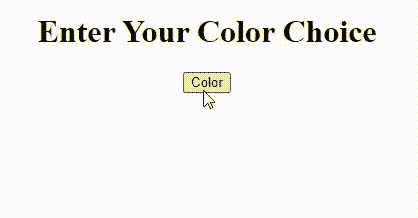

# 如何创建动态 HTML 页面？

> 原文:[https://www . geesforgeks . org/如何创建动态 html 页面/](https://www.geeksforgeeks.org/how-to-create-dynamic-html-pages/)

在本文中，我们将了解如何使用 HTML、CSS 和 JavaScript 创建动态 HTML 页面。让我们首先了解什么是动态 HTML 页面。

动态网页，顾名思义，是指一个动态的网页，它可以根据用户的输入进行自定义和更改。例如:-

*   使用 CSS，我们可以在用户每次点击网页上的按钮时改变网页的背景颜色。
*   使用 JavaScript，我们可以要求用户输入他/她的名字，然后在网页上动态显示。

如果你想进一步了解动态 HTML 页面，可以看看这篇文章 [DHTML JavaScript](https://www.geeksforgeeks.org/dhtml-javascript/) 。

让我们举一些例子来了解如何使用 HTML 和 CSS 创建动态 HTML 页面。

**例 1:** 以用户名为输入，动态改变网页文本内容

## 超文本标记语言

```html
<!DOCTYPE HTML>
<html>

<body style="text-align:center;">
    <h1>Enter Your Name</h1>

    <input id="name" type="text">
    <button type="button" onclick="EnterName()">Submit</button>
    <p style="color:green"id="demo"></p>

    <script>
        function EnterName()
        {
            var x= document.getElementById("name").value;

            document.getElementById("demo").innerHTML = 
                "Welcome to Geeks For Geeks "+ x ;
        }
    </script>
</body>

</html>
```

**输出:**


**示例 2:** 每次点击时动态改变网页的背景颜色

## 超文本标记语言

```html
<!DOCTYPE HTML>
<html>

<head>
    <script src=
"https://ajax.googleapis.com/ajax/libs/jquery/3.5.1/jquery.min.js">
    </script>
</head>

<body style="text-align:center;" id="body">
    <h1>Enter Your Color Choice</h1>

    <button type="button" onclick="changecolor()">
        Color
    </button>

    <script>
        function changecolor()
        {
            // Generating random color each time
            var color = "#"+(Math.random()*16777215|0).toString(16);

            $("body").css("background-color",color);
        }
    </script>
</body>

</html>
```

**输出:**

