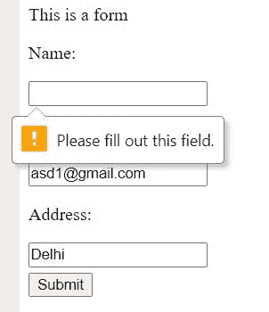
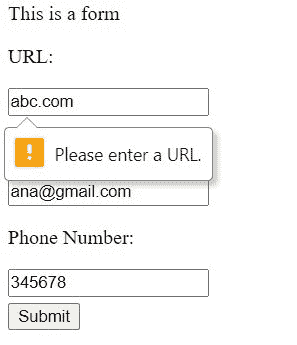
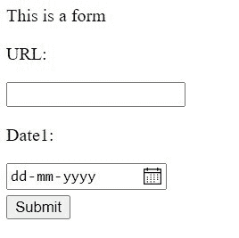

# 如何只用 HTML 创建表单验证？

> 原文:[https://www . geesforgeks . org/如何创建表单-仅使用 html 验证/](https://www.geeksforgeeks.org/how-to-create-form-validation-by-using-only-html/)

在 Web 开发中，我们经常使用 [JavaScript 和 HTML](https://www.geeksforgeeks.org/form-validation-using-html-javascript/) 来验证表单，但是我们也可以通过以下方式通过 HTML 来做同样的事情。

*   **[HTML <输入>所需属性](https://www.geeksforgeeks.org/html-input-required-attribute/)**
*   **[HTML <输入>类型属性](https://www.geeksforgeeks.org/html-input-type-attribute/)**
*   **[HTML <输入>模式属性](https://www.geeksforgeeks.org/html-input-pattern-attribute/)**

**[HTML <输入>所需属性](https://www.geeksforgeeks.org/html-input-required-attribute/) :** 在 HTML 的输入标签中，我们可以通过**“所需属性”**来指定。它通知浏览器(支持 HTML5)该字段不能留空。浏览器在这个实现上有所不同，有些浏览器会在框上出现阴影，有些会显示警告。

*   **例:**

    ```html
    <!DOCTYPE html>
    <html lang="en">

    <head>
        <title>Form</title>
    </head>

    <body>
        <p>This is a form</p>
        <form>
            <p>Name:</p>
            <input type="text" required>
            <p>Email:</p>
            <input type="email" required>
            <p>Address:</p>
            <input type="text" required>
            <br>
            <button style="margin-top: 5px;">
              Submit
            </button>
        </form>

    </body>

    </html>
    ```

*   **输出:**
    

**[HTML <输入>类型属性](https://www.geeksforgeeks.org/html-input-type-attribute/) :** 在输入标签中，如果我们要求用户输入自己的 email-id，我们可以将类型属性设置为 email，同样适用于数字、日期或 URL。类似于所需的属性，不同的浏览器有不同的实现。

*   **例:**

    ```html
    <!DOCTYPE html>
    <html lang="en">

    <head>
        <title>Form</title>
    </head>

    <body>
        <p>This is a form</p>
        <form>
            <p>URL:</p>
            <input type="url">
            <p>Email:</p>
            <input type="email">
            <p>Phone Number:</p>
            <input type="number">
            <br>
            <button style="margin-top: 5px;">
              Submit
            </button>
        </form>

    </body>

    </html>
    ```

*   **输出:**
    

**[HTML <输入>模式属性](https://www.geeksforgeeks.org/html-input-pattern-attribute/) :** 我们已经知道，除了使用默认规则之外，对于 URL、日期或价格等模式，我们也可以设置自己的规则。

*   **例:**

    ```html
    <!DOCTYPE html>
    <html lang="en">

    <head>
        <title>Form</title>
    </head>

    <body>
        <p>This is a form</p>
        <form>
            <p>URL:</p>
            <input type="url" pattern="https?://.+">
            <p>Date1:</p>
            <input type="date" 
                   pattern="\d{2, 1}/\d{2, 1}/\d{4}">
            <br>
            <button style="margin-top: 5px;">
              Submit
            </button>
        </form>
    </body>

    </html>
    ```

*   