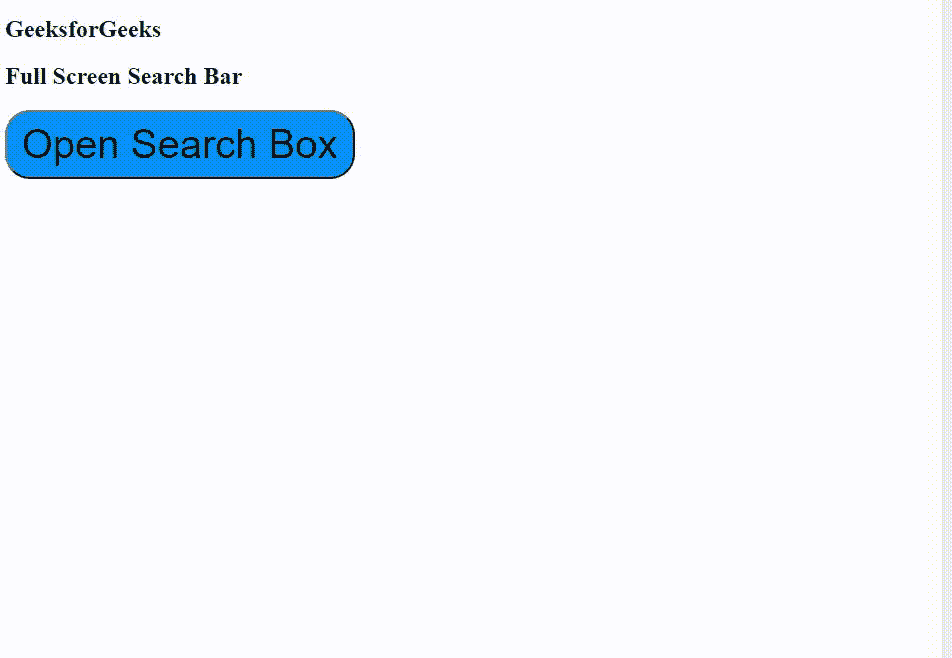

# 如何使用 HTML、CSS 和 JavaScript 创建全屏搜索栏？

> 原文:[https://www . geesforgeks . org/how-create-full screen-search-bar-use-html-CSS-and-JavaScript/](https://www.geeksforgeeks.org/how-to-create-fullscreen-search-bar-using-html-css-and-javascript/)

在本文中，您将学习如何创建全屏搜索栏。在这里，您需要创建两个**草皮**。一个用于覆盖容器，另一个用于覆盖内容容器。

**HTML 代码:**第一步是创建一个 HTML 文件。这里我们将创建搜索栏的基本结构。在这里，我们还将使用一个图标为搜索栏，我们将使用字体真棒图标。

**Fontawesome 图标 CDN 链接:**

> https://cdnjs.cloudflare.com/ajax/libs/font-awesome/4.7.0/css/font-awesome.min.css

## index.html

```html
<!DOCTYPE html>
<html>
  <head>
    <link
      rel="stylesheet"
      href=
"https://cdnjs.cloudflare.com/ajax/libs/font-awesome/4.7.0/css/font-awesome.min.css"/>
    <link
      rel="stylesheet"
      href="style.css"/>
    <script src="main.js"></script>

  </head>
  <body>
    <div id="myOverlay" class="overlay">
      <span class="closebtn" 
            onclick="closeSearch()"
            title="Close Overlay">
            ×
      </span>
      <div class="overlay-content">
        <form action="/action_page.php">
          <input type="text" 
                 placeholder="Search.." 
                 name="search" />
          <button type="submit">
            <i class="fa fa-search"></i>
          </button>
        </form>
      </div>
    </div>

    <h2>GeeksforGeeks</h2>
    <h2>
      Full Screen Search Bar 
    </h2>
    <button class="openBtn" 
            onclick="openSearch()">
            Open Search Box
    </button>
  </body>
</html>
```

**CSS 代码:**给文件添加 CSS。我们使用 CSS 来提供过渡效果和搜索栏的设计。它还用于将元素对齐到正确的位置。

## style.css

```html
* {
  box-sizing: border-box;
}

.openBtn {
  background-color: dodgerblue;
  border: 2px solid-black;
  border-radius: 25px;
  padding: 10px 15px;
  font-size: 40px;
  cursor: pointer;
}

.openBtn:hover {
  background: green;
}

.overlay {
  height: 100%;
  width: 100%;
  display: none;
  position: fixed;
  z-index: 1;
  top: 0;
  left: 0;
  background-color: rgb(0, 0, 0);
  background-color: rgba(0, 0, 0, 0.9);
}

.overlay-content {
  position: relative;
  top: 50%;
  width: 80%;
  text-align: center;
  margin-top: 30px;
  margin: auto;
}

.overlay .closebtn {
  position: absolute;
  top: 20px;
  right: 45px;
  font-size: 80px;
  cursor: pointer;
  color: white;
}

.overlay .closebtn:hover {
  color: blue;
}

.overlay input[type="text"] {
  padding: 15px;
  font-size: 17px;
  border: none;
  float: left;
  width: 80%;
  background: white;
}

.overlay input[type="text"]:hover {
  background: #f1f1f1;
}

.overlay button {
  float: left;
  width: 20%;
  padding: 15px;
  background: dodger-blue;
  font-size: 17px;
  border: none;
  cursor: pointer;
}

.overlay button:hover {
  background: #bbb;
}
```

**JavaScript 代码:**使用 JavaScript 打开和关闭叠加/全屏效果。

## main.js

```html
// Open the full screen search box
function openSearch() {
  document.getElementById("myOverlay").style.display = "block";
}

// Close the full screen search box
function closeSearch() {
  document.getElementById("myOverlay").style.display = "none";
}
```

**输出:**当您将上述三个代码段合并时，会出现此输出。

