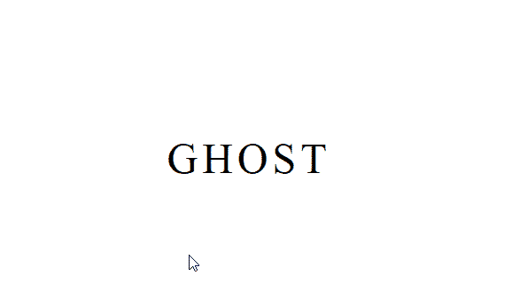

# 如何使用 HTML 和 CSS 创建悬停时的幽灵文字动画？

> 原文:[https://www . geesforgeks . org/how-create-ghost-text-animation-on-hover-use-html-and-CSS/](https://www.geeksforgeeks.org/how-to-create-ghost-text-animation-on-hover-using-html-and-css/)

幽灵文字动画可以用来给你的网站一个幽灵般的标题或子标题，这种效果可以很容易地使用一些简单的 HTML 和 CSS 创建。

**HTML 代码:**在本节中，我们有一个 *ul* 标签，它由一些显示一些文本的 *li* 标签组成。

```html
<!DOCTYPE html>
<html lang="en">
<head>
  <meta charset="UTF-8">
  <meta name="viewport" 
        content="width=device-width, initial-scale=1.0">
  <title>Ghost Text</title>
</head>
<body>
  <ul>
    <li>G</li>
    <li>H</li>
    <li>O</li>
    <li>S</li>
    <li>T</li>
  </ul>
</body>
</html>
```

**CSS 代码:**在本节中，我们使用一些基本的 CSS 属性来设计 *ul* 元素，然后为了创建鬼影动画，首先我们将使用*滤镜*属性，该属性用于为相应的元素提供一些视觉效果，然后使用*模糊()*功能为文本提供模糊效果，此外，我们将使用*第 n 个子()*选择器为文本提供一些*传输延迟*。

```html
<style>
  *{
    margin: 0;
    padding: 0;
   }

   ul{
     position: absolute;
     top: 50%;
     left: 50%;
     transform: translate(-50%, -50%);
     display: flex;
     align-items: center;
   }
   /* designing the text*/
   li{
     list-style: none;
     font-size: 3em;
     letter-spacing: 5px;
     transition: 1s;
   }
   /*creating the ghost effect*/
   li:hover{
     filter: blur(70px);
     opacity: 0;
   }
   li:nth-child(1){
     animation-delay: 0.1s;
   }
   li:nth-child(2){
     animation-delay: 0.2s;
   }
   li:nth-child(3){
     animation-delay: 0.3s;
   }
   li:nth-child(4){
     animation-delay: 0.4s;
   }
   li:nth-child(5){
     animation-delay: 0.5s;
   }

 </style>
```

**最终代码:**是以上两个代码段的组合。

```html
<!DOCTYPE html>
<html lang="en">
<head>
  <meta charset="UTF-8">
  <meta name="viewport" 
        content="width=device-width, initial-scale=1.0">
  <title>Ghost Text</title>
</head>
<style>
  *{
    margin: 0;
    padding: 0;
   }

   ul{
     position: absolute;
     top: 50%;
     left: 50%;
     transform: translate(-50%, -50%);
     display: flex;
     align-items: center;
   }
   /* designing the text*/
   li{
     list-style: none;
     font-size: 3em;
     letter-spacing: 5px;
     transition: 1s;
   }
   /*creating the ghost effect*/
   li:hover{
     filter: blur(70px);
     opacity: 0;
   }
   li:nth-child(1){
     animation-delay: 0.1s;
   }
   li:nth-child(2){
     animation-delay: 0.2s;
   }
   li:nth-child(3){
     animation-delay: 0.3s;
   }
   li:nth-child(4){
     animation-delay: 0.4s;
   }
   li:nth-child(5){
     animation-delay: 0.5s;
   }

 </style>
<body>
  <ul>
    <li>G</li>
    <li>H</li>
    <li>O</li>
    <li>S</li>
    <li>T</li>
  </ul>
</body>
</html>
```

**输出:**

