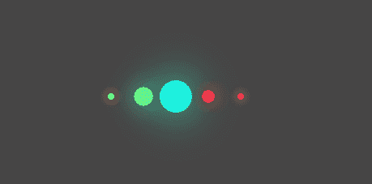

# 如何用 HTML 和 CSS 创建发光的星星效果？

> 原文:[https://www . geeksforgeeks . org/如何使用 html 和 css 创建发光的星星效果/](https://www.geeksforgeeks.org/how-to-create-glowing-star-effect-using-html-and-css/)

发光的星星效果是黑暗主题网站最酷的效果之一。它被称为恒星效应，因为它有小发光球，以不同的方式动画，看起来像星星。这种效果可以用于图像滑块、加载器，也可以作为展示用户界面元素。

**方法:**方法是使用无序列表创建小球，然后使用关键帧和第 n 个子属性为它们设置动画。对这两个属性的基本知识是本文进一步讨论的先决条件。

**HTML 代码:**在本节中，我们创建了一个无序列表。

```html
<!DOCTYPE html>
<html>
<head>
<title>GLOWING STAR EFFECT</title>
</head>
<body>
<ul>
      <li></li>
      <li></li>
      <li></li>
      <li></li>
      <li></li>

    </ul>
</body>
</html>
```

**CSS 代码:**对于 CSS，请按照下面给出的步骤操作:

*   **第一步:**根据需要对齐列表。我们已将列表与页面中心对齐。
*   **第二步:**移除所有列表样式，并使用边框半径为它们赋予圆形。
*   **步骤 3:** 通过增加比例，使用关键帧为球设置动画。没有固定的方法可以做到这一点，你可以根据自己的喜好在不同的画面上改变比例。
*   **步骤 4:** 使用第 n 个子属性在每个 li 元素的动画之间应用一些延迟。

**提示:**这个效果是最全能的效果之一。您可以更改不同帧上的动画类型，也可以更改延迟。因此，尝试本文中使用的不同属性值，为自己找到最佳动画。此外，这种效果只在暗主题的页面上看起来不错，所以不要在亮主题的网站上使用它。

```html
body {
       background: rgb(70, 69, 69);
     }
     ul {
       position: absolute;
       top: 50%;
       left: 50%;
       display: flex;
     }
     ul li {
       list-style: none;
       width: 40px;
       height: 40px;
       background: #fff;
       border-radius: 50%;

       animation: animate 1.7s ease-in-out infinite;
     }
     @keyframes animate {
       0%,
       40%,
       100% {
         transform: scale(0.2);
       }
       20% {
         transform: scale(1);
       }
     }

     ul li:nth-child(1) {
       animation-delay: -1.2s;
       background: yellow;
       box-shadow: 0 0 50px yellow;
     }
     ul li:nth-child(2) {
       animation-delay: -1s;
       background: rgb(99, 247, 136);
       box-shadow: 0 0 50px rgb(99, 247, 136);
     }
     ul li:nth-child(3) {
       animation-delay: -0.8s;
       background: rgb(30, 243, 225);
       box-shadow: 0 0 50px  rgb(30, 243, 225);
     }
     ul li:nth-child(4) {
       animation-delay: -0.6s;
       background: rgb(241, 58, 58);
       box-shadow: 0 0 50px rgb(241, 58, 58);
     }
     ul li:nth-child(5) {
       animation-delay: -0.4s;
       background: rgb(247, 61, 176);
       box-shadow: 0 0 50px  rgb(247, 61, 176);
     }
```

**完整代码:**是以上两段代码的组合。

```html
<!DOCTYPE html>
<html>
<head>
<title>GLOWING STAR EFFECT</title>
  <style>
   body {
        background: rgb(70, 69, 69);
      }
      ul {
        position: absolute;
        top: 50%;
        left: 50%;
        display: flex;
      }
      ul li {
        list-style: none;
        width: 40px;
        height: 40px;
        background: #fff;
        border-radius: 50%;

        animation: animate 1.7s ease-in-out infinite;
      }
      @keyframes animate {
        0%,
        40%,
        100% {
          transform: scale(0.2);
        }
        20% {
          transform: scale(1);
        }
      }

      ul li:nth-child(1) {
        animation-delay: -1.2s;
        background: yellow;
        box-shadow: 0 0 50px yellow;
      }
      ul li:nth-child(2) {
        animation-delay: -1s;
        background: rgb(99, 247, 136);
        box-shadow: 0 0 50px rgb(99, 247, 136);
      }
      ul li:nth-child(3) {
        animation-delay: -0.8s;
        background: rgb(30, 243, 225);
        box-shadow: 0 0 50px  rgb(30, 243, 225);
      }
      ul li:nth-child(4) {
        animation-delay: -0.6s;
        background: rgb(241, 58, 58);
        box-shadow: 0 0 50px rgb(241, 58, 58);
      }
      ul li:nth-child(5) {
        animation-delay: -0.4s;
        background: rgb(247, 61, 176);
        box-shadow: 0 0 50px  rgb(247, 61, 176);
      }

  </style>

</head>
<body>

  <ul>
      <li></li>
      <li></li>
      <li></li>
      <li></li>
      <li></li>

    </ul>
</body>
</html>
```

**输出:**

