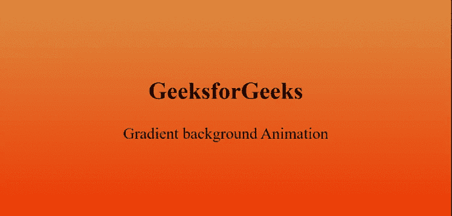

# 如何使用 HTML 和 CSS 创建渐变背景动画？

> 原文:[https://www . geesforgeks . org/如何创建-渐变-背景-动画-使用-html-and-css/](https://www.geeksforgeeks.org/how-to-create-gradient-background-animation-using-html-and-css/)

通过使用简单的 HTML 和 CSS*@关键帧*规则生成所需的动画，可以将渐变动画添加到网站的背景中。

**HTML 代码:**在下面的例子中，实现了 HTML 页面的基本结构。

```html
<!DOCTYPE html>
<html lang="en">

<head>
    <meta charset="UTF-8">
    <meta name="viewport" content=
        "width=device-width, initial-scale=1.0">
    <title>Gradient Background Animation</title>
</head>

<body>
    <section>
        <div>
            <h2>GeeksforGeeks</h2>
            <p>Gradient background Animation</p>
        </div>
    </section>
</body>

</html>
```

**CSS 代码:**在下一节中，使用提供动画特征的简单 CSS**@关键帧**规则来实现背景的设计。使用**线性渐变()**功能提供不同的渐变颜色。

```html
<style>
    body {
        margin: 0;
        padding: 0;
        animation: effect 3s linear infinite;
    }

    section {
        width: 100%;
        height: 100vh;
    }

    div {
        position: absolute;
        top: 50%;
        left: 50%;
        transform: translate(-50%, -50%);
        font-size: 3em;
    }

    h2 {
        text-align: center;
    }

    @keyframes effect {
        0% {
            background: linear-gradient(#008000, #00FF00);
        }

        50% {
            background: linear-gradient(#220080, #0084ff);
        }

        100% {
            background: linear-gradient(#e78f3c, #ff4800);
        }
    }
</style>
```

**完整代码:**是以上两个代码段的组合。

```html
<!DOCTYPE html>
<html lang="en">

<head>
    <meta charset="UTF-8">
    <meta name="viewport" content=
        "width=device-width, initial-scale=1.0">
    <title>Gradient Background Animation</title>
</head>

<style>
    body {
        margin: 0;
        padding: 0;
        animation: effect 3s linear infinite;
    }

    section {
        width: 100%;
        height: 100vh;
    }

    div {
        position: absolute;
        top: 50%;
        left: 50%;
        transform: translate(-50%, -50%);
        font-size: 3em;
    }

    h2 {
        text-align: center;
    }

    @keyframes effect {
        0% {
            background: linear-gradient(#008000, #00FF00);
        }

        50% {
            background: linear-gradient(#220080, #0084ff);
        }

        100% {
            background: linear-gradient(#e78f3c, #ff4800);
        }
    }
</style>

<body>
    <section>
        <div>
            <h2>GeeksforGeeks</h2>
            <p>Gradient background Animation</p>
        </div>
    </section>
</body>

</html>
```

**输出:**
