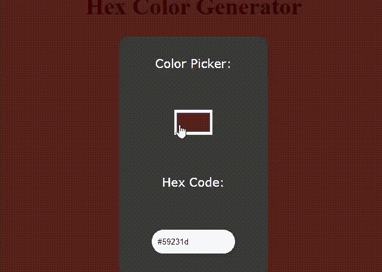

# 如何使用 HTML CSS 和 JavaScript 创建 Hex 颜色生成器？

> 原文:[https://www . geesforgeks . org/how-create-hex-color-generator-use-html-CSS-and-JavaScript/](https://www.geeksforgeeks.org/how-to-create-hex-color-generator-using-html-css-and-javascript/)

十六进制颜色是一个六位数的代码，表示组成颜色的红色、绿色和蓝色的数量。十六进制颜色生成器给出所选颜色的十六进制代码。

**进场:**

1.  要选择颜色，我们将使用<input type="”color”">创建一个颜色选择器。
2.  获取颜色选择器返回的值。(颜色选择器返回十六进制值)
3.  将颜色设置为背景并显示十六进制代码。

## 超文本标记语言

```html
<!DOCTYPE html>
<html>

<head>
    <title>Hex color generator</title>

    <style>
        body {
            margin: 0;
            padding: 0;
            display: grid;
            place-items: center;
            height: 100vh;
            font-size: 20px;
        }

        .main {
            height: 400px;
            width: 250px;
            background: #3A3A38;
            border-radius: 10px;
            display: grid;
            place-items: center;
            color: #fff;
            font-family: verdana;
            border-radius: 15px;
        }

        #colorPicker {
            background-color: none;
            outline: none;
            border: none;
            height: 40px;
            width: 60px;
            cursor: pointer;
        }

        #box {
            outline: none;
            border: 2px solid #333;
            border-radius: 50px;
            height: 40px;
            width: 120px;
            padding: 0 10px;
        }
    </style>
</head>

<body>
    <h1>Hex Color Generator</h1>

    <div class="main">

        <!-- To select the color -->
        Color Picker: <input type="color" 
            id="colorPicker" value="#6a5acd">

        <!-- To display hex code of the color -->
        Hex Code: <input type="text" id="box">
    </div>

    <script>
        function myColor() {

            // Get the value return by color picker
            var color = document.getElementById('colorPicker').value;

            // Set the color as background
            document.body.style.backgroundColor = color;

            // Take the hex code
            document.getElementById('box').value = color;
        }

        // When user clicks over color picker,
        // myColor() function is called
        document.getElementById('colorPicker')
            .addEventListener('input', myColor);
    </script>
</body>

</html>
```

**输出:**

