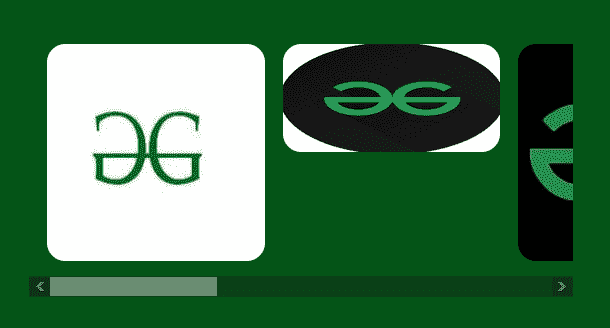
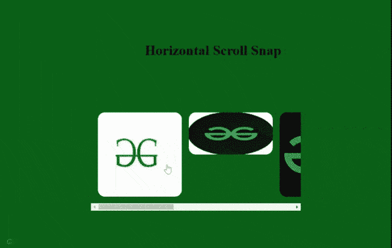

# 如何使用 HTML 和 CSS 创建水平滚动快照？

> 原文:[https://www . geeksforgeeks . org/how-create-horizontal-scroll-snap-use-html-and-CSS/](https://www.geeksforgeeks.org/how-to-create-horizontal-scroll-snap-using-html-and-css/)

在这个项目中，我们将只使用 HTML 和 CSS 创建一个简单的水平滚动快照。

**项目一瞥:**



**方法:**制作 HTML 对象动画的最佳方法是使用 CSS 类，并在不同阶段设置过渡。

**HTML 代码:**

*   创建一个 HTML 文件。
*   将提供所有动画效果的 CSS 文件链接到我们的 HTML。这也放在标签之间。
*   为创建按钮添加六个锚点 

## 超文本标记语言

```html
<!DOCTYPE html>
<html lang="en">
<head>
    <meta charset="UTF-8">
    <meta http-equiv="X-UA-Compatible" content="IE=edge">
    <meta name="viewport" 
          content="width=device-width, initial-scale=1.0">   
    <link rel="stylesheet" href="style.css">
</head>
<body>
    <h1>Horizontal Scroll Snap</h1>
    <div class="main_box">
    <!-- img-1 -->
    <a href="#">
        
    </a>
    <!-- img-2 -->
    <a href="#">
        
    </a>
    <!-- img-3 -->
    <a href="#">
        
    </a>
    <!-- img-4 -->
    <a href="#">
        
    </a>
    <!-- img-5 -->
    <a href="#">
        
    </a>
    <!-- img-6 -->
    <a href="#">
        
    </a>
    </div>
</body>
</html>
```

**CSS 代码:**以下是上述 HTML 代码中使用的‘style . CSS’文件的内容。CSS 被用来给我们的 HTML 页面提供不同类型的动画和效果，这样它看起来对所有用户都是交互式的。

*   恢复所有浏览器效果。
*   使用类和 id 给 HTML 元素赋予效果。

## style.css

```html
*{
    margin: 0;
    padding: 0;
    box-sizing: border-box;
}

body{
    background-color: rgb(4, 84, 23);
}

h1{
    position: absolute;
    top: 0;
    margin: 3em;
    left: 37%;
    margin-left: 0;
}

.main_box{
    margin: 0 auto;
    margin-top: 15em;
    display: grid;
    grid-auto-flow: column;
    padding: 1em;
    gap: 1em;
    height: 15em;
    width: 30em;
    overflow-y: hidden;
    overscroll-behavior-x: contain;
    scroll-snap-type: x mandatory;
}

.main_box > a{
    scroll-snap-align: center;
}

.main_box img{
    width: 12em;
    max-width: none;
    object-fit: contain;
    border-radius: 1em;
}
```

**输出:**



水平滚动捕捉