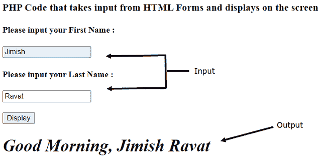

# 如何使用 PHP 创建接受用户名并显示的 HTML 表单？

> 原文:[https://www . geesforgeks . org/如何创建 html 表单接受用户名并使用 php 显示它/](https://www.geeksforgeeks.org/how-to-create-html-form-that-accept-user-name-and-display-it-using-php/)

通过 HTML 表单，可以从用户那里收集各种数据，并通过 PHP 脚本直接发送到服务器。向服务器发送数据的方法基本上有两种，一种是**“GET”**，另一种是**“POST”。**

在 **GET** 方法**、**中，数据经过浏览器的 URL，任何使用浏览器的人都可以看到，在发送关键或高度机密的数据时不太安全。但是用 **POST** 的方法，数据直接发送到服务器，任何人都看不到，被认为是最安全的将信息发送到服务器的方式。

一般来说，搜索引擎使用 **GET** 方法，因为它读取数据，但是对于要维护或更改的数据，使用 **POST** 方法。

**方法:**我们将看到一个 HTML 表单的例子，该表单收集个人的名字和姓氏，并将数据发送到 DOM，DOM 最终使用 PHP 脚本在屏幕上显示数据。

**示例:**

## 超文本标记语言

```html
<!DOCTYPE html>
<html>

<body>
    <!-- Heading -->
    <h3> HTML input form </h3>

    <!-- HTML form  -->
    <form method="POST">
        <h4>Please enter your First Name : </h4>
        <input type="text" name="f_name"><br>
        <h4>Please enter your Last Name : </h4>
        <input type="text" name="l_name"><br><br>

        <input type="submit" value="Display" name="submit">
    </form>
</body>

</html>
<?php

    // When the submit button is clicked
    if (isset($_POST['submit'])) {

        // Creating variables and 
        // storing values in it
        $f_name = $_POST['f_name'];
        $l_name = $_POST['l_name'];

        echo "<h1><i> Good Morning, $f_name $l_name </i></h1>";
    }
?>
```

**输出:**

