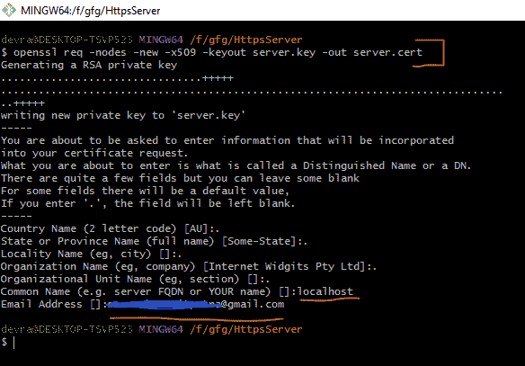
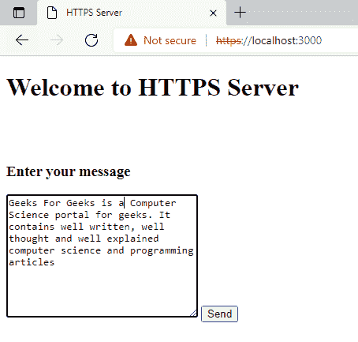
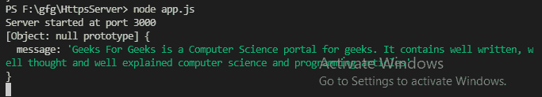

# 如何用 Node.js 创建 HTTPS 服务器？

> 原文:[https://www . geesforgeks . org/how-create-https-server-with-node-js/](https://www.geeksforgeeks.org/how-to-create-https-server-with-node-js/)

**HTTP 协议**是网络间平滑通信的最重要协议之一，但是在 HTTP 协议中，数据没有加密，因此在通信过程中可以嗅探任何敏感信息，因此有另一个版本的 HTTP，即 HTTPS，在浏览器和服务器之间的传输过程中对数据进行加密。在本文中，我们将讨论如何使用 [Node.js](https://www.geeksforgeeks.org/nodejs-tutorials/) 创建一个 HTTPS 服务器。

要用 nodeJs 构建一个 **HTTPS** 服务器，我们需要一个 SSL(安全套接字层)证书。我们可以在本地机器上创建自签名的 SSL 证书。让我们首先在我们的机器上创建一个 SSL 证书。

**步骤 1:** 首先，我们将生成自签名证书。打开您的终端或 git bash 并运行以下命令:

```html
openssl req -nodes -new -x509 -keyout server.key -out server.cert
```

运行这个命令后，我们会得到一些选项来填充。我们可以通过输入“**”来保持这些选项默认或为空。**’(点)。我们将只填充两个当前选项，因为这对我们来说很好。

*   常用名称(如服务器 FQDN 或您的姓名):**本地主机**
*   电子邮件地址:*** * * * * * * * * * * * @ * * * * * * ***(输入您的电子邮件)

其他选项，如国家/地区名称、州/省名称、地区名称、组织名称和组织单位名称是不言自明的，系统也会给出它们的帮助示例。



创建 SSL 证书

这将生成两个文件:

*   ***s*****erver . cert**:自签名证书文件。
*   **server.key** :证书的私钥。

**第二步:**现在我们对**index.html**文件进行编码。我们将创建一个表单，通过 POST 请求向服务器发送消息。

## index.html

```html
<!DOCTYPE html>
<html lang="en">

<head>
    <meta charset="UTF-8">
    <meta http-equiv="X-UA-Compatible" content="IE=edge">
    <meta name="viewport" content
        ="width=device-width, initial-scale=1.0">
    <title>HTTPS Server</title>
</head>

<body>
    <h1>Welcome to HTTPS Server</h1>
    <br><br>
    <h3>Enter your message</h3>

    <!--  sending post request to "mssg" with 
        the message from the textarea -->
    <form action="mssg" method="post">
        <textarea name="message" id="" 
            cols="30" rows="10"></textarea>
        <button type="submit">Send</button>
    </form>
</body>

</html>
```

**第三步:**现在创建一个 ***app.js*** 文件。我们将使用终端中的 *npm* 初始化项目

```html
npm init
```

我们还将安装**来处理服务器请求，并安装 ***本体解析器*** 来从 *POST* 请求中的表单获取输入。**

```html
npm install express
npm install body-parser
```

****项目结构:****

**

文件结构** 

****第四步:**现在我们将对 ***app.js*** 文件进行编码。在这个文件中，我们使用 createServer( *)* 函数创建了一个 HTTPS 服务器。我们在 createServer()函数中将 SSL 证书的证书和密钥文件作为选项对象传递。我们使用 NodeJs 中的 *express* 处理 GET 和 POST 请求。**

## **app.js**

```html
// Requiring in-built https for creating
// https server
const https = require("https");

// Express for handling GET and POST request
const express = require("express");
const app = express();

// Requiring file system to use local files
const fs = require("fs");

// Parsing the form of body to take
// input from forms
const bodyParser = require("body-parser");

// Configuring express to use body-parser
// as middle-ware
app.use(bodyParser.urlencoded({ extended: false }));
app.use(bodyParser.json());

// Get request for root of the app
app.get("/", function (req, res) {

  // Sending index.html to the browser
  res.sendFile(__dirname + "/index.html");
});

// Post request for geetting input from
// the form
app.post("/mssg", function (req, res) {

  // Logging the form body
  console.log(req.body);

  // Redirecting to the root
  res.redirect("/");
});

// Creating object of key and certificate
// for SSL
const options = {
  key: fs.readFileSync("server.key"),
  cert: fs.readFileSync("server.cert"),
};

// Creating https server by passing
// options and app object
https.createServer(options, app)
.listen(3000, function (req, res) {
  console.log("Server started at port 3000");
});
```

****步骤 5:** 使用以下命令运行**节点 app.js** 文件:**

```html
node app.js
```

****现在打开浏览器，输入运行的服务器地址:****

```html
https://localhost:3000/
```

**现在你会看到一个 HTTPS 的网页。在文本区写下你的信息。**

**

网页视图** 

**现在点击发送按钮，在你的控制台上看到它。输出将是:**

**

控制台中的输出** 

**这样，我们可以使用 Node.js 创建一个 HTTPS 服务器**