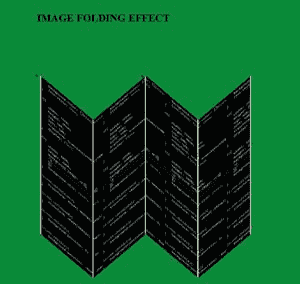

# 如何使用 HTML 和 CSS 创建图像折叠效果？

> 原文:[https://www . geesforgeks . org/how-create-image-folding-effect-use-html-and-CSS/](https://www.geeksforgeeks.org/how-to-create-image-folding-effect-using-html-and-css/)

在本文中，我们将在主图像下方创建一个图像折叠效果。这是一个简单的项目，我们只需要使用 HTML 和 CSS 就可以达到我们的目标。



**接近**:

*   创建主 div，我们在其中创建 4 个列表标签。
*   使用[第 n 个子()](https://www.geeksforgeeks.org/css-nth-child-selector/)选择器属性为不同的列表项赋予不同的样式。

**HTML 代码:**

1.  首先，我们创建一个 HTML 文件(index.html)。
2.  然后我们将提供所有动画效果的 CSS 文件链接到我们的 HTML。
    里面还放置了 *<头>* 的标签。
3.  来到我们的 HTML 代码的主体部分。
    *   首先，我们给出我们页面的标题。
    *   然后，我们必须创建一个无序列表，其中我们有 5 个列表项，进一步用于存储图像。

## index.html

```html
<!DOCTYPE html>
<html lang="en">
<head>
    <link rel="stylesheet" href="style.css">
</head>
<body>
    <h1>IMAGE FOLDING EFFECT</h1>
    <ul class="un-list">
        <li class="lis"></li>
        <li class="lis"></li>
        <li class="lis"></li>
        <li class="lis"></li>
    </ul>
</body>
</html>
```

**CSS 代码:** CSS 用来给我们的 HTML 页面赋予不同类型的动画和效果，让所有用户看起来都是交互式的。
在 CSS 中，我们要记住以下几点。

*   恢复所有浏览器效果。
*   使用类和 id 给 HTML 元素赋予效果。
*   使用[第 n 个子()](https://www.geeksforgeeks.org/css-nth-child-selector/)选择器属性为不同的列表项赋予不同的样式。

## style.css

```html
*{
    margin: 0;
    padding: 0;
    box-sizing: border-box;
}

body{
    background-color: rgb(9, 138, 57);
    list-style: none;
}

h1{
    display: flex;
    justify-content: center;
    margin: 2em;
}

.un-list{
    width: 40em;
    height: 20em;
    top: 50%;
    left: 50%;
    transform: translate(120%,50%);
    display: flex;
}

.lis{
    width: 100em;
    height: 30em;
    background-image: url(
"https://media.geeksforgeeks.org/wp-content/uploads/20210310024310/img1.png"
    );
    background-size: cover;
}

.lis:nth-child(even){
    transform: skewY(-40deg);
}

.lis:nth-child(odd){
    transform: skewY(40deg);
}

.lis:nth-child(1){
    border-left: blanchedalmond 0.2em solid;
    background-position: 0;
    border-right: blanchedalmond 0.2em solid;
}

.lis:nth-child(2){
    background-position: -8em;
    border-right: blanchedalmond 0.2em solid;
}
.lis:nth-child(3){
    background-position: -16em;
    border-right: blanchedalmond 0.2em solid;
}
.lis:nth-child(4){
    background-position: -24em;
    border-right: blanchedalmond 0.2em solid;
}
```

**输出:**


图像折叠效果