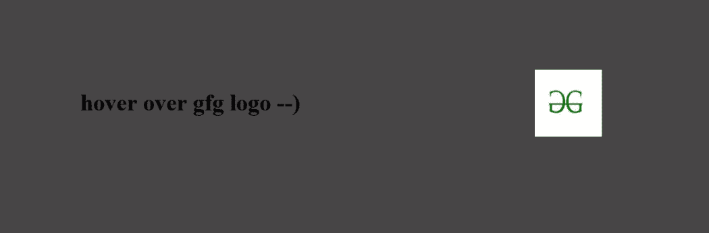
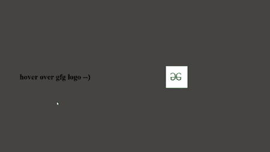

# 如何使用 HTML & CSS 创建图像悬停细节？

> 原文:[https://www . geeksforgeeks . org/如何创建-图像-悬停-细节-使用-html-css/](https://www.geeksforgeeks.org/how-to-create-image-hovered-detail-using-html-css/)

在本文中，我们将学习如何在图像上创建一种悬停效果，以获得其完整的细节。这可以通过使用简单的 HTML 和 CSS 来实现。

**我们的项目概述:**



**进场:**

*   我们将首先创建一个 HTML 文件，其中我们将为我们的图像衣架添加一个图像。
*   然后，我们将创建一个 CSS 样式，为包含图像的元素赋予动画效果。

我们将从定义页面的 HTML 和 CSS 部分开始，如下所示。

**HTML 部分:**在这个部分，定义了页面的结构。

*   我们将首先创建一个 HTML 文件。
*   然后，我们将写出 HTML 页面所需的样板代码。
*   我们接下来将链接 CSS 文件或直接添加提供所有动画效果的所需 CSS。
*   在正文部分，我们将添加一个图像源，以便显示我们的图像。

## index.html

```html
<!DOCTYPE html>
<html lang="en">

<head>
    <link rel="stylesheet" href="style.css">
</head>

<body>
    <h1>hover over gfg logo --)</h1>
    <div class="main_box">
        <div class="circle"></div>
        <div class="content">
            <h2>GeeksForGeeks</h2>
            <br>
            <p>
                A Computer Science portal for geeks.
                It contains well written,
                well thought and well explained
                computer science and programming
                articles, quizzes and much more..
            </p>
            <br>
            <a href="#">Contact Us</a>
        </div>
        
    </div>
</body>

</html>
```

**CSS 部分:**在这一部分，我们将定义页面的 CSS。使用 CSS，我们将为我们的 HTML 页面提供不同类型的动画和效果
，这样它看起来对所有用户都是交互式的。

*   我们将首先重置所有浏览器效果，以便所有浏览器上的一切都是一致的。
*   然后我们将定义给元素的样式，包括大小和位置。
*   我们将使用[剪辑路径](https://www.geeksforgeeks.org/animation-using-clip-path-property-in-css/)功能为我们的对象赋予特定的形状。

## style.css

```html
*{
    box-sizing: border-box;
    margin: 0;
    padding: 0;
    color: #000;
}

body{
    background-color: rgb(71, 69, 69);
    display: flex;
    justify-content: center;
    align-items: center;
    min-height: 100vh;
}

.main_box{
    position: relative;
    width: 42em;
    height: 25em;
    display: flex;
    align-items: center;
    border-radius: 1.5em;
    transition: .5s;
}

.main_box .circle{
    position: absolute;
    top: 6%;
    left: 0;
    width: 100%;
    height: 100%;
    border-radius: 1.5em;
    overflow: hidden;
}

.main_box .circle::before{
    content: '';
    position: absolute;
    top: 0%;
    left: 0;
    width: 100%;
    height: 100%;
    clip-path: circle(7.5em at center);
    transition: .4s;
}

h1{
    margin-right: 1em ;
}

.main_box:hover .circle::before{
    clip-path: circle(30em at center);
    background: rgb(20, 220, 43);
}

.main_box img{
    top: 50%;
    left: 50%;
    height: 5.75em;
    transform: translate(-50%,-50%);
    position: absolute;
    pointer-events: none;
    transition: 0.4s;
}
.main_box:hover img{
    left: 80%;
    top: 12.25em;
    height: 10em;
}

.main_box .content{
    position: relative;
    width: 50%;
    background: rgb(20, 220, 43);
    padding: 1.25em 1.25em 1.25em 2.5em;
    transition: .5s;
    opacity: 0;
    visibility: hidden;
}

.main_box:hover .content{
    left: 10%;
    opacity: 1;
    visibility: visible;
}

.main_box .content h2{
    text-transform: uppercase;
    font-size: 2em;
    line-height: 1em;
}

.main_box .content p{
    color: #fff;
}

.main_box .content a{
    position: relative;
    text-decoration: none;
    color: rgb(186, 14, 14);
    padding: .6em 1.25em;
    margin-top: 0.6em;
    display: inline-block;

}
```

**输出:**

