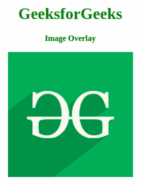
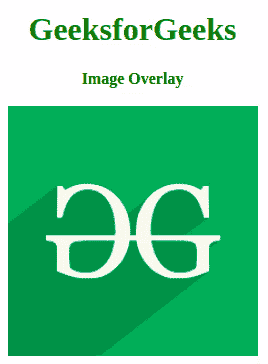

# 如何使用 HTML & CSS 创建图像叠加悬停？

> 原文:[https://www . geesforgeks . org/how-create-image-overlay-hover-use-html-CSS/](https://www.geeksforgeeks.org/how-to-create-image-overlay-hover-using-html-css/)

在本文中，我们将讨论 5 种不同类型的覆盖:左、右、上、下和渐变。你需要两块草皮。一个是你的覆盖 div，包含用户悬停在图像上时显示的内容，另一个是一个容器，保存图像及其覆盖。代表覆盖的内部 div 将有两个类。一个用于设置所有叠加的样式，另一个表示特定的叠加类型(左、右、上、下或渐变)。

您的图像应该放在内部 div(覆盖)之外，但放在外部 div(容器)之内。不要忘记添加描述图像的替代文本，以帮助依赖屏幕阅读器的用户。

**HTML 代码:**

```html
<!DOCTYPE HTML>
<html>

<head>
    <meta charset="UTF-8">
    <title>Image Overlay</title>
</head>

<body>
    <center>
        <h1 class="title">
    GeeksforGeeks
    </h1>
        <b>Image Overlay</b>
        <br>
        <br>
        <div class="container">
            
            <div class="overlay overlayLeft"></div>
        </div>
    </center>
</body>

</html>                    
```

**CSS 代码:**设置容器相对于其正常位置的位置，并定义其宽度和高度。让覆盖工作的关键是将其位置设置为绝对。这意味着它的位置相对于它最近的祖先，在这种情况下是图像。为了使覆盖层不总是存在，并且只在用户悬停在图像上时才显示，请将其不透明度设置为零，这意味着完全透明。使用“背景色”来设置覆盖的颜色。使用“过渡”使覆盖逐渐出现，而不是在图像上弹出。由于我们将叠加的不透明度设置为零，一旦我们将鼠标悬停在容器上，我们就希望将不透明度设置为 1。这意味着，一旦用户将鼠标悬停在容器项目上，就会出现覆盖图。

```html
<style>
    body {
        text-align: center;
    }

    h1 {
        color: green;
    }

    .container img {
        width: 250px;
        height: 250px;
    }

    .container {
        position: relative;
        width: 400px;
        height: auto;
    }
</style>
```

**淡化叠加:**叠加的宽度和高度是图像等 od div 图像的宽度和高度。将鼠标悬停在图像上后，叠加会出现在该图像的顶部。

*   **程序:**

    ```html
    <!DOCTYPE HTML>
    <html>

    <head>
        <meta charset="UTF-8">
        <title>Image Overlay</title>
        <style>
            body {
                text-align: center;
            }

            h1 {
                color: green;
            }

            .container img {
                width: 250px;
                height: 250px;
            }

            .container {
                position: relative;
                width: 400px;
                height: auto;
            }

            .overlay {
                position: absolute;
                transition: all 0.3s ease;
                opacity: 0;
                background-color: #9bcd9b;
            }

            .container:hover .overlay {
                opacity: 1;
            }

            .overlayFade {
                height: 250px;
                width: 250px;
                top: 0;
                left: 75px;
                background-color: #9bcd9b;
            }
        </style>
    </head>

    <body>
        <center>
            <h1 class="title">
          GeeksforGeeks
        </h1>
            <b>Image Overlay</b>
            <br>
            <br>
            <div class="container">
                
                <div class="overlay overlayFade"></div>
            </div>
        </center>
    </body>

    </html>
    ```

*   **输出:**
    

**左叠加:**叠加的高度是图像的高度(100%)。宽度为零并设置为左侧。将鼠标悬停在图像上并从左向右逐渐移动时，宽度设置为 100%。

*   **程序:**

    ```html
    <!DOCTYPE HTML>
    <html>

    <head>
        <meta charset="UTF-8">
        <title>Image Overlay</title>
        <style>
            body {
                text-align: center;
            }

            h1 {
                color: green;
            }

            .container img {
                width: 250px;
                height: 250px;
            }

            .container {
                position: relative;
                width: 400px;
                height: auto;
            }

            .overlay {
                position: absolute;
                transition: all 0.3s ease;
                opacity: 0;
                background-color: #9bcd9b;
            }

            .container:hover .overlay {
                opacity: 1;
            }

            .overlayLeft{
                height: 100%;
                width: 0;
                top: 0;
                left: 75px;
                background-color: #9bcd9b;;
            }

            .container:hover .overlayLeft{
            width: 250px;
            }
        </style>
    </head>

    <body>
        <center>
            <h1 class="title">
        GeeksforGeeks
        </h1>
            <b>Image Overlay</b>
            <br>
            <br>
            <div class="container">
                
                <div class="overlay overlayLeft"></div>
            </div>
        </center>
    </body>

    </html>                    
    ```

*   **输出:** 

**右叠加:**叠加的高度是图像的高度(100%)。宽度为零并设置为右侧。将鼠标悬停在图像上并从右向左逐渐移动时，宽度设置为 100%。

*   **程序:**

    ```html
    <!DOCTYPE HTML>
    <html>

    <head>
        <meta charset="UTF-8">
        <title>Image Overlay</title>
        <style>
            body {
                text-align: center;
            }

            h1 {
                color: green;
            }

            .container img {
                width: 250px;
                height: 250px;
            }

            .container {
                position: relative;
                width: 400px;
                height: auto;
            }

            .overlay {
                position: absolute;
                transition: all 0.3s ease;
                opacity: 0;
                background-color: #9bcd9b;
            }

            .container:hover .overlay {
                opacity: 1;
            }

            .overlayRight{
                height: 100%;
                width: 0;
                top: 0;
                right: 75px;
                background-color: #9bcd9b;;
            }

            .container:hover .overlayRight{
            width: 250px;
            }
        </style>
    </head>

    <body>
        <center>
            <h1 class="title">
        GeeksforGeeks
        </h1>
            <b>Image Overlay</b>
            <br>
            <br>
            <div class="container">
                
                <div class="overlay overlayRight"></div>
            </div>
        </center>
    </body>

    </html>                    
    ```

*   **输出:** 

**顶部覆盖:**覆盖的宽度是图像的宽度(100%)。高度为零并设置为顶部。当您将鼠标悬停在图像上并从上到下逐渐移动时，高度设置为 100%。

*   **程序:**

    ```html
    <!DOCTYPE HTML>
    <html>

    <head>
        <meta charset="UTF-8">
        <title>Image Overlay</title>
        <style>
            body {
                text-align: center;
            }

            h1 {
                color: green;
            }

            .container img {
                width: 250px;
                height: 250px;
            }

            .container {
                position: relative;
                width: 400px;
                height: auto;
            }

            .overlay {
                position: absolute;
                transition: all 0.3s ease;
                opacity: 0;
                background-color: #9bcd9b;
            }

            .container:hover .overlay {
                opacity: 1;
            }

            .overlayTop{
                width: 250px;
                height: 0;
                top: 0;
                right: 75px;
                background-color: #9bcd9b;;
            }

            .container:hover .overlayTop{
            height: 250px;
            }
        </style>
    </head>

    <body>
        <center>
            <h1 class="title">
        GeeksforGeeks
        </h1>
            <b>Image Overlay</b>
            <br>
            <br>
            <div class="container">
                
                <div class="overlay overlayTop"></div>
            </div>
        </center>
    </body>

    </html>                    
    ```

*   **输出:** 

**底部覆盖:**覆盖的宽度是图像的宽度(100%)。高度为零，设置为底部。当您将鼠标悬停在图像上并从下向上逐渐移动时，高度将设置为 100%。

*   **程序:**

    ```html
    <!DOCTYPE HTML>
    <html>

    <head>
        <meta charset="UTF-8">
        <title>Image Overlay</title>
        <style>
            body {
                text-align: center;
            }

            h1 {
                color: green;
            }

            .container img {
                width: 250px;
                height: 250px;
            }

            .container {
                position: relative;
                width: 400px;
                height: auto;
            }

            .overlay {
                position: absolute;
                transition: all 0.3s ease;
                opacity: 0;
                background-color: #9bcd9b;
            }

            .container:hover .overlay {
                opacity: 1;
            }

            .overlayBottom{
                width: 250px;
                height: 0;
                bottom: 0;
                right: 75px;
                background-color: #9bcd9b;;
            }

            .container:hover .overlayBottom{
            height: 255px;
            }
        </style>
    </head>

    <body>
        <center>
            <h1 class="title">
        GeeksforGeeks
        </h1>
            <b>Image Overlay</b>
            <br>
            <br>
            <div class="container">
                
                <div class="overlay overlayBottom"></div>
            </div>
        </center>
    </body>

    </html>    
    ```

*   **输出:** 