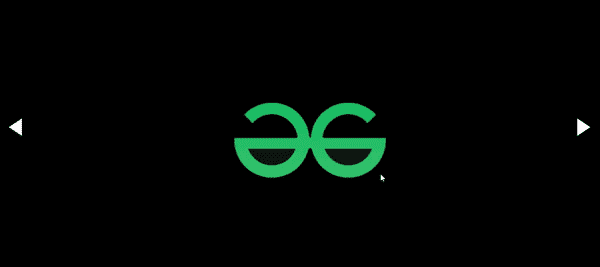

# 如何使用 HTML CSS 和 JavaScript 创建图像滑块？

> 原文:[https://www . geesforgeks . org/如何创建图像-滑块-使用-html-CSS-和-javascript/](https://www.geeksforgeeks.org/how-to-create-image-slider-using-html-css-and-javascript/)

在本文中，我们将使用 HTML、CSS 和 JavaScript 创建一个图像滑块，

HTML 和 CSS 用五个 HTML divs、左箭头、三个幻灯片和右箭头设计 HTML 页面，其中 id 或类为左箭头、幻灯片 1、幻灯片 2、幻灯片 3 和右箭头。通过单击这些箭头，我们可以使用用户定义的 JavaScript 函数(如 slideLeft()和 slideRight()来查看这些图像幻灯片。这些函数使用 JavaScript 中的[**【add event listener()】**](https://www.geeksforgeeks.org/javascript-addeventlistener-with-examples/)方法，该方法采用箭头的点击事件进行监听。

**示例:** **HTML 部分:**该部分包含页面的 HTML 部分。必须显示的幻灯片用相应的文本定义。

## index.html

```html
<!DOCTYPE html>
<html>

<head>
    <meta charset="utf-8" />
    <meta http-equiv="X-UA-Compatible" content="IE=edge" />
    <title>Image Slider</title>
    <meta name="viewport" content=
        "width=device-width, initial-scale=1" />
    <link rel="stylesheet" href=
"https://maxcdn.bootstrapcdn.com/bootstrap/3.4.1/css/bootstrap.min.css" />
    <script src=
        "https://code.jquery.com/jquery-3.6.0.min.js ">
    </script>
    <link rel="stylesheet" href="style.css" />
    <script src="script.js"></script>
</head>

<body>
    <div id="arrow-left" class="arrow"></div>
    <div class="slide slide1"></div>
    <div class="slide slide2"></div>
    <div class="slide slide3"></div>
    <div id="arrow-right" class="arrow"></div>
</body>

</html>
```

**CSS 部分:**该部分包含所有用于制作幻灯片的样式。用于移动每张幻灯片的左右箭头通过设置每张幻灯片所需的[左边距](https://www.geeksforgeeks.org/css-margin-left-property/)和[右边距](https://www.geeksforgeeks.org/css-margin-right-property/)属性来定义。这使它看起来像一个图像滑块。所有幻灯片都有[背景图像](https://www.geeksforgeeks.org/css-background-image-property/)作为滑块中使用的图像的网址。以下代码是上述 HTML 代码中使用的文件“style.css”的内容。

## style.css

```html
.slide {
  margin: 0;
  padding: 0;
  font-family: Arial, Helvetica, sans-serif;
  width: 100%;
  height: 100vh;
  overflow-x: hidden;
  background-size: cover;
  background-position: center;
  background-repeat: no-repeat;
}

.slide1 {
  background-image: url(
"https://media.geeksforgeeks.org/wp-content/uploads/20210812221217/pic1.png");
}
.slide2 {
  background-image: url(
"https://media.geeksforgeeks.org/wp-content/uploads/20210812221254/pic2.png");
}
.slide3 {
  background-image: url(
"https://media.geeksforgeeks.org/wp-content/uploads/20210812221322/pic3.png");
}
.arrow {
  cursor: pointer;
  position: absolute;
  top: 50%;
  margin-top: -35px;
  width: 0;
  height: 0;
  border-style: solid;
}
#arrow-left {
  border-width: 20px 30px 20px 0;
  border-color: transparent #fff transparent transparent;
  left: 0;
  margin-left: 20px;
}

#arrow-right {
  border-width: 20px 0 20px 30px;
  border-color: transparent transparent transparent #fff;
  right: 0;
  margin-right: 20px;
}
```

**JavaScript 部分:**该部分处理用户定义的 JavaScript 函数，如 *slideLeft()* 和 *slideRight()。*se 函数在 JavaScript 中使用[**addEventListener()**](https://www.geeksforgeeks.org/javascript-addeventlistener-with-examples/)方法，该方法采用箭头的点击事件进行监听。以下代码为上述 HTML 代码中使用的文件“script.js”的内容。

## main.js

```html
let sliderImages = document.querySelectorAll(".slide"),
  arrowLeft = document.querySelector("#arrow-left"),
  arrowRight = document.querySelector("#arrow-right"),
  current = 0;

// Clear all images
function reset() {
  for (let i = 0; i < sliderImages.length; i++) {
    sliderImages[i].style.display = "none";
  }
}

// Initial slide
function startSlide() {
  reset();
  sliderImages[0].style.display = "block";
}

// Show previous
function slideLeft() {
  reset();
  sliderImages[current - 1].style.display = "block";
  current--;
}

// Show next
function slideRight() {
  reset();
  sliderImages[current + 1].style.display = "block";
  current++;
}

// Left arrow click
arrowLeft.addEventListener("click", function () {
  if (current === 0) {
    current = sliderImages.length;
  }
  slideLeft();
});

// Right arrow click
arrowRight.addEventListener("click", function () {
  if (current === sliderImages.length - 1) {
    current = -1;
  }
  slideRight();
});

startSlide();
```

**输出:**



图像滑块