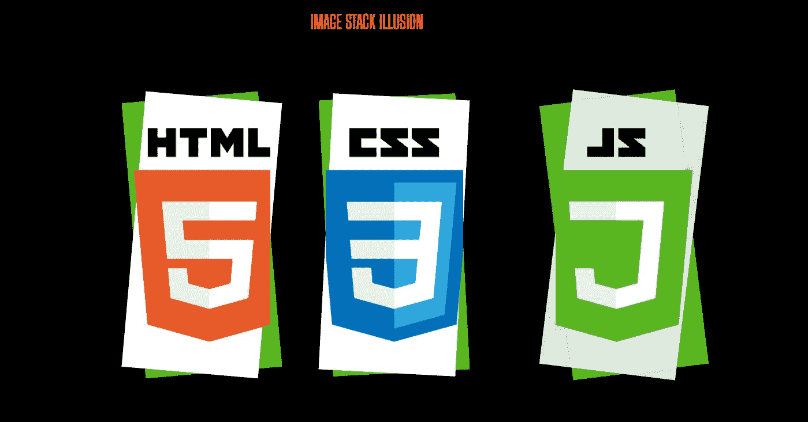
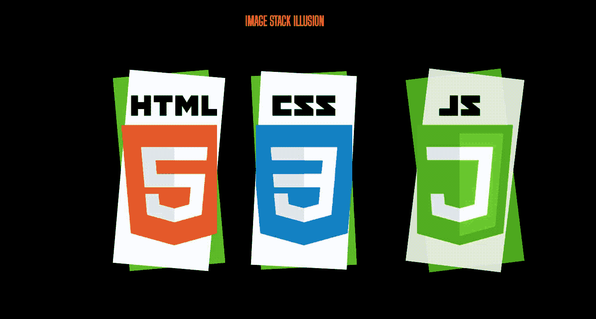

# 如何使用 HTML 和 CSS 创建图像堆栈错觉？

> 原文:[https://www . geesforgeks . org/如何使用 html 和 css 创建图像堆栈错觉/](https://www.geeksforgeeks.org/how-to-create-image-stack-illusion-using-html-and-css/)

在这篇文章中，我们将在主图像下面创建一个图像错觉。它与旧版本安卓中图库的图片集相同。这是一个简单的项目，我们只需要使用 HTML 和 CSS 就可以实现我们的目标。

**项目概况:**



**进场:**

*   创建一个主 div，我们在其中存储其他 3 个 div。
*   使用 CSS 中的伪类来创建幕后效果。
*   使用@关键帧为我们的页面提供一些过渡。

**HTML 代码:**

1.  首先，我们创建一个 HTML 文件(index.html)。
2.  创建完 HTML 文件后，我们将使用<title>标签为我们的网页赋予标题。应该放在标签里面。</title>
3.  然后我们将提供所有动画效果的 CSS 文件链接到我们的 html。也放在标签里面。
4.  现在，我们从谷歌字体添加一个链接，在我们的项目中使用不同类型的字体系列。
5.  来到我们的 HTML 代码的主体部分。
    1.  首先，我们给出我们页面的标题。
    2.  然后，我们必须创建一个 div，我们可以在其中存储所有其他 div

## 超文本标记语言

```html
<!DOCTYPE html>
<html lang="en">

<head>
    <link rel="stylesheet" href="style.css">
    <link rel="preconnect" href="https://fonts.gstatic.com">
    <link href=
"https://fonts.googleapis.com/css2?family=Big+Shoulders+Display&display=swap" 
          rel="stylesheet"></head>

<body>
    <h1>image stack illusion</h1>
    <div class="container">
        <div class="img0"></div>
        <div class="img1"></div>
        <div class="img2"></div>
    </div>
</body>

</html>
```

**CSS 代码:** CSS 用来给我们的 HTML 页面赋予不同类型的动画和效果，让所有用户看起来都是交互式的。在 CSS 中，我们要记住以下几点——

*   恢复所有浏览器效果。
*   使用类和 id 给 HTML 元素赋予效果。
*   使用[@关键帧](https://www.geeksforgeeks.org/css-animation-and-keyframes-property/)为浏览器提供动画/过渡效果。
*   使用类似[:](https://www.geeksforgeeks.org/css-before-selector/)之前、[:](https://www.geeksforgeeks.org/css-after-selector/)之后的伪类。
*   使用 [z 指数](https://www.geeksforgeeks.org/css-z-index-property/)。

## 半铸钢ˌ钢性铸铁(Cast Semi-Steel)

```html
* {
    margin: 0;
    padding: 0;
    box-sizing: border-box;
}

/* Giving all of the general styles
   to the body */
body {
    background: rgb(0, 0, 0);
    display: flex;
    justify-content: center;
    top: 10px;
    margin-top: 5em;
    font-family: 'Big Shoulders Display', cursive;
}

h1 {
    color: rgb(240, 147, 8);
    animation: todown 5s;
    text-transform: uppercase;
}

.container {
    width: 50.5em;
    height: 30em;
    position: absolute;
    top: 50%;
    left: 50%;
    transform: translate(-50%, -50%);
    display: flex;
}

.img0 {
    position: relative;
    width: 100%;
    height: 100%;
    margin-right: 3em;
    background-image: url(
https://media.geeksforgeeks.org/wp-content/uploads/20201230184929/htmlcssjslogo.png);
    background-size: cover;
    background-position: left;
    animation: shrink 1s;
}

.img0::after,
.img0::before {
    content: '';
    position: absolute;
    z-index: -1;
    width: 100%;
    height: 100%;
}

.img0::after {
    background: rgb(255, 255, 255);
    transform: rotate(5deg);
}

.img0::before {
    background: rgb(50, 205, 50);
    transform: rotate(-5deg);
}

.img1 {
    width: 100%;
    height: 100%;
    position: relative;
    left: 3em;
    margin-right: 3em;
    background-image: url(
https://media.geeksforgeeks.org/wp-content/uploads/20201230184929/htmlcssjslogo.png);
    background-size: cover;
    background-position: center;
}

.img1::after,
.img1::before {
    content: '';
    position: absolute;
    z-index: -1;
    width: 100%;
    height: 100%;
}

.img1::after {
    background: rgb(255, 255, 255);
    transform: rotate(3deg);
}

.img1::before {
    background: rgb(50, 205, 50);
    transform: rotate(-3deg);
}

.img2 {
    width: 100%;
    height: 100%;
    position: relative;
    left: 10em;
    background-image: url(
https://media.geeksforgeeks.org/wp-content/uploads/20201230184929/htmlcssjslogo.png);
    background-size: cover;
    background-position: right;
    animation: shrink 1s;
}

.img2::after,
.img2::before {
    content: '';
    position: absolute;
    z-index: -1;
    width: 100%;
    height: 100%;
}

.img2::after {
    background: rgba(255, 255, 255, 0.829);
    transform: rotate(7deg);
}

.img2::before {
    background: rgba(50, 205, 50, 0.836);
    transform: rotate(-7deg);
}

/* Animations Effect */
@keyframes todown {
    0% {
        opacity: 0;
        transform: translateY(-150px);
    }
    60% {
        opacity: 0.6;
        transform: translateY(1.2em);
        transform: scale(0.5, 0.5);
        color: rgb(0, 0, 255);
    }
    100% {
        opacity: 1;
        transform: translateY(0);
    }
}

@keyframes shrink {
    0% {
        transform: scale(0, 0);
    }
    50% {
        transform: scale(0.5, 0.5);
    }
    100% {
        transform: scale(1, 1);
    }
}
```

结合以上两段(HTML 和 CSS 代码)的代码，在浏览器上运行。它将显示图像堆栈错觉效果。

**输出:**
