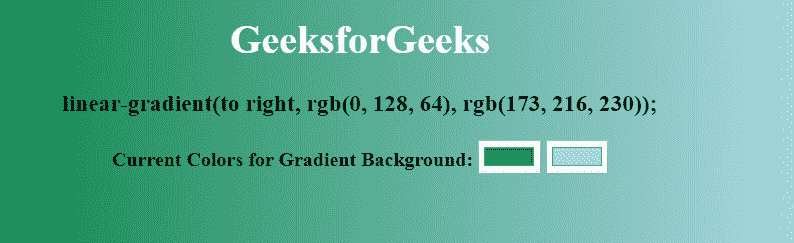
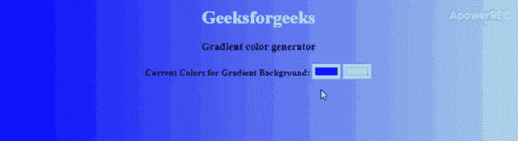

# 如何使用 HTML、CSS 和 JavaScript 创建线性渐变颜色生成器？

> 原文:[https://www . geesforgeks . org/how-create-linear-gradient-color-generator-use-html-CSS-and-JavaScript/](https://www.geeksforgeeks.org/how-to-create-linear-gradient-color-generator-using-html-css-and-javascript/)



后台生成器可以使用**[HTML](https://www.geeksforgeeks.org/html-tutorials/)****[CSS](https://www.geeksforgeeks.org/css-tutorials/)****[JavaScript](https://www.geeksforgeeks.org/javascript-tutorial/)**制作。它将根据您选择的值生成渐变背景。我们将添加两个文件，即 **style.css** 和 **script.js** 来为我们的 HTML**(index.html)**添加 css 和 js。我们使用了一个空的 h3 标签，以便显示线性渐变颜色代码。

*   **HTML 代码:**将代码保存在文件中作为**index.html**。在**index.html**文件中，我们将使用“颜色”类型的两个输入来获取渐变的值。

    ```html
    <!DOCTYPE html>
    <html>

    <head>
        <title>Gradient color generator</title>
    </head>

    <body class="change">
        <h1>GeeksforGeeks</h1>
        <h3>Gradient color generator</h3>

        <b>Current Colors for Gradient Background:</b>

        <!-- Default color for gradient -->
        <input class="color1" type="color" value="#0000ff" />
        <input class="color2" type="color" value="#add8e6" />
    </body>

    </html>
    ```

*   **CSS 代码:**对于 CSS，我们只用了一些字体和默认背景色做了一些基本的造型。您可以使用下面的样式表作为参考，通过更改一些字体和颜色来创建自己的自定义样式。

    ```html
    <style>
        /* Styling body */
        body {
            font: "Roboto";
            text-align: center;
            background: linear-gradient(to right, #0000ff, #add8e6);
        }

        /* h1 tag text color */
        h1 {
          color: white;
        }
        </style>
    ```

*   **JavaScript 代码:**现在进入 JavaScript 部分。我们做的第一件事是使用**[document . queryselector()](https://www.geeksforgeeks.org/html-dom-queryselector-method/)**方法选择了 colour1 和 colour2 节点。使用同样的方法，我们也选择了 h3 和车身。如果您不知道 querySelector 是如何工作的，我们强烈建议您首先了解这一点。现在我们创建一个函数来设置一个新选择的渐变作为背景。在这个函数中，我们简单地将使用 document.querySelector()获得的值应用于背景。我们已经使用 css.textcontent 为 h3 标签分配了线性渐变的值。

    ```html
    <script>
        var css = document.querySelector("h3");
        var color1 = document.querySelector(".color1");
        var color2 = document.querySelector(".color2");
        var body = document.querySelector(".change");

        // Changing color for the gradient
        function changeGradient() {
            body.style.background =
                "linear-gradient(to right, " 
                    + color1.value + ", " 
                    + color2.value + ")";

            css.textContent = body.style.background + ";";
        }

        color1.addEventListener("input", changeGradient);

        color2.addEventListener("input", changeGradient);
    </script>
    ```

**完整代码:**是 avobe 三段代码的组合。

```html
<!DOCTYPE html>
<html>

<head>
    <title>Gradient color generator</title>

    <style>
        body {
            font: "Roboto";
            text-align: center;
            background: linear-gradient(to right,
                        #0000ff, #add8e6);
        }

        h1 {
            color: white;
        }
    </style>
</head>

<body class="change">
    <h1>GeeksforGeeks</h1>
    <h3>Gradient color generator</h3>

    <b>Current Colors for Gradient Background:</b>

    <!-- Default color for gradient -->
    <input class="color1" type="color" value="#0000ff" />
    <input class="color2" type="color" value="#add8e6" />

    <script>
        var css = document.querySelector("h3");
        var color1 = document.querySelector(".color1");
        var color2 = document.querySelector(".color2");
        var body = document.querySelector(".change");

        // Changing color for the gradient
        function changeGradient() {
            body.style.background =
                "linear-gradient(to right, " 
                    + color1.value + ", " 
                    + color2.value + ")";

            css.textContent = body.style.background + ";";
        }

        color1.addEventListener("input", changeGradient);

        color2.addEventListener("input", changeGradient);
    </script>
</body>

</html>
```

**输出:**
