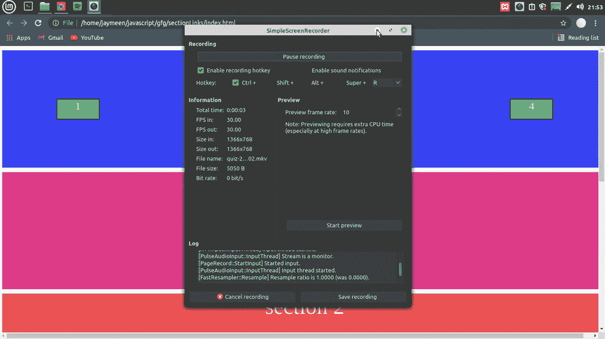

# 如何在 HTML 中创建同一页面内各节的链接？

> 原文:[https://www . geeksforgeeks . org/如何创建到 html 中同一页面内各部分的链接/](https://www.geeksforgeeks.org/how-to-create-links-to-sections-within-the-same-page-in-html/)

在本文中，我们将看到如何在他们的 HTML 页面中创建“链接”，链接到同一页面的部分。为了实现这一点，我们需要有一些 HTML 特性的先验知识[锚标签](https://www.geeksforgeeks.org/html-a-tag/)带有“href”和[类和 id](https://www.geeksforgeeks.org/difference-between-an-id-and-class-in-html/) 。

**方法:**既然我们现在知道锚标签< a >用于创建任何链接。我们还知道“href”可以保存链接地址。但是在我们的例子中，我们想要链接到同一个页面的部分，在这种情况下，我们将使用 **id** 来**识别我们网页的不同部分。然后，这些 id 可以传递给 href，如下所示 **:****

**语法:**

```html
<a href="#section1" >section 1</a>
```

在这种情况下，id“section 1”可以被赋予我们网页的任何组件或部分。上面的链接将指向 id 为 section1 的部分。这里 href 属性知道“section1”不是一个普通的链接，而是通过在开头提供“#”而成为一个 id。同样明显的是，我们不应该在 href 属性中使用类名，因为 href 属性不理解它们。此外，类名在文档中不是唯一的，因此将它们用作特定部分的标识符是没有意义的。

**示例:**在这个示例中，我们使用 div 将我们的网页分成不同的部分，第一部分有类“nav”。我们可以看到这个部分有<一个>标签来导航到我们页面的不同部分。然后我们有四个部分，每个部分都由 id 唯一标识，如“section1”和“section2”等。这个**id**是给导航区< a >标签的 **href** 的。每当用户点击< a >标签时，它将用户链接到特定的部分。

下面是上述方法的实现:

## 超文本标记语言

```html
<!DOCTYPE html>
<html lang="en">

<head>
    <meta charset="UTF-8">
    <meta http-equiv="X-UA-Compatible" content="IE=edge">
    <meta name="viewport" content=
        "width=device-width, initial-scale=1.0">
    <title>Section links</title>

    <style>
        * {
            margin: 0;
            padding: 0;
        }

        body {
            width: 100vw;
            height: 100vh;
        }

        .section {
            width: 100vw;
            height: 40vh;
            background-color: #EF5354;
            font-size: 50px;
            color: white;
            text-align: center;
            margin: 10px 5px;
        }

        .one,
        .three {
            background-color: #E03B8B;
        }

        .nav {
            width: 100vw;
            height: 40vh;
            background-color: #3944F7;
            font-size: x-large;
            color: white;
            text-align: center;
            margin: 10px 5px;
            display: flex;
            flex-direction: row;
            justify-content: space-around;
            place-items: center;
        }

        .btn {
            color: white;
            background-color: #38CC77;
            height: 40px;
            width: 90px;
            padding: 2px;
            border: 2px solid black;
            text-decoration: none;
        }
    </style>
</head>

<body>
    <div class="nav">
        <a href="#section1" class="btn">1</a>
        <a href="#section2" class="btn">2</a>
        <a href="#section3" class="btn">3</a>
        <a href="#section4" class="btn">4</a>
    </div>
    <div class="section one" id="section1">
        section 1
    </div>
    <div class="section two" id="section2">
        section 2
    </div>
    <div class="section three" id="section3">
        section 3
    </div>
    <div class="section four" id="section4">
        section 4
    </div>
</body>

</html>
```

### 输出:



链接到同一页面的部分