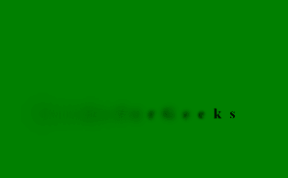

# 如何使用 HTML 和 CSS 创建加载模糊文本动画效果？

> 原文:[https://www . geesforgeks . org/如何创建-加载-模糊-文本-动画-效果-使用-html 和-css/](https://www.geeksforgeeks.org/how-to-create-loading-blur-text-animation-effect-using-html-and-css/)

模糊文本动画被称为烟雾效果，它被用来给我们的文本一个模糊的动画。文本在一个方向上线性模糊，然后重新出现。

**方法:**本文的方法相当简单。我们正在使用[模糊()](https://www.geeksforgeeks.org/css-blur-function/)功能制作模糊效果的动画。然后我们使用第 n 个子属性来应用动画延迟。现在让我们直接进入代码。

**HTML 代码:**我们已经创建了一个 div 元素，加载的文本字符被包装在一个 span 元素中。

```html
<!DOCTYPE html>
<html lang="en">

<head>
    <meta charset="UTF-8" />
    <meta name="viewport" content=
        "width=device-width, initial-scale=1.0" />
    <title>GeeksforGeeks</title>
</head>

<body>
    <div class="geeks">
        <span>G</span>
        <span>e</span>
        <span>e</span>
        <span>k</span>
        <span>s</span>
        <span>f</span>
        <span>o</span>
        <span>r</span>
        <span>G</span>
        <span>e</span>
        <span>e</span>
        <span>k</span>
        <span>s</span>
    </div>
</body>

</html>
```

**CSS 代码:**

*   **步骤-1:** 第一步很简单我们已经将文本对齐到中心，并为我们的身体提供背景。
*   **步骤 2:** 然后我们提供了一个线性动画，其关键帧标识符为*动画*。
*   **步骤-3:** 现在我们使用关键帧对动画的不同帧应用模糊功能。
*   **Step-4:** 最后一步是应用第 n 个子概念，为每个角色提供一个动画延迟，以便在一个时间点只有一个角色变得模糊。

```html
<style>
    body {
        margin: 0;
        padding: 0;
        background: green;
    }

    .geeks {
        position: absolute;
        top: 50%;
        left: 50%;
        transform: translate(-50%, -50%);
        font-size: 30px;
        font-weight: 800;
        letter-spacing: 5px;
    }

    .geeks span {
        animation: animate 3s linear infinite;
    }

    .geeks span:nth-child(1) {
        animation-delay: 0s;
    }

    .geeks span:nth-child(2) {
        animation-delay: 0.1s;
    }

    .geeks span:nth-child(3) {
        animation-delay: 0.2s;
    }

    .geeks span:nth-child(4) {
        animation-delay: 0.3s;
    }

    .geeks span:nth-child(5) {
        animation-delay: 0.4s;
    }

    .geeks span:nth-child(6) {
        animation-delay: 0.5s;
    }

    .geeks span:nth-child(7) {
        animation-delay: 0.6s;
    }

    .geeks span:nth-child(8) {
        animation-delay: 0.9s;
    }

    .geeks span:nth-child(9) {
        animation-delay: 0.8s;
    }

    .geeks span:nth-child(10) {
        animation-delay: 0.9s;
    }

    .geeks span:nth-child(11) {
        animation-delay: 1s;
    }

    .geeks span:nth-child(12) {
        animation-delay: 1.1s;
    }

    .geeks span:nth-child(13) {
        animation-delay: 1.2s;
    }

    @keyframes animate {
        0% {
            filter: blur(0);
        }

        40% {
            filter: blur(20px);
        }

        80% {
            filter: blur(0);
        }

        100% {
            filter: blur(0);
        }
    }
</style>
```

**完整代码:**在本节中，我们将结合以上两个部分来创建加载文本动画效果。

```html
<!DOCTYPE html>
<html lang="en">

<head>
    <meta charset="UTF-8" />
    <meta name="viewport" content=
        "width=device-width, initial-scale=1.0" />

    <title>Document</title>
    <style>
        body {
            margin: 0;
            padding: 0;
            background: green;
        }

        .geeks {
            position: absolute;
            top: 50%;
            left: 50%;
            transform: translate(-50%, -50%);
            font-size: 30px;
            font-weight: 800;
            letter-spacing: 5px;
        }

        .geeks span {
            animation: animate 3s linear infinite;
        }

        .geeks span:nth-child(1) {
            animation-delay: 0s;
        }

        .geeks span:nth-child(2) {
            animation-delay: 0.1s;
        }

        .geeks span:nth-child(3) {
            animation-delay: 0.2s;
        }

        .geeks span:nth-child(4) {
            animation-delay: 0.3s;
        }

        .geeks span:nth-child(5) {
            animation-delay: 0.4s;
        }

        .geeks span:nth-child(6) {
            animation-delay: 0.5s;
        }

        .geeks span:nth-child(7) {
            animation-delay: 0.6s;
        }

        .geeks span:nth-child(8) {
            animation-delay: 0.9s;
        }

        .geeks span:nth-child(9) {
            animation-delay: 0.8s;
        }

        .geeks span:nth-child(10) {
            animation-delay: 0.9s;
        }

        .geeks span:nth-child(11) {
            animation-delay: 1s;
        }

        .geeks span:nth-child(12) {
            animation-delay: 1.1s;
        }

        .geeks span:nth-child(13) {
            animation-delay: 1.2s;
        }

        @keyframes animate {
            0% {
                filter: blur(0);
            }

            40% {
                filter: blur(20px);
            }

            80% {
                filter: blur(0);
            }

            100% {
                filter: blur(0);
            }
        }
    </style>
</head>

<body>
    <div class="geeks">
        <span>G</span>
        <span>e</span>
        <span>e</span>
        <span>k</span>
        <span>s</span>
        <span>f</span>
        <span>o</span>
        <span>r</span>
        <span>G</span>
        <span>e</span>
        <span>e</span>
        <span>k</span>
        <span>s</span>
    </div>
</body>

</html>
```

**输出:**
