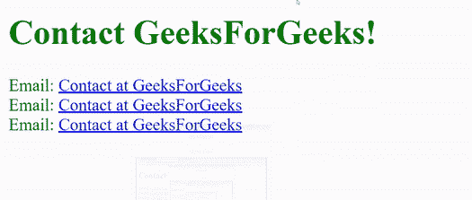
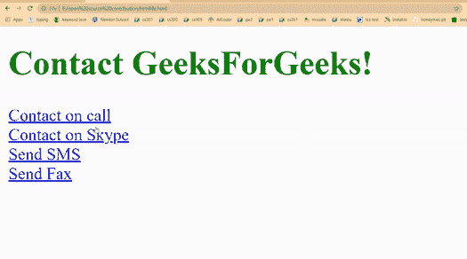

# 如何在 HTML 中创建邮件和电话链接？

> 原文:[https://www . geesforgeks . org/如何创建邮件和电话链接 html/](https://www.geeksforgeeks.org/how-to-create-mail-and-phone-link-in-html/)

在本文中，我们将逐步创建一个 HTML [Mailto](https://www.geeksforgeeks.org/how-to-use-mailto-in-html/) 和调用链接。当用户点击 mailto 链接时，它会在用户的系统中打开一个默认的电子邮件客户端。您可以使用[锚点](https://www.geeksforgeeks.org/html-a-tag/)标签轻松创建这些类型的可点击链接。

**Mailto 链接:**用户可以借助 Mailto 链接轻松联系网站所有者或任何人。Mailto 链接将用户重定向到电子邮件客户端，并创建新邮件，寻址 mailto 链接中的电子邮件。此外，我们可以在 mailto 链接中指定主题和默认正文，这可以节省用户的时间。

**以下查询和参数进入 mailto 链接:**

*   **mailto:** 它接受收件人的电子邮件地址。
*   **cc:** 为可选参数。它接受另一个电子邮件地址，将收到副本。
*   **bcc** :也是可选参数。它接受一个或多个电子邮件地址，这些地址将接收盲复写纸。
*   **主题**:在该参数中，可以指定邮件的默认主题。
*   **正文**:可以设置默认正文。但是，它是可选的。
*   **？**:是第一个参数分隔符。
*   **&** :允许你分离多个查询。

**语法:**

```html
<a href = "mailto:name@gmail.com"> </a>
```

此外，用户可以向 mailto 链接添加默认主题。如果用户想添加更多的信息，如抄送邮件、密件抄送邮件和正文，我们可以很容易地做到这一点。我们必须在用户电子邮件后面加上问号来添加所有查询。如果用户想要添加多个查询，那么他们可以使用&运算符来分隔两个查询。

**示例:**

> [极客办公室联系](”mailto:feedback@geeksforgeeks.org?cc=feedback@xyz.com&bcc=contact@xyz.org&subject=Mail)

## 超文本标记语言

```html
<!--html code to apply mailto link-->
<!DOCTYPE html>
<html>

<head>
    <title>Mailto link</title>
</head>

<body>
    <h1 style="color: Green;">
        Contact GeeksForGeeks!
    </h1>

    <!-- Only user email address added -->
    <label>Email: </label>

    <a href="mailto:feedback@geeksforgeeks.org">
        Contact at GeeksForGeeks
    </a><br />

    <!-- Subject also added user email address -->
    <label>Email: </label>

    <a href="mailto:feedback@geeksforgeeks.org?subject=Mail to GeeksForGeeks"
        target="_blank">
        Contact at GeeksForGeeks
    </a>
    <br />

    <!-- CC and BCC emails added with subject 
        and body text field -->
    <label>Email: </label>

    <a href="mailto:feedback@geeksforgeeks.org?cc=feedback@xyz.com&bcc=contact@xyz.org&subject=Mail to GeeksForGeeks&body=Demo email"
        target="_blank">
        Contact at GeeksForGeeks
    </a>
</body>

</html>
```

**输出:**



**调用链接:**由于我们已经添加了 mailto 链接，我们也可以使用 HTML 锚标签添加调用链接。当用户点击呼叫链接时，它会将用户重定向到默认的呼叫应用程序，该应用程序在呼叫链接中具有所寻址的电话号码。因此，用户不需要拨打电话号码，他们可以通过按呼叫按钮直接拨打电话。

**语法:**

```html
<a href="tel:Number"></a>
```

我们还可以在链接内的电话号码前添加国家代码。

```html
<a href="tel:+91123-456-7890"> call US </a>
```

**不同的呼叫动作:**

*   **电话**–重定向至通话应用。
*   **呼叫**–打开 skype 应用。
*   **短信**–发送短信。
*   **传真**–发送传真。

**示例:**

> [拨打美国](”callto:+91123-456-7890″)
> < a href= "短信:+91123-456-7890 ">拨打美国</a>
> T8】a href = "传真:+91123-456-7890 ">拨打美国< /a >

**示例:**

## 超文本标记语言

```html
<!--html code to apply call link-->
<!DOCTYPE html>
<html>

<head>
    <title>Call link</title>
</head>

<body>
    <h1 style="color: Green;">
        Contact GeeksForGeeks!
    </h1>

    <a href="tel:+91123-456-7890"> 
        Contact on call 
    </a> <br />

    <a href="callto:+91123-456-7890"> 
        Contact on Skype 
    </a> <br />

    <a href="SMS:+91123-456-7890"> 
        Send SMS 
    </a><br />

    <a href="fax:+91123-456-7890"> 
        Send Fax 
    </a><br />
</body>

</html>
```

**输出:**

