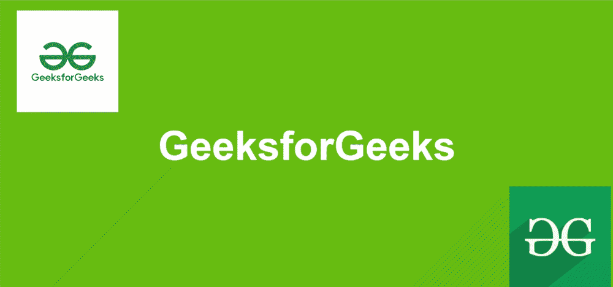

# 如何使用 HTML CSS & Javascript 创建鼠标移动视差效果？

> 原文:[https://www . geesforgeks . org/how-create-mouse move-parallax-effects-use-html-CSS-JavaScript/](https://www.geeksforgeeks.org/how-to-create-mousemove-parallax-effects-using-html-css-javascript/)

在本文中，我们将学习使用 [CSS](https://www.geeksforgeeks.org/css-tutorials/) 和 [JavaScript](https://www.geeksforgeeks.org/javascript-tutorial/) 创建鼠标移动视差效果。在鼠标移动视差效果中，当我们移动光标时，图像会以不同的速度向不同的方向移动。视差效果用于使网站更具吸引力，增加网站的交互性水平。视差效果是一种在不同方向以不同速度滚动或移动前景&背景图像的方式。我们可以使用任何一种组合，即文本和图像或图像和图像，来创建视差效果。

**进场:**

*   在标签中，创建一个标签来分配一些要应用视差效果的图像，为每个负责图像移动量的图像分配一个类名和值属性。
*   对于 CSS 样式，在[样式](https://www.geeksforgeeks.org/html-style-tag/#:~:text=The%20tag%20in%20HTML,font%20family%2C%20font%20color%20etc.)标签中添加一些 CSS 属性，比如图像的位置和大小。
*   我们已经借助 JavaScript 实现了视差效果。在[脚本](https://www.geeksforgeeks.org/html-script-tag/)标签下给出的片段中，我们创建了一个函数 parallax，它使用 [img](https://www.geeksforgeeks.org/html-img-tag/#:~:text=HTML%20tag%20is%20used,holds%20space%20for%20the%20image.) 标签的类名来获取用于定位和移动目的的值。

**示例:**在这一步中，我们将使用上面的方法创建一个 movemouse 视差效果。

## index.html

```html
<!DOCTYPE html>
<html lang="en">
  <head>
    <style>
      * {
        margin: 0;
        padding: 0;
        box-sizing: border-box;
        font-family: sans-serif;
      }
      body {
        background-color: rgb(102, 189, 16);
      }
      .mouse_move {
        position: relative;
        width: 100%;
        height: 100vh;
        overflow: hidden;
        display: flex;
        justify-content: center;
        align-items: center;
      }
      .mouse_move h2 {
        position: relative;
        font-size: 100px;
        color: white;
      }

      .mouse_move img {
        position: absolute;
      }
      #img1 {
        top: 80px;
        left: 80px;
        height: 250px;
        width: 250px;
      }
      #img2 {
        bottom: 80px;
        right: 80px;
        height: 250px;
        width: 250px;
      }
    </style>
    <title>Parallax</title>
  </head>
  <body>
    <div class="mouse_move">
      
      <h2>GeeksforGeeks</h2>
      
    </div>

    <script type="text/javascript">
      document.addEventListener("mousemove", parallax);
      function parallax(event) {
        this.querySelectorAll(".mouse").forEach((shift) => {
          const position = shift.getAttribute("value");
          const x = (window.innerWidth - event.pageX * position) / 90;
          const y = (window.innerHeight - event.pageY * position) / 90;

          shift.style.transform = `translateX(${x}px) translateY(${y}px)`;
        });
      }
    </script>
  </body>
</html>
```

**输出:**



从上面的例子中，您可以看到当我们将光标从一个方向移动到另一个方向时，图像开始浮动或移动。