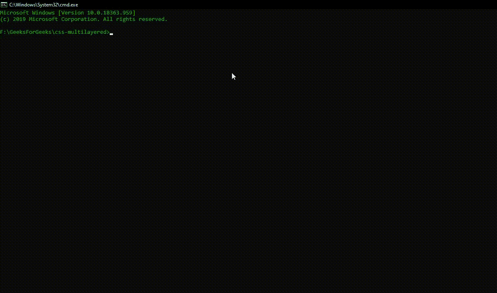

# 如何使用 HTML 和 CSS 创建多层文本效果？

> 原文:[https://www . geeksforgeeks . org/如何使用 html 和 css 创建多层文本效果/](https://www.geeksforgeeks.org/how-to-create-multilayered-text-effect-using-html-and-css/)

**多层文本效果**是网页设计领域使用最多的文本效果之一。作为设计师或前端开发人员，应该知道如何创建多层文本效果。今天我们将看一个最简单的方法来创建多层文本效果。
**方法:**为了达到这个文本效果，我们将使用 [**文本-阴影**](https://www.geeksforgeeks.org/css-shadow-effect/) 属性。同样的方法也用于 [**使用 HTML 和 CSS**](https://www.geeksforgeeks.org/create-a-3d-text-effect-using-html-and-css/) 创建 3D 文本效果。如文章中所述， **CSS** **文本-阴影**属性的妙处在于，该属性可以多次应用于同一 **HTML DOM** 元素，具有不同的厚度、颜色和角度，以实现 3D 外观或多层文本效果。

使用 CSS 的 [**双层文本效果中也介绍了类似的方法。在本教程中，我们将只使用 HTML 和 CSS 为网站实现多层文本效果。我们假设您熟悉 **HTML** 和 **CSS** 规则，并且对 CSS **文本阴影**属性有基本的了解。**](http://geeksforgeeks.org/double-layered-text-effect-using-css/) 

*   **步骤 1:** 使用 [**npm**](https://www.geeksforgeeks.org/node-js-npm-node-package-manager/) 安装 [**浏览器同步**](https://www.browsersync.io/) 。我们将使用**浏览器同步**启动一个服务器，并提供一个网址来查看 HTML 网站、CSS 动画和加载相应的 JavaScript 文件。我们将在全球安装**浏览器同步**。

```html
npm install -g browser-sync

```

*   **步骤 2:** 在项目根文件夹中创建一个**index.html**文件和一个 **index.css** 文件。
    **index.html:** 在该文件中添加以下代码片段:

## 超文本标记语言

```html
<head>
    <title>GeeksForGeeks</title>
    <link rel="stylesheet" href="index.css">
</head>
<body>
    <title>GeeksForGeeks</title>
    <h3>Multilayered Text Effect using CSS</h3>
    <div>Hello Geeks</div>
</body>
```

*   **第三步:**使用 CSS，我们已经将 **div** 元素与屏幕中心对齐，并提供了一些初始背景样式。如上所述，我们简单地使用 CSS 的**文本阴影**属性来应用多层文本效果，如上所述。我们已经将文本效果的每一层都做成可区分的颜色，以便可见。我们可以简单地添加 CSS [**悬停**](https://www.geeksforgeeks.org/css-hover-selector/) 属性，在悬停在 HTML strong div 标签上的同时激活这个文本效果。
    **index.css:**

## 半铸钢ˌ钢性铸铁(Cast Semi-Steel)

```html
div {
    font-size: 12rem;
    text-align: center;
    height: 90vh;
    line-height: 90vh;
    color: green;
    background: white;
    font-family: "Times New Roman", Times, serif;
    font-weight: 700;
    text-shadow: 5px 5px 0px #eb452b, 
                 10px 10px 0px #efa032, 
                 15px 15px 0px #46b59b, 
                 20px 20px 0px #017e7f, 
                 25px 25px 0px #052939, 
                 30px 30px 0px blue, 
                 35px 35px 0px violet, 
                 40px 40px 0px black;
}
```

*   **步骤 4:** 要使用 Browsersync 启动应用程序，请在项目目录中运行以下命令:

```html
browser-sync start --server --files "*"

```

**输出:**这将在**服务器**模式下启动浏览器同步，并按照 ***** 通配符的指定监视目录中所有文件的更改。默认情况下，应用程序将在 **http://localhost:3000/** 启动。

[](https://media.geeksforgeeks.org/wp-content/uploads/20200725233521/Output-1-GIF18.gif)