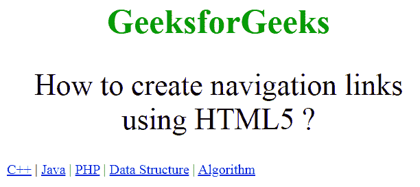

# 如何使用 HTML5 创建导航链接？

> 原文:[https://www . geesforgeks . org/如何创建导航链接-使用-html5/](https://www.geeksforgeeks.org/how-to-create-navigation-links-using-html5/)

在本文中，我们通过使用文档中的 **<导航>** 标签来创建导航链接。**导航**元素表示页面的一部分，其目的是提供当前文档或其他文档的导航链接。“导航”元素中的链接可能指向其他网页或同一网页的不同部分。它是一个语义元素。“导航”元素的常见例子是菜单、表格、内容和索引。

**语法:**

```html
<nav>
    Links...
</nav>

```

**示例:**

```html
<!DOCTYPE html>
<html>

<head>
    <title>
        How to create navigation 
        links using HTML5 ?
    </title>

    <style>
        .gfg {
            font-size: 40px;
            color: #090;
            font-weight: bold;
            text-align: center;
        }

        .nav_tag {
            text-align: center;
            margin: 30px 0;
            font-size: 35px;
        }
    </style>
</head>

<body>
    <div class="gfg">
        GeeksforGeeks
    </div>

    <div class="nav_tag">
        How to create navigation 
        links using HTML5 ?
    </div>

    <nav>
        <a href="#">C++</a> |
        <a href="#">Java</a> |
        <a href="#">PHP</a> |
        <a href="#">Data Structure</a> |
        <a href="#">Algorithm</a>
    </nav>
</body>

</html>
```

**输出:**


**支持的浏览器如下:**

*   谷歌 Chrome
*   微软公司出品的 web 浏览器
*   火狐浏览器
*   苹果 Safari
*   歌剧