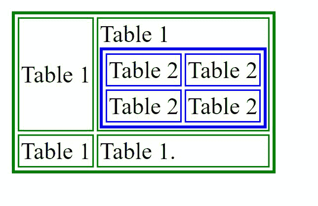
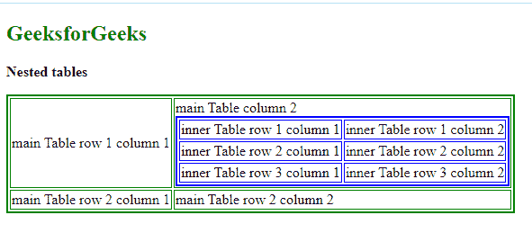

# 如何在 HTML 中的表内创建嵌套表？

> 原文:[https://www . geeksforgeeks . org/如何在 html 中创建嵌套表中的表/](https://www.geeksforgeeks.org/how-to-create-nest-tables-within-tables-in-html/)

[HTML 表格](https://www.geeksforgeeks.org/html-tables/)对于以行和列的形式组织内容非常有帮助。但是有时需要在表中添加一个表。HTML 支持这种功能，被称为表的嵌套。表可以嵌套在一起，在表中创建一个表。

要创建嵌套表，我们需要使用标记创建一个表。这张桌子被称为外桌。将成为嵌套表的第二个表称为内部表。该表也是使用

标签创建的，但是有一件特别的事情必须记住。

**注意:**内桌必须放在< td >之间…..< /td >外桌。

**示例 1:** 下面是创建嵌套表的示例。内表添加到第一个表的第一行的第二列，即外表的< td > … < /td >标签内。表格用不同的颜色绘制，以便读者更好地理解和清楚。*绿色*边框表格代表外部表格，而内部表格有蓝色边框。

## 超文本标记语言

```html
<!DOCTYPE html>
<html>

<body>
    <table border="2" bordercolor="green">
        <tr>
            <td>Table 1</td>
            <td> Table 1
                <table border="2" bordercolor="blue">
                    <tr>
                        <td>Table 2</td>
                        <td>Table 2</td>
                    </tr>
                    <tr>
                        <td> Table 2 </td>
                        <td>Table 2</td>
                    </tr>
                </table>
            </td>
        </tr>
        <tr>
            <td> Table 1 </td>
            <td> Table 1\. </td>
        </tr>
    </table>
</body>

</html>
```

**输出:**



**例 2:** 为了更好理解，对上面的例子做了一点修改。

## 超文本标记语言

```html
<!DOCTYPE html>
<html>

<body>
    <h2 style="color:green">GeeksforGeeks</h2>
    <p><b>Nested tables</b></p>

    <table border="2" bordercolor="green">
        <tr>
            <td>main Table row 1 column 1</td>
            <td>main Table column 2
                <table border="2" bordercolor="blue">
                    <tr>
                        <td>inner Table row 1 column 1</td>
                        <td>inner Table row 1 column 2</td>
                    </tr>
                    <tr>
                        <td>inner Table row 2 column 1 </td>
                        <td>inner Table row 2 column 2</td>
                    </tr>
                    <tr>
                        <td>inner Table row 3 column 1 </td>
                        <td>inner Table row 3 column 2</td>
                    </tr>
                </table>
            </td>
        </tr>
        <tr>
            <td> main Table row 2 column 1 </td>
            <td> main Table row 2 column 2 </td>
        </tr>
    </table>
</body>

</html>
```

**输出:**



**注意:**嵌套表的加载速度可能会很慢，对布局有限制，并且会妨碍网页的灵活性和功能性。从搜索引擎优化的角度来看，它们不太受推荐。