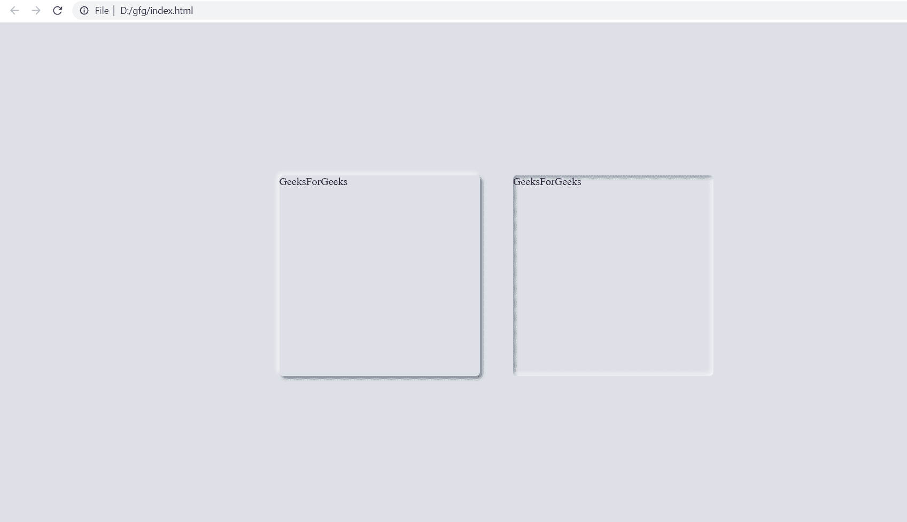

# 如何使用 HTML 和 CSS 创建神经形态效果？

> 原文:[https://www . geeksforgeeks . org/how-create-neu morphism-effect-use-html-and-CSS/](https://www.geeksforgeeks.org/how-to-create-neumorphism-effect-using-html-and-css/)

**新变形**(新变形)是一种设计任何网页的网页元素并提供 3D 效果的现代方式。这种动画效果可以通过使用 HTML 和 CSS 轻松生成。CSS 的阴影属性可以用来实现神经变形。它用于在给定元素的一侧添加深色阴影，在另一侧添加浅色阴影。

**HTML 代码:**在这一节中我们将进行盒子的布局。

*   **index.html:**

## 超文本标记语言

```html
<!DOCTYPE html>
<html lang="en">

<head>
    <meta charset="utf-8">
</head>

<body>
    <div class="container">
        <div class="neu-1"> GeeksForGeeks</div>
        <div class="neu-2">GeeksForGeeks</div>
    </div>
</body>

</html>
```

**CSS 代码:**在本节中，我们将使用一些 CSS 属性来设计盒子。

*   **index.css:**

## 超文本标记语言

```html
<style>
  *{
    padding: 0;
    margin: 0;
    box-sizing: border-box;
  }
  .container {
    height: 100vh;
    display: flex;
    flex-direction: row;
    justify-content: center;
    align-items: center;
    padding: 30px;
    background: #dde1e7;
  }
  .neu-1 {
    height: 300px;
    width: 300px;
    background: #dde1e7;
    border-radius: 6px;
    box-shadow: -3px -3px 7px #ffffffb2, 
                  3px 3px 5px rgba(94, 104, 121, 0.945);
  }
  .neu-2 {
    margin: 50px;
    height: 300px;
    width: 300px;
    background: #dde1e7;
    border-radius: 6px;
    box-shadow: inset -3px -3px 7px #ffffffb0, 
       inset 3px 3px 5px rgba(94, 104, 121, 0.692);
  }
</style>
```

**完整代码:**在这一节中，我们将结合上面两个小节，使用 HTML 和 CSS 创建一个新形态。

## 超文本标记语言

```html
<!DOCTYPE html>
<html lang="en" dir="ltr">

<head>
  <meta charset="utf-8">

  <style>
      *{
        padding: 0;
        margin: 0;
        box-sizing: border-box;
      }
      .container {
        height: 100vh;
        display: flex;
        flex-direction: row;
        justify-content: center;
        align-items: center;
        padding: 30px;
        background: #dde1e7;
      }
      .neu-1 {
        height: 300px;
        width: 300px;
        background: #dde1e7;
        border-radius: 6px;
        box-shadow: -3px -3px 7px #ffffffb2, 
         3px 3px 5px rgba(94, 104, 121, 0.945);
      }
      .neu-2 {
        margin: 50px;
        height: 300px;
        width: 300px;
        background: #dde1e7;
        border-radius: 6px;
        box-shadow: inset -3px -3px 7px #ffffffb0, 
         inset 3px 3px 5px rgba(94, 104, 121, 0.692);
      }
  </style> 
</head>

<body>
    <div class="container">
        <div class="neu-1"> GeeksForGeeks</div>
        <div class="neu-2">GeeksForGeeks</div>
    </div>
</body>

</html>
```

**输出:**

