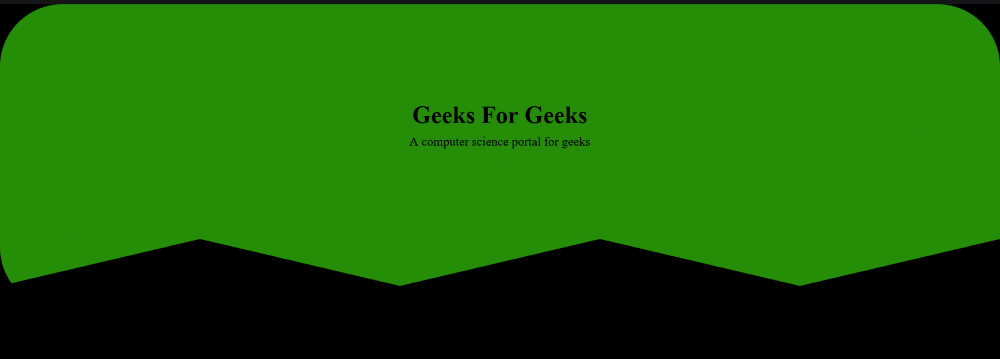

# 如何用 HTML & CSS 创建非矩形表头？

> 原文:[https://www . geesforgeks . org/如何创建非矩形标题-使用-html-css/](https://www.geeksforgeeks.org/how-to-create-non-rectangular-header-using-html-css/)

在本文中，我们将使用 [HTML](https://www.geeksforgeeks.org/html-tutorials/) 和 [CSS](https://www.geeksforgeeks.org/css-tutorials/) 的基础知识创建一个非矩形标题。



**进场:**

*   使用[*<>*](https://www.geeksforgeeks.org/html-5-header-tag/)标签创建表头。
*   创建一个 [*div*](https://www.geeksforgeeks.org/div-tag-html/) 为表头添加内容。
*   使用[剪辑路径()](https://www.geeksforgeeks.org/css-clip-path-property/)功能为标题赋予特定的形状。

**HTML 代码:**

*   创建一个 HTML 文件。
*   链接在 HTML 上提供所有动画效果的 CSS 文件。CSS 文件链接在网页的头部。
*   来到我们的 HTML 代码的主体部分。
    *   创建标题标签。
    *   创建一个 [*div*](https://www.geeksforgeeks.org/div-tag-html/) 标签，并为其分配类。
    *   在特定的*分区*中添加标题和段落。

## 超文本标记语言

```html
<!DOCTYPE html>
<html lang="en">

<head>
    <title>Document</title>
    <link rel="stylesheet" href="style.css">
</head>

<body>
    <header>
        <div class="main_box">
            <h1>Geeks For Geeks</h1>
            <p>A computer science portal for geeks</p>
        </div>
    </header>
</body>

</html>
```

**CSS 代码:**以下代码添加在“*style . CSS”*文件中，用于 HTML 代码中。CSS 用于给 HTML 页面提供不同类型的动画和效果，以便所有用户都可以交互。

*   恢复所有浏览器效果。
*   使用类和 id 给 HTML 元素赋予效果。
*   使用 CSS [剪辑路径()](https://www.geeksforgeeks.org/css-clip-path-property/)功能为标题赋予特定的形状。

## style.css

```html
*{
    margin: 0;
    padding: 0;
    box-sizing: border-box;
}

body{
    background-color: #000;
}

header{
    height: 65vh;
    background-color: rgb(37, 142, 8);
    clip-path:
    polygon(0 0, 100% 0, 100% 50vh, 
        80% 60vh, 60% 50vh, 40% 60vh, 
        20% 50vh, 0 60vh);
    border-radius: 10em;
}

.main_box{
    position: absolute;
    top: 25%;
    left: 50%;
    text-align: center;
    transform: translate(-50%,-50%);
}

h1{
    font-size: 3.85em;
    margin: 0.25em;
}

p{
    font-size: 2em;
}
```

将上面两段代码(HTML 和 CSS)结合起来，在浏览器上运行。

**输出:**

