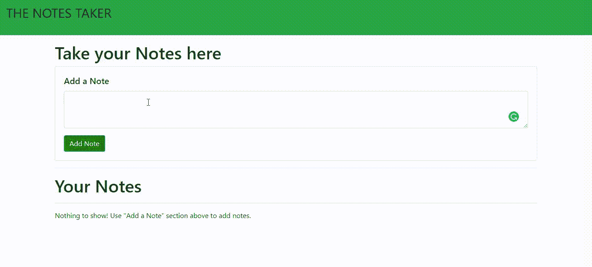

# 如何使用 HTML、Bootstrap 和 JavaScript 创建笔记网站？

> 原文:[https://www . geesforgeks . org/how-create-notes-site-use-html-bootstrap-and-JavaScript/](https://www.geeksforgeeks.org/how-to-create-notes-taking-site-using-html-bootstrap-and-javascript/)

我们将制作一个网站，记录我们的笔记，并保存下来，以备将来使用。

**先决条件:**

*   对 [HTML](https://www.geeksforgeeks.org/html-tutorials/) 、 [Bootstrap](https://www.geeksforgeeks.org/bootstrap-tutorials/) 、 [JavaScript](https://www.geeksforgeeks.org/javascript-tutorial/) 的基本了解。

**进场:**

*   **HTML:** 我们将使用 HTML 创建网站的基本框架。
*   **Bootstrap:** 相比 CSS，让我们的工作更轻松。所以我们使用了 Bootstrap 来美化我们的框架。
*   **JavaScript:** 保存笔记并删除笔记的基本逻辑在 index.js 文件内部。

**示例:**这里我们首先设计项目的结构，然后我们将为功能进行编码。

## index.html

```html
<!DOCTYPE html>
<html lang="en">

<head>
    <link rel="stylesheet" href=
"https://stackpath.bootstrapcdn.com/bootstrap/4.3.1/css/bootstrap.min.css"
        integrity=
"sha384-ggOyR0iXCbMQv3Xipma34MD+dH/1fQ784/j6cY/iJTQUOhcWr7x9JvoRxT2MZw1T"
        crossorigin="anonymous">

    <script src=
"https://code.jquery.com/jquery-3.3.1.slim.min.js" integrity=
"sha384-q8i/X+965DzO0rT7abK41JStQIAqVgRVzpbzo5smXKp4YfRvH+8abtTE1Pi6jizo"
        crossorigin="anonymous">
    </script>

    <script src=
"https://cdnjs.cloudflare.com/ajax/libs/popper.js/1.14.7/umd/popper.min.js"
        integrity=
"sha384-UO2eT0CpHqdSJQ6hJty5KVphtPhzWj9WO1clHTMGa3JDZwrnQq4sF86dIHNDz0W1"
        crossorigin="anonymous">
    </script>

    <script src=
"https://stackpath.bootstrapcdn.com/bootstrap/4.3.1/js/bootstrap.min.js"
        integrity=
"sha384-JjSmVgyd0p3pXB1rRibZUAYoIIy6OrQ6VrjIEaFf/nJGzIxFDsf4x0xIM+B07jRM"
        crossorigin="anonymous">
    </script>
</head>

<body>
    <nav class="navbar navbar-expand-lg 
                navbar-light bg-success">
        <a class="navbar-brand" href="#">
            <p style="font-size: 30px;">
                THE NOTES TAKER
            </p>

        </a>
    </nav>

    <div class="container my-3">
        <h1>Take your Notes here</h1>
        <div class="card">
            <div class="card-body">
                <h5 class="card-title">
                    Add a Note

                </h5>
                <div class="form-group">
                    <textarea class="form-control" 
                        id="addTxt" rows="3">
                    </textarea>
                </div>
                <button class="btn btn-primary" 
                    id="addBtn" style=
                    "background-color:green">
                    Add Note
                </button>
            </div>
        </div>
        <hr>
        <h1>Your Notes</h1>
        <hr>

        <div id="notes" class=
            "row container-fluid"> 
        </div>
    </div>

    <script src="gfg.js"></script>
</body>

</html>
```

## index.js

```html
showNotes();

// If user adds a note, add it to the localStorage
let addBtn = document.getElementById("addBtn");
addBtn.addEventListener("click", function(e) {
    let addTxt = document.getElementById("addTxt");
    let notes = localStorage.getItem("notes");

    if (notes == null) notesObj = [];
    else notesObj = JSON.parse(notes);

    notesObj.push(addTxt.value);
    localStorage.setItem("notes", JSON.stringify(notesObj));
    addTxt.value = "";

    showNotes();
});

// Function to show elements from localStorage
function showNotes() {
    let notes = localStorage.getItem("notes");

    if (notes == null) notesObj = [];
    else notesObj = JSON.parse(notes);

    let html = "";

    notesObj.forEach(function(element, index) {
        html += `<div class="noteCard my-2 mx-2 card" 
            style="width: 18rem;">
                <div class="card-body">
                    <h5 class="card-title">
                        Note ${index + 1}
                    </h5>
                    <p class="card-text"> 
                        ${element}
                    </p>

                  <button id="${index}" onclick=
                    "deleteNote(this.id)"
                    class="btn btn-primary">
                    Delete Note
                </button>
            </div>
        </div>`;
    });

    let notesElm = document.getElementById("notes");

    if (notesObj.length != 0) notesElm.innerHTML = html;
    else
        notesElm.innerHTML = `Nothing to show! 
        Use "Add a Note" section above to add notes.`;
}

// Function to delete a note
function deleteNote(index) {
    let notes = localStorage.getItem("notes");

    if (notes == null) notesObj = [];
    else notesObj = JSON.parse(notes);

    notesObj.splice(index, 1);

    localStorage.setItem("notes", 
        JSON.stringify(notesObj));

    showNotes();
}
```

**输出:**

