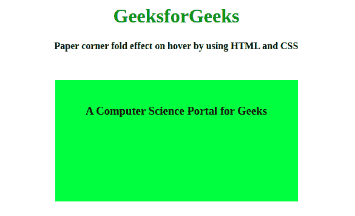
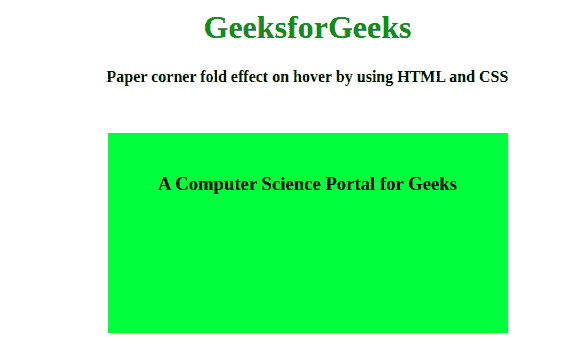

# 如何利用 HTML 和 CSS 在悬停时创建纸角折叠效果？

> 原文:[https://www . geeksforgeeks . org/如何使用 html 和 css 创建纸角折叠悬停效果/](https://www.geeksforgeeks.org/how-to-create-paper-corner-fold-effect-on-hover-by-using-html-and-css/)



折叠效果在网站上很有吸引力，可能你在一些网站上看到过，当你把鼠标悬停在页面布局上时，它会折叠在角落里。折叠角效果只用 HTML 和 CSS 就可以实现。以下部分将指导您如何创建动画。在本文中，我们将把文章分为两个部分，第一部分我们将创建基本结构。在第二部分，我们将装饰结构。
**创建结构:**在本节中，我们将只使用 HTML 来创建结构，其中我们将使用折角效果。

*   **HTML 代码:**在这一节中，我们将使用 [**div**](https://www.geeksforgeeks.org/div-tag-html/) 标签创建一个基本的 div，并给它一个类名。

## 超文本标记语言

```html
<!DOCTYPE html>
<html lang="en" dir="ltr">

<head>
    <meta charset="utf-8">
    <title>
        Paper corner fold effect on hover
        by using HTML and CSS
    </title>
</head>

<body>
    <center>
        <h1>
            GeeksforGeeks
        </h1>
        <b>
            Paper corner fold effect on hover
            by using HTML and CSS
        </b>
        <div class="Fold">
            <h3>
            A Computer Science Portal for Geeks</h3>
        </div>
    </center>
</body>

</html>                   
```

**设计结构:**在本节中，我们将只使用 CSS 来装饰上一节中已经创建的结构。

*   **CSS 代码:**在这一节中，我们将首先对没有折叠效果的基本 div 元素进行样式化，然后为了创建折叠效果，我们将使用 [**CSS::在**](https://www.geeksforgeeks.org/css-after-selector/) 伪元素之后。它将位于 div 框的右上角，顶部和右边框被设置为与父 div 元素的背景颜色相匹配的颜色。然后给左边框和下边框一个较暗的 div 背景色，我们也将使用**悬停**选择器来创建当我们将鼠标悬停在框上时的折叠效果。

## 半铸钢ˌ钢性铸铁(Cast Semi-Steel)

```html
<style>
        h1 {
            color: green;
        }

        .Fold {
            position: absolute;
            left: 50%;
            top: 55%;
            transform: translate(-50%, -50%);
            width: 400px;
            height: 200px;
            background-color: #4EE73C;
        }

        h3 {
            margin: 20px;
            padding: 20px;
        }

        .Fold:after {
            position: absolute;
            content: '';
            right: 0;
            top: 0;
        }

        .Fold:hover:after {
            transition-duration: 1s;
            border-bottom: 50px solid black;
            border-right: 50px solid white;
        }
</style>
```

**最终解决方案:**它是上面两个编码部分的组合，y 结合上面的部分我们已经在悬停时创建了一个折叠角效果。

## 超文本标记语言

```html
<!DOCTYPE html>
<html lang="en" dir="ltr">

<head>
    <meta charset="utf-8">
    <title>
        Paper corner fold effect on hover
        by using HTML and CSS
    </title>
    <style>
        h1 {
            color: green;
        }

        .Fold {
            position: absolute;
            left: 50%;
            top: 55%;
            transform: translate(-50%, -50%);
            width: 400px;
            height: 200px;
            background-color: #4EE73C;
        }

        h3 {
            margin: 20px;
            padding: 20px;
        }

        .Fold:after {
            position: absolute;
            content: '';
            right: 0;
            top: 0;
        }

        .Fold:hover:after {
            transition-duration: 1s;
            border-bottom: 50px solid black;
            border-right: 50px solid white;
        }
    </style>
</head>

<body>
    <center>
        <h1>
            GeeksforGeeks
        </h1>
        <b>
            Paper corner fold effect on hover
            by using HTML and CSS
        </b>
        <div class="Fold">
            <h3>
            A Computer Science Portal for Geeks</h3>
        </div>
    </center>
</body>

</html>
```

**输出:**

