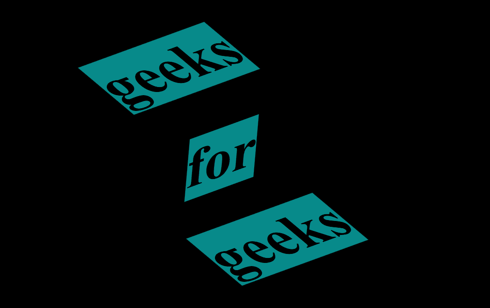

# 如何使用 HTML & CSS 创建透视文本？

> 原文:[https://www . geesforgeks . org/how-to-create-perspective-text-use-html-CSS/](https://www.geeksforgeeks.org/how-to-create-perspective-text-using-html-css/)

在这篇文章中，我们将在主图像下面创建一个图像错觉。这是一篇简单的文章，我们只有使用 HTML & CSS 才能达到我们的目标。



**方法:**创建一个主 div，其中我们添加了一个标题标签，然后使用 CSS 中的选择器来创建效果。

**HTML 代码:**

1.  首先，我们创建一个 HTML 文件(index.html)。
2.  创建完 HTML 文件后，我们将使用<title>标签为我们的网页赋予标题。应该放在标签里面。</title>
3.  然后我们将提供所有动画效果的 CSS 文件链接到我们的 html。也放在标签里面。
4.  来到我们的 HTML 代码的主体部分。
    1.  首先，我们给出我们页面的标题。
    2.  在标题内创建 3 个跨度来存储数据。

## 超文本标记语言

```html
<!DOCTYPE html>
<html lang="en">
<head>
    <link rel="stylesheet" href="style.css">
</head>
<body>
    <h1>
        <span>geeks</span>
        <span>for</span>
        <span>geeks</span>
    </h1>
</body>
</html>
```

**CSS 代码:** CSS 用来给我们的 HTML 页面赋予不同类型的动画和效果，让所有用户看起来都是交互式的。在 CSS 中，我们要记住以下几点——

*   恢复所有浏览器效果。
*   使用类和 id 给 HTML 元素赋予效果。
*   使用选择器选择不同的元素！

## 半铸钢ˌ钢性铸铁(Cast Semi-Steel)

```html
*{
    margin: 0;
    padding: 0;
    box-sizing: border-box;
}

body{
    height: 100vh;
    margin: 0;
    display: flex;
    justify-content: center;
    align-items: center;
    background: #000;
    color: teal;
}

h1{
    width: 3em;
    height: 1em;
    font-size: 6em;
    position: relative;
    white-space: nowrap;
    color: transparent;
}

h1 span{
    position: absolute;
    background-color: rgb(7, 138, 138);
    color: #000;
}

span:nth-child(odd){
    transform: skew(50deg,-20deg) scaleY(0.75);
}

span:nth-child(even){
    transform: skew(-5deg,-20deg);
}

span:nth-child(1){
    bottom: 1em;
    left: 0.5em;
}
span:nth-child(2){
    top: 0.5em;
    left: 2em;
}

span:nth-child(3){
    top: 2em;
    left: 2.5em;
}
```

**输出:**

