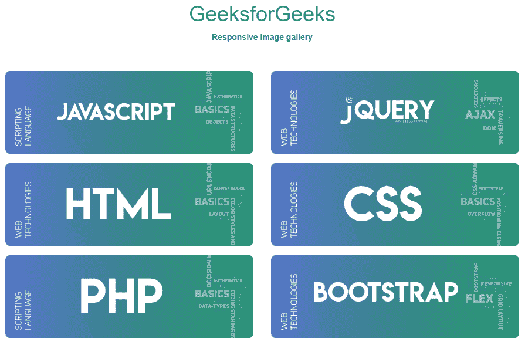

# 如何使用 HTML、CSS、jQuery 和 Bootstrap 创建响应性的图片库？

> 原文:[https://www . geesforgeks . org/how-create-responsive-image-gallery-use-html-CSS-jquery-and-bootstrap/](https://www.geeksforgeeks.org/how-to-create-responsive-image-gallery-using-html-css-jquery-and-bootstrap/)


随着 web 技术中新框架的出现，设计和实现功能丰富且响应迅速的网页变得相当容易。在这里，我们将使用 HTML、CSS、jQuery 和 Bootstrap 设计一个响应性的图像库。

**要实现的特性或功能:**

*   响应图像
*   响应网格系统
*   图像查看器

**先决条件:**基本知识**[HTML](https://www.geeksforgeeks.org/html-tutorials/)****[CSS](https://www.geeksforgeeks.org/css-tutorials/)****[JavaScript](https://www.geeksforgeeks.org/javascript-tutorial/)****[jQuery](https://www.geeksforgeeks.org/jquery-tutorials/)**和 **[Bootstrap](https://www.geeksforgeeks.org/bootstrap-tutorials/)** 。另外，用户应该知道 Bootstrap 中的 **[网格系统是如何工作的。](https://www.geeksforgeeks.org/bootstrap-4-grid-system/)**

我们将把完整的解决方案分成三个不同的部分。在第一部分中，我们将为画廊创建结构。在第二部分，我们将使用 CSS 设计图库。并且在最后一部分将使它可以响应用户的交互。

**创建结构:**初始化 HTML 布局和响应图像，但是我们将通过 jQuery 以数组格式附加图像。

*   **HTML Code:**

    ```html
    <!DOCTYPE html>
    <html>
    <meta charset="utf-8">

    <head>

        <link rel="stylesheet" href=
    "https://maxcdn.bootstrapcdn.com/bootstrap/3.4.1/css/bootstrap.min.css">
        <script src=
    "https://ajax.googleapis.com/ajax/libs/jquery/3.4.1/jquery.min.js">
        </script>
        <script src=
    "https://maxcdn.bootstrapcdn.com/bootstrap/3.4.1/js/bootstrap.min.js">
        </script>
    </head>
    <body>
        <br>
        <br>
        <center>
            <h1 class="text text-success">GeeksforGeeks</h1>
            <b>Responsive image gallery</b>
        </center>
        <br>
        <br>
        <div class="container-fluid">
            <center>
                <div id=gallery>

                    <!-- Content is appended here -->
                </div>
            </center>

            <!-- Modal -->
            <div class="modal fade" id="myModal" role="dialog">
                <div class="modal-dialog">

                    <!-- Modal content-->
                    <div class="modal-content">
                        <div class="modal-header">
                            <button type="button" class="close" 
                                    data-dismiss="modal">
                              ×
                            </button>

                        </div>
                        <div class="modal-body">
                        </div>
                        <div class="modal-footer">

                        </div>
                    </div>
                </div>
          </div>
      </div>

    </body>

    </html>
    ```

    **设计结构:**我们将根据项目的需求添加 CSS 属性。

    *   **CSS 代码:**

        ```html
        <style>

            img {
                border-radius: 8px;
            }

            .container-fluid {
                margin-left: 12px;
                margin-right: 12px
            }

            .contain {
                padding-top: 8px;
                padding-bottom: 8px;
            }
        </style>
        ```

    *   **Bootstrap 代码:**我们将使用 Bootstrap 模态作为图像查看器，并根据我们的要求进行相应的修改。我们将使模态透明的所有不必要的组件。请记住，我们在模态中附加了图像，所以我们需要使用 **on()方法**来附加这些选择器的功能。

        ```html
        <style>
            /* For overriding box-shadow and other default
               effects of modal and it's children */
            .modal,
            .modal-content,
            .modal-header,
            .modal-footer {
                background-color: transparent;
                border: 0px;
                color: white;

                /* Disable box shadow for different browsers */
                -webkit-box-shadow: 0px 0px 0px 0px rgba(255, 255, 255, 1);
                -moz-box-shadow: 0px 0px 0px 0px rgba(255, 255, 255, 1);
                box-shadow: 0px 0px 0px 0px rgba(255, 255, 255, 1);
            }

            .modal-dialog {
                width: 100%;
                height: 50%;
                margin-top: 8px;
            }

            .close {
                color: white;
                opacity: 0.8;
            }

            .modal-body {
                height: 75%;
            }
        </style>
        ```

    **响应部分:**在这个部分我们将为响应图库附加所有图像，使它们响应用户。下面是我们将用于在图像库中显示图像的网格排列。因为班级用的是 **col-sm-6 col-md-2** 。逻辑是中屏断点 2 格，大断点 6 格。每当内容重叠时，它们也会进一步划分，从而呈现为单个网格。

    *   **jQuery 代码:**下面是这样追加的脚本。我们假设我们从服务器获取图像(作为 JavaScript 中图像 URL 的数组)。现在，我们将相应地在页面的内容面板中添加图像。下面是同样的

        ```html
        <script>

              // Taking Array of Image Addresses 
              // Suppose it as information from the server
              // Modify this for different address
              a = [
        'https://www.geeksforgeeks.org/wp-content/uploads/javascript.png',
        'https://www.geeksforgeeks.org/wp-content/uploads/jquery-banner.png',
        'https://www.geeksforgeeks.org/wp-content/uploads/html-768x256.png',
        'https://www.geeksforgeeks.org/wp-content/uploads/CSS-768x256.png',
        'https://www.geeksforgeeks.org/wp-content/uploads/php-1-768x256.png',
        'https://media.geeksforgeeks.org/wp-content/uploads/20200130114942/bootstrap4.png'
              ];
              var x = 0;
              for (var i = 0; x < a.length; i++) {
                  var append = "<div class='row'>";
                  for (var j = 0; j < 6 && x < a.length; j++) {
                      append += `
              <div class="contain col-sm-6 col-md-2">
                
              </div>
              `;
                  }
                  append += '</div>';
                  appender(append);
              }

              // Function to append the data
              function appender(x) {
                  $('#gallery').html(function(i, original_html) {
                      return (original_html + x);
                  });
              }

              // For Image Modal
              $(document).on('click', 'img', function() {
                  imgAddr = $(this).attr('src');
                  data = "<center>";
                  $('#myModal').find('.modal-body').html(data);
                  $('#myModal').modal();
              });
          </script>
        ```

        的实现

    **最终解决方案:**这是以上三段的组合，这是完整的响应式图库代码。

    *   **代码:**

        ```html
        <!DOCTYPE html>
        <html>
        <meta charset="utf-8">

        <head>

            <link rel="stylesheet" href=
        "https://maxcdn.bootstrapcdn.com/bootstrap/3.4.1/css/bootstrap.min.css">
            <script src=
        "https://ajax.googleapis.com/ajax/libs/jquery/3.4.1/jquery.min.js">
            </script>
            <script src=
        "https://maxcdn.bootstrapcdn.com/bootstrap/3.4.1/js/bootstrap.min.js">
            </script>
        </head>
        <style>

            img {
                border-radius: 8px;
            }

            .container-fluid {
                margin-left: 12px;
                margin-right: 12px
            }

            .contain {
                padding-top: 8px;
                padding-bottom: 8px;
            }

            /* For overriding box-shadow and other default
               effects of modal and it's children */
            .modal,
            .modal-content,
            .modal-header,
            .modal-footer {
                background-color: transparent;
                border: 0px;
                color: white;

                /* Disable box shadow for different browsers */
                -webkit-box-shadow: 0px 0px 0px 0px rgba(255, 255, 255, 1);
                -moz-box-shadow: 0px 0px 0px 0px rgba(255, 255, 255, 1);
                box-shadow: 0px 0px 0px 0px rgba(255, 255, 255, 1);
            }

            .modal-dialog {
                width: 100%;
                height: 50%;
                margin-top: 8px;
            }

            .close {
                color: white;
                opacity: 0.8;
            }

            .modal-body {
                height: 75%;
            }
        </style>

        <body>
            <br>
            <br>
            <center>
                <h1 class="text text-success">GeeksforGeeks</h1>
                <b>Responsive image gallery</b>
            </center>
            <br>
            <br>
            <div class="container-fluid">
                <center>
                    <div id=gallery>

                        <!-- Content is appended here -->
                    </div>
                </center>

                <!-- Modal -->
                <div class="modal fade" id="myModal" role="dialog">
                    <div class="modal-dialog">

                        <!-- Modal content-->
                        <div class="modal-content">
                            <div class="modal-header">
                                <button type="button" class="close" 
                                        data-dismiss="modal">
                                  ×
                                </button>

                            </div>
                            <div class="modal-body">
                            </div>
                            <div class="modal-footer">

                            </div>
                        </div>
                    </div>
              </div>
          </div>
          <script>

              // Taking Array of Image Addresses 
              // Suppose it as information from the server
              // Modify this for different address
              a = [
        'https://www.geeksforgeeks.org/wp-content/uploads/javascript.png',
        'https://www.geeksforgeeks.org/wp-content/uploads/jquery-banner.png',
        'https://www.geeksforgeeks.org/wp-content/uploads/html-768x256.png',
        'https://www.geeksforgeeks.org/wp-content/uploads/CSS-768x256.png',
        'https://www.geeksforgeeks.org/wp-content/uploads/php-1-768x256.png',
        'https://media.geeksforgeeks.org/wp-content/uploads/20200130114942/bootstrap4.png'
              ];
              var x = 0;
              for (var i = 0; x < a.length; i++) {
                  var append = "<div class='row'>";
                  for (var j = 0; j < 6 && x < a.length; j++) {
                      append += `
              <div class="contain col-sm-6 col-md-2">
                  
              </div>
              `;
                  }
                  append += '</div>';
                  appender(append);
              }

              // Function to append the data
              function appender(x) {
                  $('#gallery').html(function(i, original_html) {
                      return (original_html + x);
                  });
              }

              // For Image Modal
              $(document).on('click', 'img', function() {
                  imgAddr = $(this).attr('src');
                  data = "<center>";
                  $('#myModal').find('.modal-body').html(data);
                  $('#myModal').modal();
              });
          </script>
        </body>

        </html>
        ```

    *   **输出:**
        