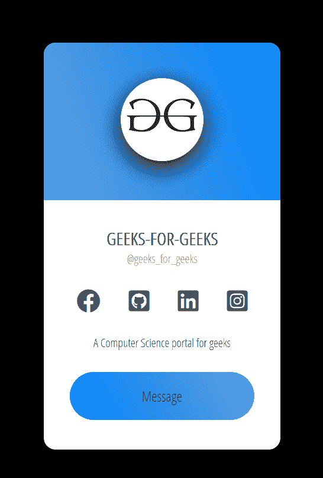
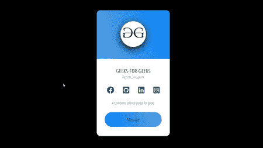

# 如何使用 HTML 和 CSS 创建响应性个人资料卡？

> 原文:[https://www . geesforgeks . org/how-create-responsive-profile-card-use-html-and-CSS/](https://www.geeksforgeeks.org/how-to-create-responsive-profile-card-using-html-and-css/)

在本文中，我们将创建一个配置文件卡，用户可以从中查看其他用户的基本详细信息，并通过不同的句柄与他们连接，还可以向用户发送消息。



**进场:**

*   首先，我们创建一个 HTML 文件，在其中我们做以下事情:
    *   创建一个包含所有信息的容器。
    *   添加用户的个人资料图片。
    *   添加不同社交媒体句柄的链接。
    *   添加消息按钮。
*   然后，我们创建一个 CSS 文件，其中我们为我们的 HTML 标签应用不同类型的样式属性。
*   最后，我们使用 HTML 头部的链接标签将我们的 CSS 文件链接到 HTML 文件。

**HTML 代码:**

1.  首先，我们创建一个 HTML 文件(index.html)。
2.  创建完 HTML 文件后，我们将使用<title>标签为我们的网页赋予标题。应该是<br/>放置在<头>标签之间。</title>
3.  然后，我们将提供所有动画效果的 css 文件链接到我们的 html。这也放在标签之间。
4.  现在我们从谷歌字体添加一个链接，在我们的项目中使用不同类型的字体系列。
5.  **来到我们 HTML 代码的主体部分。**
    1.  创建一个 div，我们可以在其中存储所有的图像，链接，按钮，标题和段落。
    2.  然后我们创建一个 div，在其中添加用户的图像。
    3.  创建了另一个 div，在这个 div 中，我们必须添加以下标签:
        1.  添加标题标签来存储用户的姓名。
        2.  添加一个段落标签来存储用户的用户名。
        3.  然后我们添加了一些社交媒体链接，这样就可以与这个特定的用户连接。
        4.  最后，我们创建了一个链接，用于使用消息服务连接其他人。

## 超文本标记语言

```html
<!DOCTYPE html>
<html lang="en">

<head>
    <link rel="stylesheet" href="style.css">
    <link rel="preconnect"
        href="https://fonts.gstatic.com">
    <link href=
"https://fonts.googleapis.com/css2?family=Open+Sans+Condensed:wght@300&display=swap"
        rel="stylesheet">
</head>

<body>
    <div class="container">
        <div class="user-image">
            
        </div>

        <div class="content">
            <h3 class="name">Geeks-For-Geeks</h3>
            <p class="username">@geeks_for_geeks</p>

            <div class="links">
                <a class="facebook" href=
"https://www.facebook.com/geeksforgeeks.org/"
                    target="_blank" title="GFG_facebook">
                    <i class="fab fa-facebook"></i>
                </a>

                <a class="git" href=
"https://github.com/topics/geeksforgeeks"
                    title="GFG_github" target="_blank">
                    <i class="fab fa-github-square"></i>
                </a>

                <a class="linkedin" href=
"https://www.geeksforgeeks.org/tag/linkedin/"
                    title="GFG_linkedin" target="_blank">
                    <i class="fab fa-linkedin"></i>
                </a>

                <a class="insta" href=
"https://www.instagram.com/geeks_for_geeks/?hl=en"
                    target="_blank" title="GFG_instagram">
                    <i class="fab fa-instagram-square"></i>
                </a>
            </div>

            <p class="details">
                A Computer Science portal for geeks
            </p>

            <a class="effect effect-4" href="#">
                Message
            </a>
        </div>
    </div>

    <!-- This is link of adding small images
         which are used in the link section  -->
    <script src="https://kit.fontawesome.com/704ff50790.js"
        crossorigin="anonymous">
    </script>
</body>

</html>
```

**CSS 代码:** CSS 用来给我们的 HTML 页面赋予不同类型的动画和效果，让所有用户看起来都是交互式的。

在 CSS 中，我们要提醒以下几点-

*   恢复所有浏览器效果。
*   使用类和 id 给 HTML 元素赋予效果。
*   使用 CSS 的第 n 个子选择器特性来调用不同的链接。

## 半铸钢ˌ钢性铸铁(Cast Semi-Steel)

```html
*{
    margin: 0;
    padding: 0;
    box-sizing: border-box;
}

/* Assigning all the same properties to the body */
body{
    height: 100vh;
    display: flex;
    justify-content: center;
    background-color: rgb(0, 0, 0);
    align-items: center;
}

.container{
    width: 20em;
    background-color: rgb(255, 255, 255);
    overflow: hidden;
    border-radius: 1em;
    text-align: center;
    font-family: 'Open Sans Condensed', sans-serif;
    font-size: 1em;
}

.user-image{
    padding: 3em 0;
    background-image: linear-gradient(70deg,#61A1DD,#0083FD);
}

.user-image img{
    width: 7em;
    height: 7em;
    border-radius: 50%;
    box-shadow:  0 0.6em 1.8em ;
    object-fit: cover;
}

.content{
    color: #565656;
    padding: 2.2em;
}

.name{
    font-size: 1.5em;
    text-transform: uppercase;
}

.username{
    font-size: 1em;
    color: #9e9e9e;
}

.links{
    display: flex;
    justify-content: center;
    margin: 1.5em 0;
}

a{
    text-decoration: none;
    color: #565656;
    transition: all 0.3s;
    font-size: 2em;
    margin-right: 1.2em;
}

a:last-child{
    margin: 0;
}

.insta:hover{
    color:rgb(255, 70, 101);
    transform: scale(2,2);
}

.git:hover{
    color:rgb(0, 0, 0);
    transform: scale(2,2);
}

.linkedin:hover{
    color:rgba(4, 0, 253, 0.842);
    transform: scale(2,2);
}

.facebook:hover{
    color:rgb(4, 0, 255);
    transform: scale(2,2);
}

.details{
    margin-bottom: 1.8em;
}

/* CSS for messagin link */

.effect {
    text-align: center;
    display: inline-block;
    position: relative;
    text-decoration: none;
    color: rgb(48, 41, 41);
    text-transform: capitalize;
    width: 100%;
    background-image: linear-gradient(60deg,#0083FD,#61A1DD);
    font-size: 1.2em;
    padding: 1em 3em;
    border-radius: 5em;
    overflow: hidden;
}

.effect.effect-4:before {
    content: "\f2b6";
    font-family: FontAwesome;
    display: flex;
    align-items: center;
    justify-content: center;
    position: absolute;
    top: 0;
    left: 0;
    width: 100%;
    height: 100%;
    text-align: center;
    font-size: 1.8em;
    transform: scale(0, 1);
}
.effect.effect-4:hover {
    text-indent: -9999px;
}

.effect.effect-4:hover:before {
transform: scale(1, 1);
text-indent: 0;
}
```

**输出:**

