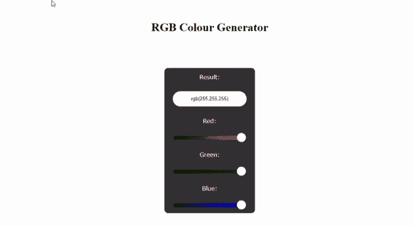

# 如何用 HTML CSS 和 JavaScript 创建 RGB 颜色生成器？

> 原文:[https://www . geesforgeks . org/how-create-RGB-color-generator-use-html-CSS-and-JavaScript/](https://www.geeksforgeeks.org/how-to-create-rgb-color-generator-using-html-css-and-javascript/)

在本文中，我们将使用 HTML、CSS 和 JavaScript 创建一个 RGB 颜色生成器。使用 RGB 颜色生成器，我们可以从红、绿、蓝颜色的组合中构建所有的颜色。每种颜色由从 0 到 255 的十进制数字范围表示(每种颜色 256 个级别)。因此，可用颜色的总数是 256 x 256 x 256，即 16，777，216 种可能的颜色。

**进场:**

1.  为每种颜色创建一个输入类型范围滑块。
2.  将滑块的最小值和最大值分别设置为 0 和 255。
3.  获取每种颜色的值，并将其存储在三个变量中。
4.  使用 rgb()函数通过给出三种颜色的值作为参数来生成颜色。

## index.html

```html
<!DOCTYPE html>
<html>

<head>
    <meta charset="utf-8">
    <title>RGB Colour Generator</title>

    <link rel="stylesheet" type="text/css" 
        href="style.css">
</head>

<body>
    <h1>RGB Colour Generator</h1>

    <div class="main">
        Result:<input type="text" id="box"
            value="rgb(255,255,255)">

        <!--  Range slider for red colour -->
        Red:<input type="range" id="red" 
            value="255" min="0" max="255">

        <!-- Range slider for green colour -->
        Green:<input type="range" id="green" 
            value="255" min="0" max="255">

        <!-- Range slider for blue colour -->
        Blue:<input type="range" id="blue" 
            value="255" min="0" max="255">
    </div>

    <script src="script.js"></script>
</body>

</html>
```

## style.css

```html
body {
    margin: 0;
    padding: 0;
    display: grid;
    place-items: center;
    height: 100vh;
}

.main {
    height: 400px;
    width: 250px;
    background: #333;
    border-radius: 10px;
    display: grid;
    place-items: center;
    color: #fff;
    font-family: verdana;
}

#box {
    height: 40px;
    width: 80%;
    border: none;
    outline: none;
    outline: none;
    border-radius: 50px;
    text-align: center;
}

/* CSS property for slider */
input[type="range"] {
    -webkit-appearance: none;
    height: 10px;
    width: 80%;
    border-radius: 50px;
    outline: none;
}

/* CSS property for slider thumb */
input[type="range"]::-webkit-slider-thumb {
    -webkit-appearance: none;
    height: 25px;
    width: 25px;
    background: #fff;
    border-radius: 50%;
    cursor: pointer;
}

.main #red {
    background: linear-gradient(90deg, #000, red);
}

.main #green {
    background: linear-gradient(90deg, #000, green);
}

.main #blue {
    background: linear-gradient(90deg, #000, blue);
}
```

## script.js

```html
function myColour() {

    // Get the value of red color
    var red = document.getElementById('red').value;

    // Get the value of green color
    var green = document.getElementById('green').value;

    // Get the value of blue color
    var blue = document.getElementById('blue').value;

    // rgb() function is used to create the color
    // from red, green and blue values
    var colour = 'rgb(' + red + ',' + green + ',' + blue + ')';

    // Change background colour with the 
    // color obtained by rgb function
    document.body.style.backgroundColor = colour;

    // Set the obtained rgb() colour code in the
    // input text field having id=box  
    document.getElementById('box').value = colour;

}

// On changing red range slider myColour()
// function is called  
document.getElementById('red')
    .addEventListener('input', myColour);

// On changing green range slider myColour()
// function is called
document.getElementById('green')
    .addEventListener('input', myColour);

// On changing blue range slider myColour()
// function is called
document.getElementById('blue')
    .addEventListener('input', myColour);
```

**输出:**

