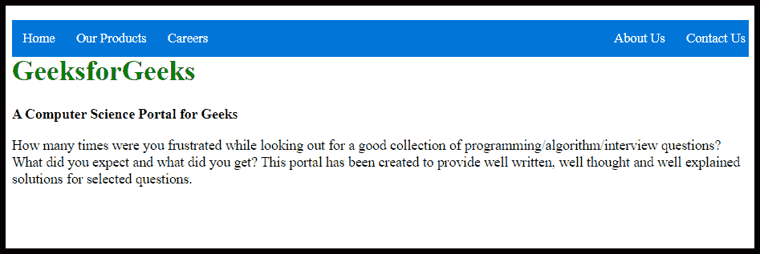
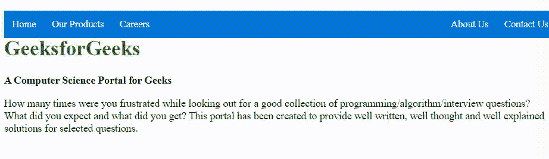

# 如何使用 HTML 和 CSS 创建右对齐菜单链接？

> 原文:[https://www . geesforgeks . org/如何创建-右对齐-菜单-链接-使用-html 和-css/](https://www.geeksforgeeks.org/how-to-create-right-aligned-menu-links-using-html-and-css/)



许多网站都使用右对齐的菜单链接。像酒店网站在菜单部分包含很多选项，但在紧急情况下与他们联系需要特别注意。在这种情况下，您可以将所有菜单选项放在导航栏的左侧，并在导航栏的右侧显示联系我们选项。这种设计将使网站比常规菜单链接更有吸引力。要创建右对齐菜单链接，你只需要 HTML 和 CSS。菜单链接应该包含您想要显示在右侧的重要菜单列表。下面的例子将说明这个概念的方法。

**创建结构:**在本节中，我们将创建一个基本的网站结构，以创建一个右对齐的菜单链接。

*   **HTML 代码制作结构:**

    ```html
    <!DOCTYPE html>
    <html>

    <head>
        <title>
            How To Create Right Aligned Menu
            Links using HTML and CSS ?
        </title>

        <meta name="viewport"
            content="width=device-width, initial-scale=1">
    </head>

    <body>

        <!-- Navbar items -->
        <div id="navlist">
            <a href="#">Home</a>
            <a href="#">Our Products</a>
            <a href="#">Careers</a>
            <div class="navlist-right">
            <a href="#">About Us</a>
            <a href="#">Contact Us</a>
            </div>
        </div>

        <!-- logo with tag -->
        <div class="content">
            <h1 style="color:green; padding-top:40px;">
                GeeksforGeeks
            </h1>

            <b>A Computer Science Portal for Geeks</b>

            <p>
                How many times were you frustrated while
                looking out for a good collection of
                programming/algorithm/interview questions?
                What did you expect and what did you get?
                This portal has been created to provide
                well written, well thought and well
                explained solutions for selected questions.
            </p>
        </div>
    </body>

    </html>
    ```

**设计结构:**在上一节中，我们已经创建了基础网站的结构。在本节中，我们将设计导航栏的结构。

*   **CSS 结构代码:**

    ```html
    <style>

        /* styling navlist */
        #navlist {
            background-color: #0074D9;
            position: absolute;
            width: 100%;
        }

        /* styling navlist anchor element */
        #navlist a {
            float:left;
            display: block;
            color: #f2f2f2;
            text-align: center;
            padding: 12px;
            text-decoration: none;
            font-size: 15px;
        }
        .navlist-right{
            float:right;
        }

        /* hover effect of navlist anchor element */
        #navlist a:hover {
            background-color: #ddd;
            color: black;
        }
    </style>
    ```

**合并 HTML 和 CSS 代码:**这是合并以上两部分后的最终代码。您可以看到主页、职业和我们的产品默认左对齐，但关于我们和联系我们右对齐。

```html
<!DOCTYPE html>
<html>

<head>
    <title>
        How To Create Right Aligned Menu
        Links using HTML and CSS ?
    </title>

    <meta name="viewport"
        content="width=device-width, initial-scale=1">

    <style>

        /* styling navlist */
        #navlist {
            background-color: #0074D9;
            position: absolute;
            width: 100%;
        }

        /* styling navlist anchor element */
        #navlist a {
            float:left;
            display: block;
            color: #f2f2f2;
            text-align: center;
            padding: 12px;
            text-decoration: none;
            font-size: 15px;
        }
        .navlist-right{
            float:right;
        }

        /* hover effect of navlist anchor element */
        #navlist a:hover {
            background-color: #ddd;
            color: black;
        }
    </style>
</head>

<body>

    <!-- Navbar items -->
    <div id="navlist">
        <a href="#">Home</a>
        <a href="#">Our Products</a>
        <a href="#">Careers</a>
        <div class="navlist-right">
        <a href="#">About Us</a>
        <a href="#">Contact Us</a>
        </div>
    </div>

    <!-- logo with tag -->
    <div class="content">
        <h1 style="color:green; padding-top:40px;">
            GeeksforGeeks
        </h1>

        <b>A Computer Science Portal for Geeks</b>

        <p>
            How many times were you frustrated while
            looking out for a good collection of
            programming/algorithm/interview questions?
            What did you expect and what did you get?
            This portal has been created to provide
            well written, well thought and well
            explained solutions for selected questions.
        </p>
    </div>
</body>

</html>
```

**输出:**
