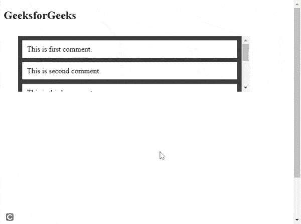

# 如何创建可滚动的 HTML 评论框？

> 原文:[https://www . geesforgeks . org/如何创建-可滚动-html-注释-框/](https://www.geeksforgeeks.org/how-to-create-scrollable-html-comment-box/)

本文的目的是使用 HTML 和 [CSS3 属性](https://www.geeksforgeeks.org/css-properties-complete-reference/)创建一个可滚动的评论框。

**方法:**对于本文的范围，我们将制作一个显示注释的 div 元素，并且我们将创建一个可滚动的 div 元素。我们将创建一个带有“*评论区*类的*分区*。我们将在这个 *div* 中制作另一个 *div* s，用于评论文本。

[*溢出-y*](https://www.geeksforgeeks.org/css-overflow-y-property/) 属性表示 y 轴的溢出行为是垂直的。我们必须将此设置为**滚动，**以便可以滚动。

**HTML 代码:**

## 超文本标记语言

```html
<!DOCTYPE html>
<html lang="en">
<head>
    <meta charset="UTF-8">
    <meta http-equiv="X-UA-Compatible" content="IE=edge">
    <meta name="viewport" 
          content="width=device-width, initial-scale=1.0">
</head>
<style>
    main{
        padding:0%;
        margin: 5%;
        display: block;
        min-height: 100vh;
        min-width: 100vh;
    }
    .comment-section{
        max-height: 25vh;
        max-width: 90%;
        background-color: #3f3f3f;
        overflow-y:scroll;
    }
    .comment{
        height: 10%;
        padding: 2%;
        margin: 2%;
        background-color: #ffff;
        color: black;
    }

</style>
<body>
    <h2>GeeksforGeeks</h2>
    <main>
        <div class="comment-section">
           <div class="comment">
             This is first comment.
           </div>
           <div class="comment">
             This is second comment.
            </div>
            <div class="comment">
              This is third comment.
            </div>
            <div class="comment">
              This is fourth comment.
            </div>
            <div class="comment">
              This is fifth comment.
            </div>
            <div class="comment">
              This is sixth comment.
            </div>
        </div>
    </main>
</body>
</html>
```

**输出:**
