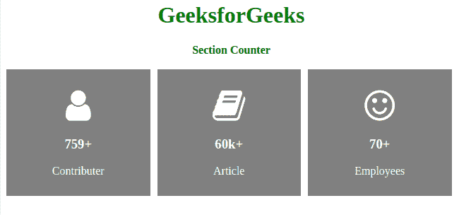

# 如何使用 HTML 和 CSS 创建截面计数器？

> 原文:[https://www . geeksforgeeks . org/如何使用 html 和 css 创建部分计数器/](https://www.geeksforgeeks.org/how-to-create-section-counter-using-html-and-css/)



小节计数器就像一张卡片，对网页页脚很有用。它包含公司的详细信息。在这篇文章中，我们将介绍一些公司的预测数据。我们将这篇文章分成两部分，在第一部分我们将创建正常的结构，然后我们将进行设计。
**创建结构:**在本节中，我们将使用简单的 HTML 代码创建三个部分来显示公司的一些细节。我们将使用 **fontawesome** 图标来更具体地代表用户的功能。

*   **字体超赞图标的 CDN 链接:**

> <link rel="”stylesheet”" href="”https://cdnjs.cloudflare.com/ajax/libs/font-awesome/4.7.0/css/font-awesome.min.css”">

*   **HTML 代码:**

## 超文本标记语言

```html
<!DOCTYPE html>
<html>

<head>
    <meta name="viewport"
        content="width=device-width, initial-scale=1">
    <link rel="stylesheet" href=
"https://cdnjs.cloudflare.com/ajax/libs/font-awesome/4.7.0/css/font-awesome.min.css">

</head>

<body>
    <h1>GeeksforGeeks</h1>
    <strong>Section Counter</strong>
    <br><br>
    <div class="row">
        <div class="column">
            <div class="card">

<p><i class="fa fa-user"></i></p>

                <h3>759+</h3>

<p>Contributer</p>

            </div>
        </div>
        <div class="column">
            <div class="card">

<p><i class="fa fa-book"></i></p>

                <h3>60k+</h3>

<p>Article</p>

            </div>
        </div>
        <div class="column">
            <div class="card">

<p><i class="fa fa-smile-o"></i></p>

                <h3>70+</h3>

<p>Employees</p>

            </div>
        </div>
    </div>
</body>

</html>                   
```