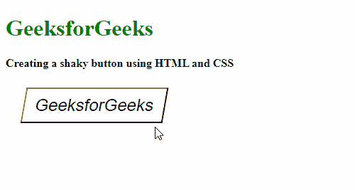

# 如何用 HTML 和 CSS 创建抖音按钮？

> 原文:[https://www . geeksforgeeks . org/如何使用 html 和 css 创建不稳定的按钮/](https://www.geeksforgeeks.org/how-to-create-shaky-button-using-html-and-css/)

抖音按钮是过去十年推出的一种按钮效果。这是我们用来设计按钮样式的最少使用的效果之一。这可以在按钮像小睡按钮一样时使用。

**方法:**创建此动画的方法是使用带有关键帧的**扭曲()**功能来制作每一帧的扭曲角度的动画。

**HTML 部分:**在这个部分中，定义了基本的 HTML 页面结构，并创建了一个新的按钮，稍后将使用 CSS 进行样式化。

**代码:**

## 超文本标记语言

```html
<!DOCTYPE html>
<html>

<head>
    <title>Shaky Button</title>
</head>

<body>
    <h1 style="color: green">
        GeeksforGeeks
    </h1>
    <b>
        Creating a shaky button using
        HTML and CSS
    </b>
    <p style="margin: 25px;">

        <!-- Create the shaky button -->
        <button class="shaky-btn">
            GeeksforGeeks
        </button>
    </p>

</body>

</html>
```

**CSS 部分:**在这一部分，我们将对按钮进行样式化，并对其应用动画，以获得想要的效果。应遵循以下步骤:

*   **第 1 步:**创建一个新的类，用于设置按钮的样式。将基本样式应用到这个按钮类，如边距、填充和一些边框，以分隔和定位按钮。
*   **第 2 步:**使用**skew()**功能将按钮倾斜到 x 轴上的特定角度。第一次角度应为负值。
*   **步骤 3:** 当按钮悬停在上方时，使用悬停选择器应用动画和效果。
*   **第 4 步:**使用关键帧使用倾斜功能创建动画。角度的顺序应该在原始负角度和它的正值之间交替。通过指定按钮摇动的次数，可以将一帧分成多个帧。

**提示:**使用**:在**选择器完全可选之前，可以用不同的效果来设计按钮，但是，必须确保角度值交替使用，一个为正，另一个为负，

**代码:**

## 半铸钢ˌ钢性铸铁(Cast Semi-Steel)

```html
<style>
    /* Style the button */
    .shaky-btn {
        width: 200px;
        height: 50px;

        background: white;
        font-size: 24px;
        transform: skewX(-10deg);

        cursor: pointer
    }

    /* Specify the effect when the
       button is hovered over */
    .shaky-btn:hover {
        animation: shake 0.4s ease-out;
        border: 2px solid green;
        color: green;
    }

    /* Use the keyframes for defining 
       the animation */
    @keyframes shake {
        0% {
            transform: skewX(-10deg);
        }

        25% {
            transform: skewX(10deg);
        }

        50% {
            transform: skewX(-10deg);
        }

        75% {
            transform: skewX(10deg);
        }

        100% {
            transform: skewX(-10deg);
        }
    }
</style>
```

**完整代码:**是以上两段代码的组合。

## 超文本标记语言

```html
<!DOCTYPE html>
<html>

<head>
    <title>Shaky Button</title>

    <style>

        /* Style the button */
        .shaky-btn {
            width: 200px;
            height: 50px;

            background: white;
            font-size: 24px;
            transform: skewX(-10deg);
            cursor: pointer;
        }

        /* Specify the effect when the
        button is hovered over */
        .shaky-btn:hover {
            animation: shake 0.4s ease-out;
            border: 2px solid green;
            color: green;
        }

        /* Use the keyframes for defining 
        the animation */
        @keyframes shake {
            0% {
                transform: skewX(-10deg);
            }

            25% {
                transform: skewX(10deg);
            }

            50% {
                transform: skewX(-10deg);
            }

            75% {
                transform: skewX(10deg);
            }

            100% {
                transform: skewX(-10deg);
            }
        }
    </style>
</head>

<body>
    <h1 style="color: green">
        GeeksforGeeks
    </h1>
    <b>Creating a shaky button using
        HTML and CSS</b>
    <p style="margin: 25px;">

        <!-- Create the shaky button -->
        <button class="shaky-btn">
            GeeksforGeeks
        </button>
    </p>
</body>

</html>
```

**输出:**

