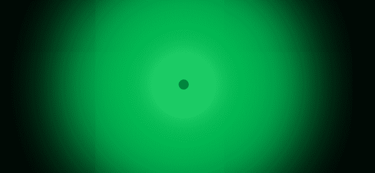

# 如何使用 HTML 和 CSS 创建冲击波或爆炸效果？

> 原文:[https://www . geesforgeks . org/如何使用 html 和 css 创建冲击波或爆炸效果/](https://www.geeksforgeeks.org/how-to-create-shock-wave-or-explosion-effect-using-html-and-css/)



冲击波效应也被称为爆炸效应。它是简单的 CSS 效果之一。对于初学者来说，学习伪元素的概念是最好的例子之一。我们使用的伪元素是[悬停](https://www.geeksforgeeks.org/css-hover-selector/)。我建议你在进入代码之前先浏览一遍，以便更好地理解它。对于简报，悬停用于在鼠标悬停在元素上时将样式应用于元素。

*   **HTML 代码:**通过使用 HTML，我们将创建一个正常的结构，在这里我们使用爆炸或冲击波效果。

    ```html
    <!DOCTYPE html>
    <html lang="en">

    <head>
        <meta charset="UTF-8" />
        <meta name="viewport"
            content="width=device-width, initial-scale=1.0" />
        <title>Document</title>
    </head>

    <body>
        <div class="geeks"></div>
    </body>

    </html>                    
    ```

*   **CSS Code:** 第一步是使用 **[flexbox](https://www.geeksforgeeks.org/advance-css-layout-with-flexbox/)** 将我们的 div 与页面中心对齐，然后我们必须使用 [**边框半径**](https://www.geeksforgeeks.org/css-border-radius-property/) 属性创建一个圆。我们在每一步都增加了它的补偿值。然后我们将使用 **[过渡持续时间](https://www.geeksforgeeks.org/css-transition-duration-property/)** 到 div。现在使用悬停选择器复制并粘贴我们之前使用的 **[框阴影属性](https://www.geeksforgeeks.org/css-box-shadow-property/)** ，并增加其偏移值。我们增加了它的值，这样在悬停时它感觉像是从中心出来了(爆炸效果)。你可以利用方块阴影的颜色来进行不同甚至多重的色彩爆炸。

    ```html
    <style> 
        body {
            margin: 0;
            padding: 0;
            background: black;
            display: flex;
            justify-content: center;
            align-items: center;
            height: 100vh;
        }

        .geeks {
            width: 20px;
            height: 20px;
            background: green;
            border-radius: 50%;
            box-shadow: 0 0 20px rgb(127, 153, 127), 
                        0 0 40px rgb(127, 153, 127), 
                        0 0 60px rgb(127, 153, 127), 
                        0 0 80px rgb(127, 153, 127),
                        0 0 120px rgb(127, 153, 127), 
                        0 0 220px rgb(127, 153, 127),
                        0 0 320px rgb(127, 153, 127);
            transition: 2s;
        }

        .geeks:hover {
            box-shadow: 0 0 0 30px rgb(83, 224, 83), 
                        0 0 0 60px rgb(83, 224, 83),
                        0 0 0 100px rgb(83, 224, 83),
                        0 0 0 120px rgb(82, 226, 82), 
                        0 0 0 200px rgb(37, 214, 37), 
                        0 0 0 400px rgb(27, 165, 27), 
                        0 0 0 450px rgb(63, 235, 63);
        }
    </style>
    ```

**最终解决方案:**在本节中，我们将以上两个部分结合在一起，以实现上述任务。

*   **程序:**

    ```html
    <!DOCTYPE html>
    <html lang="en">

    <head>
        <meta charset="UTF-8" />
        <meta name="viewport" 
              content="width=device-width, initial-scale=1.0" />
        <title>Document</title>
        <style>
            body {
                margin: 0;
                padding: 0;
                background: black;
                display: flex;
                justify-content: center;
                align-items: center;
                height: 100vh;
            }

            .geeks {
                width: 20px;
                height: 20px;
                background: green;
                border-radius: 50%;
                box-shadow: 0 0 20px rgb(127, 153, 127),
                            0 0 40px rgb(127, 153, 127), 
                            0 0 60px rgb(127, 153, 127), 
                            0 0 80px rgb(127, 153, 127), 
                            0 0 120px rgb(127, 153, 127),
                            0 0 220px rgb(127, 153, 127),
                            0 0 320px rgb(127, 153, 127);
                transition: 2s;
            }

            .geeks:hover {
                box-shadow: 0 0 0 30px rgb(83, 224, 83), 
                            0 0 0 60px rgb(83, 224, 83),
                            0 0 0 100px rgb(83, 224, 83),
                            0 0 0 120px rgb(82, 226, 82), 
                            0 0 0 200px rgb(37, 214, 37),
                            0 0 0 400px rgb(27, 165, 27), 
                            0 0 0 450px rgb(63, 235, 63);
            }
        </style>
    </head>

    <body>
        <div class="geeks"></div>
    </body>

    </html>
    ```

*   **输出:** 