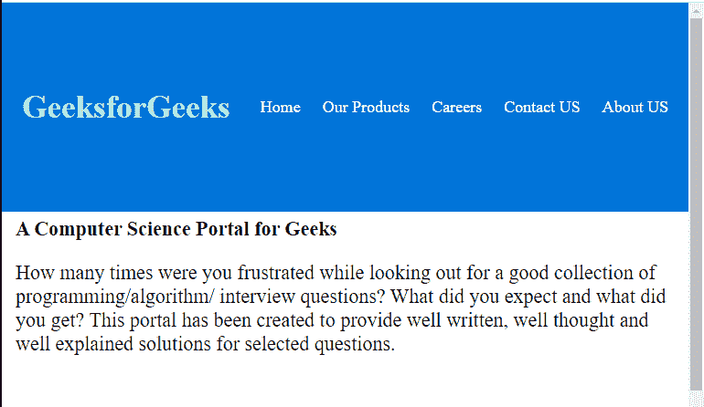
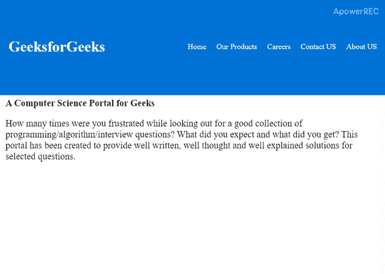

# 如何使用 HTML、CSS 和 JavaScript 创建滚动时的收缩头？

> 原文:[https://www . geesforgeks . org/如何使用-html-CSS-和-javascript 创建-收缩-滚动标题/](https://www.geeksforgeeks.org/how-to-create-shrink-header-on-scroll-using-html-css-and-javascript/)



当用户向下滚动页面时，收缩导航栏会起作用。在本文中，我们将使用 HTML、CSS 和 JavaScript 来设计收缩导航栏。HTML 用于创建结构，CSS 用于在 HTML 结构上设置样式，使其看起来很好。这种缩小的 navbar 在网站上看起来很有吸引力。通过使用 JavaScript，当用户向下滚动时，您可以很容易地使导航栏收缩。

**创建结构:**在本节中，我们将为可收缩的导航栏创建一个基本的网站结构，当用户向下滚动页面时，它将显示效果。

*   **创建结构的 HTML 代码:**

```html
<!DOCTYPE html>
<html>

<head>
    <meta name="viewport" content
        ="width=device-width, initial-scale=1">

    <title>
        How to Create Shrink Header on Scroll
        using HTML, CSS and JavaScript ?
    </title>
</head>

<body>
    <!-- Navlist of heade -->
    <div id="navlist">
        <a href="#default" id="logo">
            GeeksforGeeks
        </a>

        <div id="navlist-right">
            <a href="#home">Home</a>
            <a href="#about">Our Products</a>
            <a href="#about">Careers</a>
            <a href="#contact">Contact US</a>
            <a href="#about">About US</a>
        </div>
    </div>

    <!-- Page Content -->
    <div class="content">
        <b> 
            A Computer Science Portal for Geeks
        </b>
        <p>
            How many times were you frustrated while 
            looking out for a good collection of 
            programming/algorithm/interview questions? 
            What did you expect and what did you get? 
            This portal has been created to provide 
            well written, well thought and well 
            explained solutions for selected questions.
        </p>
    </div>
</body>

</html>
```

**设计结构:**上一节我们已经创建了基础网站的结构。在本节中，我们将设计导航栏的结构，然后使用 JavaScript 在导航栏上进行向下滚动效果。

*   **CSS 代码在 HTML 结构上添加样式:**

    ```html
    <style>
        * {
            box-sizing: border-box;
        }

        body { 
            margin: 0;
        }

        /* Navlist designing */
        #navlist {
            overflow: hidden;
            background-color: #0074D9;
            padding: 90px 10px;
            transition: 0.4s;
            position: fixed;
            width: 100%;
            top: 0;
            z-index: 1;
        }

        #navlist a {
            float: left;
            color: white;
            text-align: center;
            padding: 12px;
            text-decoration: none;
            font-size: 18px; 
            line-height: 25px;
            border-radius: 4px;
        }

        #navlist #logo {
            font-size: 35px;
            font-weight: bold;
            transition: 0.4s;
        }

        #navlist a:hover {
            color: #01FE06;
        }

        #navlist-right {
            float: right;
        }

        /* Content desing */
        .content {
            margin-top:220px;
            padding:15px 15px 1800px;
            font-size:22px;
        }
    </style>
    ```

*   **菜单上动画的 JavaScript 代码:**

    ```html
    <script>

        // Scrolls down 90px from the top of
        // the document, to resize the navlist
        // padding and the title font-size
        window.onscroll = function() {
            scrollFunction()
        };

        function scrollFunction() {
            if (document.body.scrollTop > 90 ||
                document.documentElement.scrollTop > 90)
            {
                document.getElementById("navlist")
                            .style.padding = "25px 10px";

                document.getElementById("logo")
                        .style.fontSize = "24px";
            } 
            else {
                document.getElementById("navlist")
                            .style.padding = "90px 10px";

                document.getElementById("logo")
                            .style.fontSize = "35px";
            }
        }
    </script>
    ```

**示例:**在这个示例中，我们将结合 HTML、CSS 和 JavaScript 代码来制作收缩标题导航栏。

```html
<!DOCTYPE html>
<html>

<head>
    <meta name="viewport" content
        ="width=device-width, initial-scale=1">

    <title>
        How to Create Shrink Header on Scroll
        using HTML, CSS and JavaScript ?
    </title>

    <style>
        * {
            box-sizing: border-box;
        }

        body { 
            margin: 0;
        }

        /* Navlist designing */
        #navlist {
            overflow: hidden;
            background-color: #0074D9;
            padding: 90px 10px;
            transition: 0.4s;
            position: fixed;
            width: 100%;
            top: 0;
            z-index: 1;
        }

        #navlist a {
            float: left;
            color: white;
            text-align: center;
            padding: 12px;
            text-decoration: none;
            font-size: 18px; 
            line-height: 25px;
            border-radius: 4px;
        }

        #navlist #logo {
            font-size: 35px;
            font-weight: bold;
            transition: 0.4s;
        }

        #navlist a:hover {
            color: #01FE06;
        }

        #navlist-right {
            float: right;
        }

        /* Content desing */
        .content {
            margin-top:220px;
            padding:15px 15px 1800px;
            font-size:22px;
        }
    </style>
</head>

<body>

    <!-- Navlist of heade -->
    <div id="navlist">
        <a href="#default" id="logo">
            GeeksforGeeks
        </a>

        <div id="navlist-right">
            <a href="#home">Home</a>
            <a href="#about">Our Products</a>
            <a href="#about">Careers</a>
            <a href="#contact">Contact US</a>
            <a href="#about">About US</a>
        </div>
    </div>

    <!-- Page Content -->
    <div class="content">
        <b> 
            A Computer Science Portal for Geeks
        </b>
        <p>
            How many times were you frustrated while 
            looking out for a good collection of 
            programming/algorithm/interview questions? 
            What did you expect and what did you get? 
            This portal has been created to provide 
            well written, well thought and well 
            explained solutions for selected questions.
        </p>
    </div>

    <script>

        // Scrolls down 90px from the top of
        // the document, to resize the navlist
        // padding and the title font-size
        window.onscroll = function() {
            scrollFunction()
        };

        function scrollFunction() {
            if (document.body.scrollTop > 90 ||
                document.documentElement.scrollTop > 90)
            {
                document.getElementById("navlist")
                            .style.padding = "25px 10px";

                document.getElementById("logo")
                            .style.fontSize = "24px";
            } 
            else {
                document.getElementById("navlist")
                            .style.padding = "90px 10px";

                document.getElementById("logo")
                            .style.fontSize = "35px";
            }
        }
    </script>
</body>

</html>
```

**输出:**
