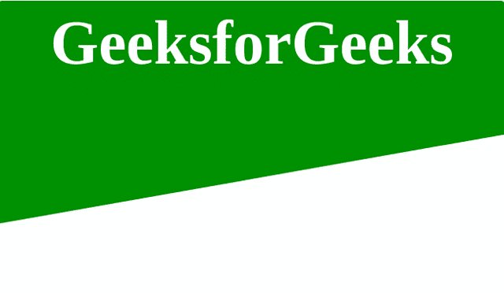

# 如何使用 HTML 和 CSS 创建具有悬停效果的倾斜背景？

> 原文:[https://www . geeksforgeeks . org/如何使用 html 和 css 创建带有悬停效果的倾斜背景/](https://www.geeksforgeeks.org/how-to-create-skewed-background-with-hover-effect-using-html-and-css/)


倾斜的背景或者你可以说天使色的阴影背景可以用 HTML 和 CSS 创建。这个背景可以作为你网站的封面图片，会很有吸引力。在本文中，我们将创建一个简单的倾斜背景。我们将把文章分成两部分，在第一部分我们将创建结构，在第二部分，我们将装饰结构。

**创建结构:**在本节中，我们将只使用简单的 HTML 代码来创建结构。

*   **HTML 代码:**通过使用 **[HTML <部分>标记](https://www.geeksforgeeks.org/html-section-tag/)** 我们将为倾斜的背景创建部分，该部分内部将有一个**[HTML<div>](https://www.geeksforgeeks.org/div-tag-html/)**标记。

    ```html
    <!DOCTYPE html>
    <html>

    <head>
        <meta>
        <title>
            Skewed Background using HTML and CSS
        </title>
    </head>

    <body>
        <section>
            <div class="content">
                <h2>GeeksforGeeks</h2>
            </div>
        </section>

    </body>

    </html>                    
    ```

**设计结构:**在这一节中我们将借助 CSS 装饰预先创建的结构。

*   **CSS 代码:**在本节中，我们首先将使用一些 CSS 属性来设计背景，然后我们将使用 CSS 的**倾斜属性**，该属性将元素沿着 x 轴和 Y 轴倾斜给定的角度。

    ```html
    <style>
        body {
            margin: 0;
            padding: 0;
            font-family: serif;
        }

        section:hover {
              background: linear-gradient( green , yellow);
        }

        section {
            display: flex;
            background: green;
            height: 350px;
            justify-content: center;
            align-items: center;
            transform: skew(0deg, -10deg) translateY(-120px);
        }

        .content {
            margin: 0;
            padding: 0;
            position: relative;
            max-width: 900px;
            transform: skew(0deg, 10deg);
            text-align: center;
        }

        .content h2 {
            color: #fff;
            font-size: 80px;
        }
    </style>
    ```

**最终代码:**正是以上两个代码段的组合通过组合以上两个代码段我们可以实现背景的歪斜。

*   **程序:**

    ```html
    <!DOCTYPE html>
    <html>

    <head>
        <meta>
        <title>
            Skewed Background using HTML and CSS
        </title>
    </head>
    <style>
        body {
            margin: 0;
            padding: 0;
            font-family: serif;
        }

        section:hover {
              background-image: linear-gradient(to left, green , yellow);
              transition-time: 5s;
        }
        section {
            display: flex;
            background: green;
            height: 350px;
            justify-content: center;
            align-items: center;
            transform: skew(0deg, -10deg) translateY(-120px);
        }

        .content {
            margin: 0;
            padding: 0;
            position: relative;
            max-width: 900px;
            transform: skew(0deg, 10deg);
            text-align: center;
        }

        .content h2 {
            color: #fff;
            font-size: 80px;
        }
    </style>

    <body>
        <section>
            <div class="content">
                <h2>GeeksforGeeks</h2>
            </div>
        </section>

    </body>

    </html>

    ```

*   **输出:** 